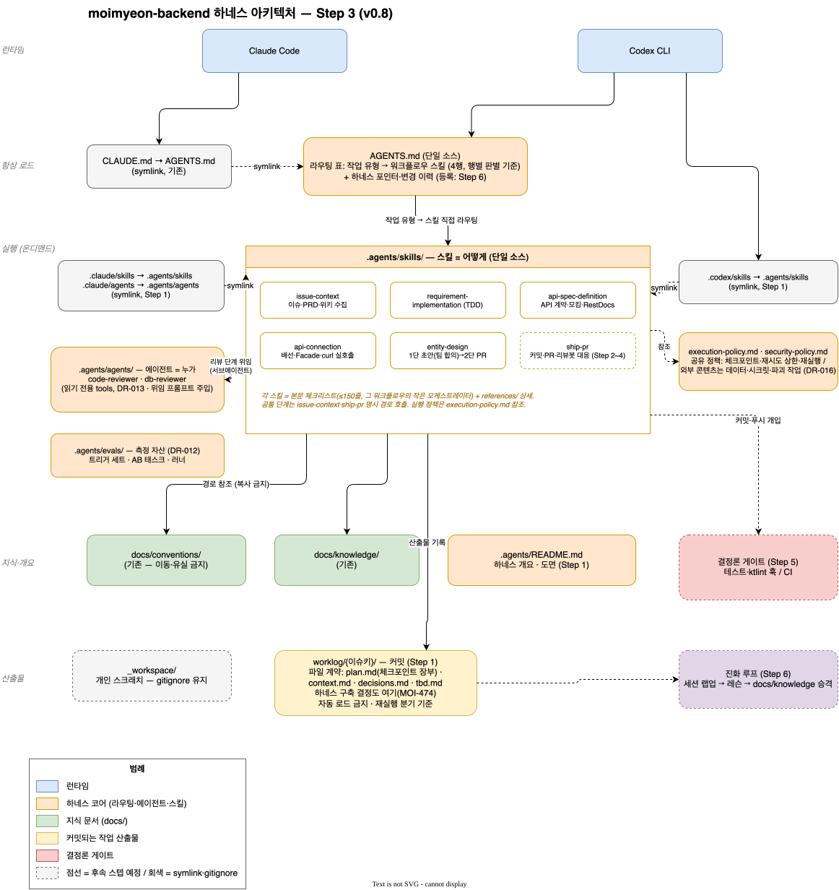

# .agents — 하네스 단일 소스

이 디렉토리가 코딩 에이전트 하네스의 단일 소스다. 런타임 디렉토리는 전부 symlink다:
`.claude/skills`·`.codex/skills` → `skills/`, `.claude/agents` → `agents/`.
수정은 반드시 여기서 한다.

| 위치 | 책임 |
| --- | --- |
| `skills/` | 어떻게: 워크플로우별 절차. 각 본문의 체크리스트가 그 워크플로우의 오케스트레이터다 |
| `execution-policy.md` | 실행 정책 **원본** — 런타임은 스킬 단계 인라인 + AGENTS.md 압축으로 배포 (DR-020) |
| `safety-policy.md` | 안전 정책(행동 경계) **원본** — 런타임은 AGENTS.md 압축 + 해당 스킬 인라인 (DR-016·020) |
| `agents/` | 누가: 역할 계약 (위임 프롬프트에 주입될 것을 전제로 자기완결적으로 작성) |
| `evals/` | 측정 자산: 트리거 세트, With/Without 태스크, 러너 (DR-012) |

라우팅은 `AGENTS.md`의 작업 유형 → 스킬 표가 담당한다. 별도 오케스트레이터 스킬은 없다.

작업 산출물 계약은 [worklog/README.md](../worklog/README.md),
구축 의사결정은 [worklog/MOI-474/decisions.md](../worklog/MOI-474/decisions.md) 참조.

도면은 XML 임베디드 SVG다 — draw.io에서 열면 그대로 편집된다.
