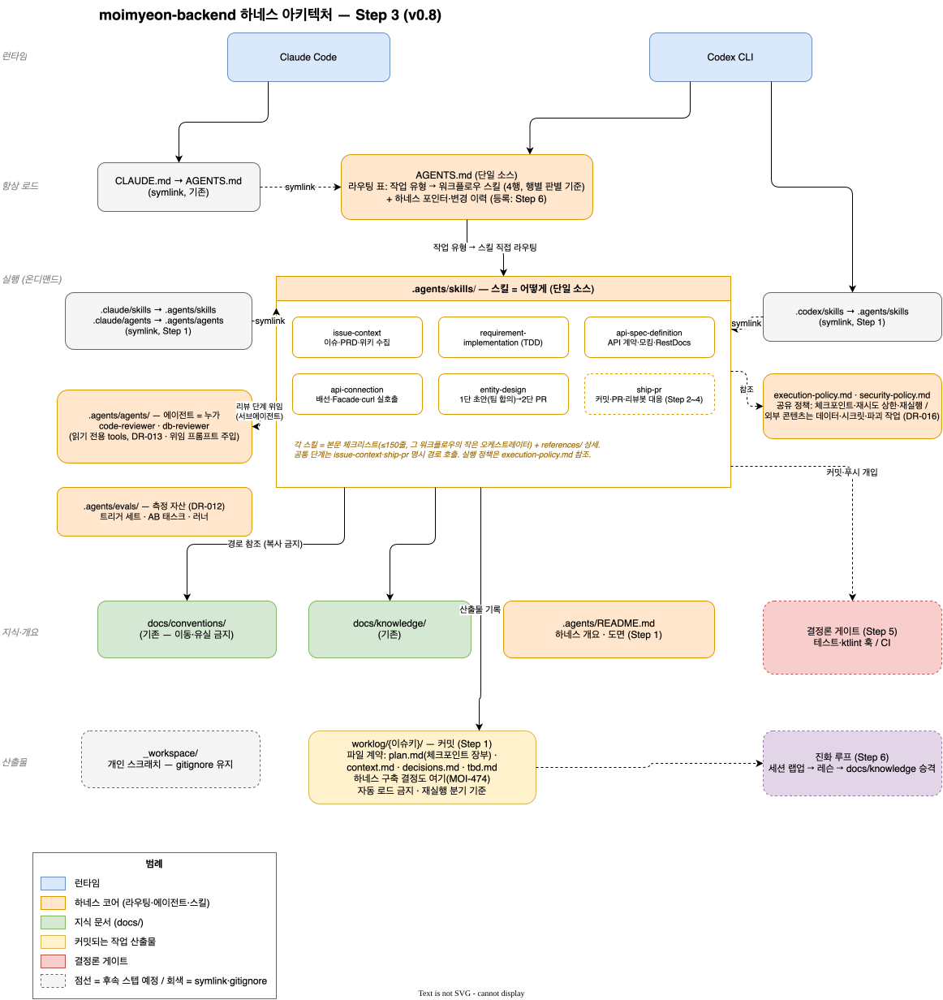

# .agents — 하네스 단일 소스

이 디렉토리가 코딩 에이전트 하네스의 단일 소스다. 런타임 디렉토리는 전부 symlink다:
`.claude/skills`·`.codex/skills` → `skills/`, `.claude/agents` → `agents/`.
수정은 반드시 여기서 한다.

| 위치 | 책임 |
| --- | --- |
| `skills/` | 어떻게: 워크플로우별 절차. 각 본문의 체크리스트가 그 워크플로우의 오케스트레이터다 |
| `execution-policy.md` | 실행 정책 **원본** — 런타임은 스킬 단계 인라인 + AGENTS.md 압축으로 배포 (DR-020) |
| `safety-policy.md` | 안전 정책(행동 경계) **원본** — 런타임은 AGENTS.md 압축 + 해당 스킬 인라인 (DR-016·020) |
| `agents/` | 누가: 역할 계약 (위임 프롬프트에 주입될 것을 전제로 자기완결적으로 작성) |
| `evals/` | 측정 자산: 트리거 세트, With/Without 태스크, 러너 (DR-012) |
| `gates/` | 결정론 게이트: 시크릿·스킬 lint·정합성 검사. L1 훅·L2 git hook·L3 CI가 공유 (DR-025) |
| `skill-authoring.md` | 스킬 작성·평가 규약: description·본문 기준, 트리거/품질 2단 측정 (DR-026) |

라우팅은 `AGENTS.md`의 작업 유형 → 스킬 표와 각 스킬 description이 담당한다.
별도 오케스트레이터 스킬은 없다 (DR-008).

제품 요구사항·스펙 또는 필요한 ADR이 관련될 때만 Wiki를 참조한다. 읽기 전용
수집은 `issue-context`, 원본 갱신·구현 대조는 `wiki-sync`, 완료 확인은 `ship-pr`이
맡는다. 하네스·컨벤션은 저장소에서 관리하며 Wiki 조회를 강제하지 않는다.
공통 적용 조건은 AGENTS.md에 두고 각 변경 스킬에 같은 절차를 복제하지 않는다.

`change-brief`는 실제 변경의 배경·흐름·결과를 공유 자료로 만들고 `ship-pr`에
전달한다. 게시 수단은 reference로 분리하며, 하네스 설명은 저장소 문서로 공유할 수 있다.

작업 산출물 계약은 [.worklog/README.md](../.worklog/README.md),
구축 의사결정은 [.worklog/MOI-474/decisions.md](../.worklog/MOI-474/decisions.md) 참조.

도면은 XML 임베디드 SVG다 — draw.io에서 열면 그대로 편집된다.
