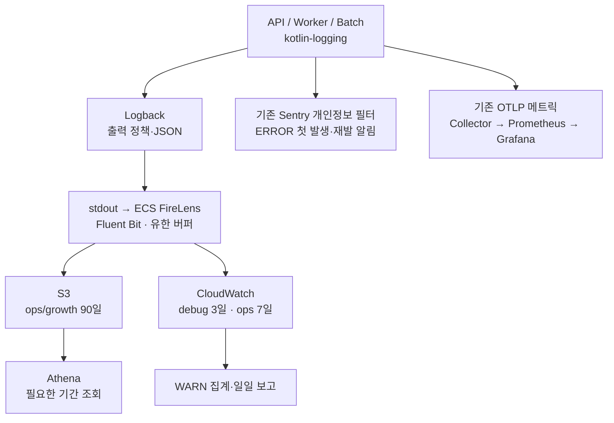

# MOI-411 로깅 설계

2026-09-14 · 코드 기준 `b3ae0040` · 운영 정책 확정, 구현 전

사용자가 추천 운영 정책을 채택했다. live 담당자는 팀원 3명 전원이며 live 알림을 함께 받는다. 채널은 dev/staging과 분리한다. 보존·유실 허용·알림 간격의 확정 범위는 결정 기록 DR-22에 남겼다.

이 설계의 목표는 장애가 났을 때 필요한 사건을 찾고 민감정보를 저장하지 않으며 로그 때문에 서비스가 느려지거나 비용이 계속 늘어나는 상황을 막는 데 있다. kotlin-logging과 S3 저장은 요구사항이다. 앱의 직접 S3 호출, Kafka, ELK는 도입하지 않는다.

기존 코드에는 Sentry 개인정보 필터와 dev용 Collector·Prometheus·Grafana가 있다. 로그는 여전히 텍스트 stdout에서 CloudWatch로 간다. 이번에는 이 구성에서 빠진 사건 기록·S3 보관·로그 알림을 채운다. 기존 선택의 근거와 변경 이력은 [결정 기록](decisions.md)에 둔다.

## 1. 저장과 검색의 비용

S3에 저장하는 것만으로 장애 대응이 끝나지는 않는다. 방금 실패한 요청을 찾을 검색 경로도 필요하다. 반대로 모든 로그를 검색 서버에 오래 보관하면 저장비와 운영 부담이 커진다.

| 해결안 | 얻는 것 | 감수할 것 |
| --- | --- | --- |
| 앱의 S3 Appender·업로드 스케줄러 | 앱 안에서 저장까지 연결 | 업로드·인증·재시도·종료 처리가 JVM 책임이 됨. 사용자 제약과 맞지 않음 |
| 파일 → host collector → S3 | 앱 밖 전송, 로컬 파일 확인 | ECS mount·rotation·읽기 위치·호스트 교체 관리 |
| 기존 awslogs → CloudWatch → Data Firehose → S3 | 관리형 전달, sidecar 자원 변경 감소 | CloudWatch 전체 ingestion과 Firehose 비용 |
| stdout → FireLens/Fluent Bit → S3·CloudWatch | 앱은 출력만 담당, 목적지별 전송량 조절 | sidecar 자원, 버퍼와 종료 관리 |
| DB 또는 검색 클러스터에 로그 적재 | 조회 기능을 직접 구성 | 서비스 DB 부하 또는 새 클러스터 운영. 현재 요구에 비해 큼 |

현재 선택은 FireLens다. 기존 ECS task의 로그 드라이버를 확장하고 앱에는 로그용 AWS SDK를 추가하지 않는다. 이 선택이 가장 저렴하다고 측정한 것은 아니다. dev API가 이미 t3.small의 2vCPU와 1600MiB를 예약하므로, 배치 용량을 검증했을 때 EC2 증설 비용이 크면 Firehose 안으로 바꾼다. 관리형 전달은 끝까지 남겨둘 대안이다. [FireLens 공식 문서](https://docs.aws.amazon.com/AmazonECS/latest/developerguide/using_firelens.html)

그림의 ECS 경로는 API·worker에 먼저 적용한다. batch는 공통 출력 정책을 사용하되 현재 ECS 배포가 확인되지 않았으므로 실행 환경의 수집기 연결을 따로 확인한다. Sentry·Grafana도 코드와 실제 배포·알림 활성화를 구별한다. 현재 Collector에는 metrics 파이프라인만 있으며 WARN 경보와 일일 보고는 새로 구성할 대상이다.

S3는 로그 한 줄마다 호출하지 않는다. 수집기가 여러 줄을 gzip JSON Lines 객체로 묶는다. 객체 키는 `env/service/retention/dt/hour/unique.json.gz`로 정하고 사용자나 요청 ID를 파티션으로 쓰지 않는다. 객체 이름의 고유성을 보장하고 전달 순서 대신 이벤트의 시각과 ID로 분석한다.

이 구조를 선택하면 저장 실패와 버퍼 관리가 다음 문제가 된다. 그 전에 어떤 내용을 저장할지부터 제한한다.

## 2. 사건별 기록 범위

로그 종류와 로그 수준은 다른 축이다. 보안 사건도 정상적인 로그인 완료면 INFO이고 배치 사건도 재시도 중이면 WARN이다. 파일을 여덟 종류로 나누기보다 `category`와 고정 `eventCode`로 구분한다.

공통 필드는 `schemaVersion`, `timestamp`(UTC), `service`, `environment`, `release`, `instanceId`, `category`, `eventCode`, `eventId`, `level`이다. 요청에만 requestId·route·status·durationMs를 붙이고 실패에만 errorCode·errorType을 붙인다. 없는 trace나 사용자 식별자를 빈 문자열·가짜 값으로 채우지 않는다. retention 등급과 경보 eventKey는 서버의 사건 정책에서 계산하며 외부 요청이 지정하지 못한다. `schemaVersion=1`에서는 필드 추가를 허용하되 이름·타입 변경은 새 버전으로 분리하고 Athena·알림 필터의 호환성을 먼저 확인한다.

| 종류 | 기록할 사건과 필드 | 수집 위치·조회 경로 | 제외할 내용 |
| --- | --- | --- | --- |
| 요청/응답 | method, route template, status, durationMs, errorCode | API 완료 지점 → ops 로그 | body, query, 헤더 덤프, raw URI |
| 오류·예외 | 최종 실패, errorCode, 예외 클래스, 제한된 코드 위치 | Advice·worker 최종 처리 → ops·Sentry | 예외 메시지·cause 원문·지역 변수 |
| 사용자 활동 | 모임 생성·참가 확정·후기 작성, 결과·대상 ID | commit 이후 → growth | 사용자 입력 문장, 인증 세션 |
| 시스템 상태 | 시작·종료·의존성 상태 전환 | 앱 → ops, 수치 추세는 기존 메트릭 | CPU·메모리 값을 매 요청 로그로 복제 |
| DB 쿼리 | 느린 작업 코드·시간·결과, pool 고갈·타임아웃 | 우선 앱 메트릭·안전한 db 사건 | SQL bind, JDBC URL, SQL 원문 전체 |
| 보안 | 로그인 실패·인가 거부·검증 실패·관리자 작업 | Security·admin 경계 → ops의 security 분류 | 토큰·OAuth code·쿠키·실패한 비밀번호 |
| 배치·worker | runId/eventId, 시작·완료·실패, 건수·시간·시도 횟수 | 실행 경계 → ops | 처리 대상 payload와 이메일·푸시 본문 |
| 디버깅 | 선택한 기능의 분기·단계·안전한 상태 코드 | 제한한 logger → debug | 객체 전체 덤프, HTTP wire, SDK body |

앱 밖의 사건은 앱 로거가 수집하지 않는다. ALB·WAF는 기존 경로를 유지하고 ECS task 종료·EC2 장애는 AWS 상태 사건으로 감지한다. OS와 DB 서버의 상세 로그 수집은 별도 범위다. 현재 Grafana에 JVM·DB pool이 보인다는 이유로 OS·MySQL 서버 로그까지 수집된다고 해석하지 않는다.

health 성공 요청은 로그에서 제외하되 가용성 감시는 남긴다. health 실패도 body 없이 상태 사건이나 외부 health 신호로 잡는다. 반복 폴링은 매번 INFO를 쌓지 않고 상태 전환을 기록한다. 처리 건수와 대기량은 메트릭에 둔다.

## 3. 개인정보가 빠져나가는 경로

body를 안 찍어도 `e.message`, 외부 URL, MDC에 원문이 남을 수 있다. 현재 Advice·이력서 처리·OG 조회의 로그 호출이 이 범위에 들어간다. 정규식만 적용하면 새 필드나 자유 텍스트를 놓치고 마스킹을 수집기에서 하면 원문은 이미 stdout과 버퍼를 거친다.

선택은 수집 최소화, 필드 검증, 출력 직전 정제의 순서다. 사건별 허용된 원시 타입만 받고 DTO·Entity·임의 Map의 `toString()`은 허용하지 않는다. `support:logging`의 작은 출력 정책이 stdout과 Sentry에서 공통으로 허용할 사건 코드·값 규칙을 정의한다. 각 목적지는 필요한 부분만 가져가며 Sentry가 일반 로그 전체를 받지는 않는다.

| 데이터 | 기본 정책 | 필요한 경우의 대안 |
| --- | --- | --- |
| 비밀번호·토큰·쿠키·세션 자격 증명 | 수집 금지 | 없음. 장애 재현에도 원문은 필요하지 않음 |
| 이메일·전화·주소·GPS·주민/카드 정보 | 필드 제외, 뜻하지 않게 들어온 값은 전체 삭제 또는 `[REDACTED]` | 업무상 필요한 별도 기록은 목적·권한·보존을 먼저 정함 |
| 회원 식별자 | 요청 요약에는 기본 생략 | 필요한 활동 사건에 HMAC-SHA-256 128비트 + keyVersion |
| 경로·URL | MVC route template, 외부 제공자 코드 | 매칭 실패는 `UNMATCHED`, 보안 경로는 고정 분류 |
| message·MDC·key-value | 사건별 허용 값만 재구성 | 승인한 프레임워크 템플릿과 안전한 속성만 추가 |
| 예외 | 타입과 코드 위치, 제한된 원인 체인 | 자유 형식 message·cause·suppressed message는 제외 |

부분 마스킹은 사람을 다시 식별할 단서를 남긴다. 이번 서비스는 운영 로그에 이메일 일부나 전화번호 끝자리를 남길 이유가 없어 완전 삭제를 선택했다. 정규식은 예상하지 못한 이메일·토큰 형태를 잡는 마지막 방어다. 모든 개인정보를 인식하는 도구로 취급하지 않는다. [OWASP Logging Cheat Sheet](https://cheatsheetseries.owasp.org/cheatsheets/Logging_Cheat_Sheet.html)

가명 ID의 키는 JWT 키와 분리해 SSM의 기존 비밀 주입 방식으로 받는다. 키를 바꾸면 같은 사람도 다른 값이 나오므로 버전과 연결 기간을 정한다. HMAC을 익명화나 역변환 가능한 암호화라고 부르지 않는다. 키가 없을 때 원문 ID로 대신 기록하지 않는다.

JSON은 serializer로 만들고 CR/LF·제어문자를 escape한다. 일반 문자열 256자, 전체 이벤트 16KiB, 예외 프레임 30개·cause 깊이 5를 초기 제한으로 제안한다. 초과 시 필드를 줄여 유효 JSON을 남긴다. 직렬화 실패는 고정된 `logging.serialization_failed`로 처리하고 원문 fallback은 금지한다. 같은 실패를 로거 안에서 다시 로깅해 재귀를 만들지도 않는다.

미등록 라이브러리 메시지는 logger·level·안전한 예외 타입만 보존한다. 메시지 내용이 줄어 진단이 어려워지는 대가가 있으므로 실제 필요한 부팅·연결 진단 템플릿부터 검토해 허용한다. 이 정책은 라이브러리 로그를 전부 버리는 것과 다르다.

Sentry에는 이미 `SentryPrivacyFilter`가 있다. 이를 유지하면서 안전한 eventCode·errorCode·traceId를 명시적으로 보존하도록 확장한다. Console formatter의 정제가 Sentry에 자동 적용되지는 않는다. 검증은 각 appender 결과뿐 아니라 최종 stdout/stderr와 Sentry 전송 객체까지 확인한다.

## 4. 로그 수준과 실패의 의미

WARN을 사용자 잘못의 표시로 쓰면 정상적인 입력 오류만으로 경보가 발생한다. 현재 `CoreErrorType`은 닉네임 중복·세션 만료·정원 초과도 WARN이다. 여기에 곧바로 알림 규칙을 붙이지 않는다.

| 수준 | 판단 기준 | 이 서비스의 예 | 처리 |
| --- | --- | --- | --- |
| TRACE | 특정 기능의 세부 실행 경로 | 선택한 처리 단계의 분기 | 기본 OFF, 기간을 정한 조사에서만 사용 |
| DEBUG | 개발·조사에 필요한 안전한 상태 | 재시도 판단, 선택한 경로 코드 | 필요한 logger만, 3일 보존 |
| INFO | 정상 흐름과 예상 가능한 거절 | 요청 완료, 모임 생성, 닉네임 중복, 만료 세션 | 상시 기록, 호출 담당자를 깨우지 않음 |
| WARN | 기능 저하 또는 비정상 징후지만 복구 여지가 남음 | 외부 호출 재시도, 느린 요청, 비정상 인가 시도 | 같은 사건 1분 5회 경보, 일일 보고 |
| ERROR | 요청·작업의 최종 실패, 복구나 조치가 필요 | 예상하지 못한 500, 재시도 소진, worker 최종 실패 | 첫 발생 즉시, 반복 묶음 |
| FATAL에 해당하는 사건 | 프로세스가 기능을 계속 제공할 수 없음 | 필수 초기화 실패, 실행 불가능한 구성 | `ERROR`와 `impact=critical`, 프로세스 밖 감시 병행 |

Logback의 실제 수준에는 FATAL이 없다. 별도 logger API를 만들지 않고 `ERROR + impact=critical`로 표현한다. OOM이나 강제 종료는 마지막 로그 자체가 없을 수 있어 ECS 종료 사건·외부 health 감시가 필요하다. [Logback 수준 정의](https://logback.qos.ch/manual/architecture.html)

예상 가능한 업무 거절은 ErrorType의 logLevel을 INFO로 바꾸는 안이다. HTTP 상태·오류 코드는 그대로 두고 사건의 운영 의미만 재분류한다. 라이브러리 경고나 낯선 사건을 임의로 INFO로 낮추지는 않는다. 코드별 분류표를 먼저 만들고 분류가 끝난 뒤 WARN 알림을 켠다.

요청 요약과 실패 진단은 한 실패를 두 번 경보로 세지 않는다. 일반 요청 요약은 INFO로 status·errorCode를 남기고 실패의 최종 처리 경계가 WARN/ERROR 진단 한 건을 기록한다. 성공했지만 느린 요청은 완료 요약 자체를 WARN `http.request.slow`로 남긴다. 이미 실패 진단이 있으면 slow 경보를 추가하지 않는다. 단순 4xx→WARN, 5xx→ERROR 규칙보다 복구·실패 의미가 정확하다.

worker의 일시적 재시도는 WARN, 재시도 소진이나 영구 실패는 ERROR다. 같은 작업을 이어서 처리할 때는 message eventId와 attempt를 유지한다. 전체 batch가 실패한 사건과 항목 하나의 실패도 구분한다. 시간 기준이 필요한 slow는 일반 API 1초를 시작값으로 두고 업로드·외부 모델 호출은 별도 예산을 정한다. 전체 API에 같은 기준을 강요하지 않는다.

## 5. 알림의 속도와 소음

저장은 전체 사건을 남기는 일이고 알림은 지금 조치할 사건을 전달하는 일이다. 둘을 같은 경로에 묶으면 S3 업로드 대기나 저장 장애가 알림까지 늦춘다.

ERROR의 정책은 사용자가 정했다. 첫 발생은 즉시 알리고 반복은 묶는다. 여기서 즉시는 건수 임계값이나 일일 보고를 기다리지 않는다는 뜻이다. 외부 전송 지연까지 0초라는 약속은 아니다.

| 대상 | 실행 경로 | 조건과 반복 정책 |
| --- | --- | --- |
| WARN | CloudWatch ops → metric filter → alarm → SNS → 알림 채널 | environment·service·고정 eventKey별 `Sum >= 5`, 60초 구간 1회 충족 |
| ERROR | 기존 Sentry 오류 이벤트 → issue alert | 첫 발생·해결 후 재발 즉시. 같은 오류는 추가 발생 시 최소 10분 간격으로 재알림 |
| critical | Sentry critical 규칙 + AWS 상태 사건 | 일반 반복 억제와 별도 규칙. 앱 종료 후에는 ECS/health 감시가 담당 |
| 일일 WARN 보고 | Scheduler → 운영용 Lambda → Logs Insights → 보고서·SNS | 매일 09:00 KST, 전날 00:00~24:00 KST의 WARN 집계 |
| 전송·보고 실패 | router 상태, canary 도착, Lambda 실패·누락 지표 | 앱 로그의 WARN 집계와 독립적으로 감지 |

WARN은 인스턴스별로 나누지 않는다. 같은 서비스의 여러 task에서 나온 같은 사건을 합친다. `eventKey`는 사건 코드와 허용된 오류 코드를 묶은 유한한 값이다. traceId·SID·URL·예외 메시지는 집계 차원에 넣지 않는다. metric filter에는 최대 3개 차원만 쓰고 알려진 사건별 alarm을 구성한다. 미등록 라이브러리 WARN은 유한한 `library.warning` 분류로 모아 감지 공백을 막는다. [CloudWatch metric filter](https://docs.aws.amazon.com/AmazonCloudWatch/latest/logs/FilterAndPatternSyntaxForMetricFilters.html)

초기 WARN 창은 시계에 맞춘 고정 60초다. 12:00:59에 3회, 12:01:01에 2회면 한 구간에서 5회를 채우지 못한다. 임의의 연속 60초를 정확히 세는 규칙이 필요하면 별도 이동창 집계가 필요하다. 사용자와 합의한 초기 정책은 상태 관리 없이 운영하는 고정창이다. 경보 시각은 해당 구간 종료와 수집·평가 지연 뒤다.

CloudWatch alarm은 ALARM 상태가 유지되는 동안 매 이벤트마다 통지하는 도구가 아니다. 상태 전환 때 통지하고 일일 보고에서 반복량을 보여준다. WARN처럼 드문 사건의 missing data는 경보 없음으로 처리하되 수집기 heartbeat 누락을 정상으로 치환하지 않는다. [CloudWatch alarm 동작](https://docs.aws.amazon.com/AmazonCloudWatch/latest/monitoring/CloudWatch_Alarms.html)

Sentry의 묶음 기준은 service·eventCode·errorCode·예외 종류와 필요한 코드 위치다. 요청 ID나 배포 SHA를 fingerprint에 넣어 같은 오류를 쪼개지 않는다. 환경은 규칙에서 분리하고 새 배포의 재발은 별도 조건으로 감지한다. Throwable 없는 ERROR도 eventCode로 구별한다. 현재 필터는 이 필드를 보존하지 않으므로 확장이 먼저다. 자동 수집과 수동 captureException을 중복 호출하지 않는다.

최초·해결 후 재발 규칙과 미해결 오류의 지속 발생 규칙을 분리한다. 지속 규칙은 추가 이벤트가 들어올 때만 평가하고 같은 이슈에 최소 10분 간격을 적용한다. Action interval만 설정하고 재발 조건만 두면 미해결 오류의 반복 알림은 오지 않는다. 두 규칙이 최초 사건을 동시에 알리지 않는지도 시험한다. 반복 묶음은 같은 오류 이슈의 대표 재알림이며 정확한 10분 구간 집계표는 아니다. 알림에는 해당 이슈의 조회 링크를 넣어 누적 횟수를 확인하게 한다. [Sentry 반복 알림 간격](https://sentry.zendesk.com/hc/en-us/articles/21252824620571-What-does-the-Action-Interval-option-do-in-the-alert-rules)

애플리케이션이 같은 실패를 여러 번 기록하는 중복은 호출 지점에서 없앤다. 전송 재시도로 생긴 중복은 별도 문제다. CloudWatch metric filter는 eventId별 정확한 중복 제거를 제공하지 않으므로 WARN 기준은 수신된 사건 수다. 재시도 폭주가 경보를 부풀리는지 검증하며 정확한 사건 수가 필요한 보고서는 eventId로 중복을 제거한다.

기존 Sentry가 있는 상태에서 ERROR용 Slack Appender나 별도 경보 서버를 추가할 이유는 작다. WARN은 현재 Sentry 이벤트 대상이 아니므로 CloudWatch가 맡는다. 정상 ERROR를 Sentry와 CloudWatch에서 동시에 호출하지 않고 AWS 쪽은 Sentry 장애·프로세스 종료 등 감시 공백을 보완한다.

일일 보고에는 사건별 횟수, 첫·마지막 시각, 서비스·배포 버전, 안전한 조회 링크만 담는다. 미해결 여부는 운영 도구의 상태가 없으면 추정하지 않는다. query 실패는 0건 보고로 바꾸지 않는다. 날짜·환경을 실행 키로 삼아 보고서 덮어쓰기와 중복 통지를 구별하고 재시도에서 중복 통지가 남을 수 있음을 기록한다. 운영용 Lambda는 앱 밖에서 조회 API를 호출하며 payload를 분석 모델로 보내지 않는다. 초기 보고는 CloudWatch 기준이라 늦게 도착한 S3 로그까지 반영한 완전한 집계는 아니다.

## 6. 보존 기간과 복제본

TRACE·DEBUG 3일 정책은 로그 줄의 level만 바꿔서는 지킬 수 없다. 한 S3 객체에 DEBUG와 INFO를 섞으면 객체 lifecycle을 3일과 90일로 나눌 수 없기 때문이다.

| 보존 등급 | CloudWatch | S3 | 다른 복제본 |
| --- | --- | --- | --- |
| debug: TRACE·DEBUG | debug 전용 그룹, 3일 | 전송하지 않음 | Sentry event·breadcrumb·보고서에 복사하지 않음 |
| ops: 요청·오류·보안 운영·작업 | ops 그룹, 7일 | ops prefix, 90일 만료 | Sentry는 정제된 오류만, SaaS 보존 별도 확인 |
| growth: 확정 비즈니스 사건 | 기본 전송 안 함 | growth prefix, 90일 만료 | 보고서에는 필요한 집계만 |
| reports: 운영 집계 | 생성 상태만 기록 | reports prefix, 90일 만료 제안 | 알림 채널의 보존 정책도 확인 |
| 법적 감사 대상 | 일반 ops와 분리 | 필수 필드·기간·내구성 확정 후 별도 구성 | 일반 로그 정책으로 준법 완료를 주장하지 않음 |

DEBUG까지 S3에 복제하는 안도 검토했다. 생성 후 2일 지난 DEBUG를 업로드하고 객체 생성 기준 3일 만료를 걸면 처음 생성한 시각부터 약 5일 남는다. 이를 맞추는 별도 파기 작업보다 CloudWatch debug 그룹만 3일로 보관하는 편이 단순하다. S3 저장 요구는 장기 보관할 ops·growth가 충족한다.

수집기는 등급별 tag와 output을 나누고 debug를 S3 output에서 제외한다. CloudWatch에는 원래 사건의 timestamp를 전달해 재전송 시각으로 덮어쓰지 않는다. 보존 기간보다 오래된 사건은 CloudWatch가 거절하므로 수집기는 이를 성공 업로드나 무한 재시도 대상으로 오인하지 않아야 한다. 현재 한 변수로 묶인 앱·WAF·Redis 보존도 분리한다. [PutLogEvents의 시각·거절 계약](https://docs.aws.amazon.com/AmazonCloudWatchLogs/latest/APIReference/API_PutLogEvents.html)

초기 CloudWatch ops에는 요청 요약·WARN/ERROR·낮은 빈도의 상태 사건을 전부 보낸다. 예전 안의 정상 요청 선별 전송은 비용이 확인된 뒤 적용한다. 초기에는 정상 요청에서 실패까지 연결해 보는 편이 유리하고 body를 제외한 요약으로 먼저 양을 줄일 수 있기 때문이다. growth는 이중 적재하지 않는다. 정상 요청 샘플링을 추가하면 sampleRate를 남기고 비율은 기존 메트릭으로 계산한다.

S3 90일과 CloudWatch 7일은 사용자가 채택한 일반 운영 로그 정책이다. 강의의 3년을 모든 로그에 적용하지 않는다. Glacier는 법적·업무상 장기 보관 목적이 생길 때 복원 시간과 최소 저장 기간까지 따져 결정한다. 형량·과징금 사례를 이 서비스의 자동 적용 규칙으로 옮기지 않는다. [개인정보의 안전성 확보조치 기준](https://www.law.go.kr/LSW/admRulInfoP.do?admRulSeq=2100000281400&chrClsCd=010201)

3일은 만료 정책이며 정확히 72시간 안에 물리 삭제된다는 보장은 아니다. S3 lifecycle과 CloudWatch 삭제는 비동기다. 엄격한 삭제 시한이 필요하면 보관 지연·재전송·로컬 버퍼·백업까지 다른 계약이 필요하다. S3 versioning은 일반 로그 버킷에서 기본 비활성으로 두고 켠다면 noncurrent version도 만료 규칙에 포함한다. [S3 만료](https://docs.aws.amazon.com/AmazonS3/latest/userguide/lifecycle-expire-general-considerations.html), [CloudWatch 보존](https://docs.aws.amazon.com/AmazonCloudWatch/latest/logs/Working-with-log-groups-and-streams.html)

DEBUG는 수집기에서 메모리 버퍼만 사용하고 손실을 허용한다. 엔진의 공용 filesystem buffer에 debug chunk가 섞이지 않도록 실제 FireLens 입력·라우팅 설정을 검증한다. 분리가 지원되지 않으면 전체 input은 메모리로 두고 ops·growth의 S3 plugin 전용 버퍼만 디스크에 두는 쪽을 택한다. 이 경우 CloudWatch 장애 중 ops 로그의 손실 위험도 커진다. 로컬·CI에서 별도 파일을 남기는 경우에는 3일 이내 정리 규칙을 명시한다.

## 7. 환경별 출력 정책

현재 `logging.config`는 `spring.profiles.active` 전체를 XML 파일명에 넣는다. `dev,perf`에서는 파일명이 깨지고 staging XML도 없다. 프로파일별 파일을 더 복제하기보다 고정된 `logback-spring.xml` 하나에서 환경과 출력 형식을 선택한다. [Spring Boot Logback 확장](https://docs.spring.io/spring-boot/reference/features/logging.html)

| 환경 | 기본 수준·형식 | 외부 저장·알림 | DEBUG·TRACE |
| --- | --- | --- | --- |
| local | 앱 DEBUG, 라이브러리 INFO, 정제된 읽기 쉬운 콘솔 | S3·Sentry·운영 알림 OFF | 선택한 logger, 원문 예외·body 제한은 유지 |
| test | WARN 기본, 테스트가 필요한 로그는 메모리 캡처 | 외부 전송 OFF | 검증 fixture만, 파일을 남기면 3일 이내 정리 |
| local-dev | 앱 INFO, 정제된 콘솔 또는 JSON | 자동 외부 전송 OFF | 실제 데이터 접근 가능성을 고려해 시간 제한 |
| dev | INFO·JSON, dev 저장소 | dev 전용 채널·규칙. live 호출 채널과 분리 | 선택 logger만, debug 등급 3일 |
| staging | INFO·JSON, staging 저장소 | 운영과 같은 규칙을 별도 채널에서 검증 | dev와 동일하게 제한 |
| live | INFO·JSON, live 저장소 | ERROR/critical 즉시, WARN 5회/분, 일일 보고 | 기본 OFF, 사고 조사 중 제한된 logger만 |
| perf 조합 | 기본 환경 상속·JSON | perf 표시를 두고 운영 채널에서 분리 | 고빈도 TRACE 금지, 부하 비교 조건을 기록 |

한 실행에는 local·local-dev·dev·staging·live 중 한 환경만 둔다. perf 같은 보조 프로파일은 그 위에 조합한다. 서로 다른 기본 환경이 함께 켜지면 시작 검증에서 실패시킨다. 검증 전에 초기화되는 로깅은 dev/staging/live 중 하나라도 있으면 보수적인 JSON·원문 차단 설정을 택해 부팅 중 누출을 막는다. test와 local의 기존 프로파일 상속은 명시적으로 허용하며 외부 전송 OFF가 우선한다.

공통 태그는 기존 `OTEL_SERVICE_NAME`, `DEPLOYMENT_ENVIRONMENT`, `APP_RELEASE`에서 읽는다. `spring.profiles.active`의 쉼표 문자열을 환경 태그로 쓰지 않는다. live/staging에서 잘못되거나 빠진 환경 식별자는 시작 단계에서 감지한다. 로그 정책 버전도 남겨 어떤 필터를 거쳤는지 확인한다.

DEBUG 조사는 대상 logger·담당자·만료 시각을 기록한 설정으로 켠다. 예를 들어 30분 후 원래 수준으로 복구하는 기능은 새로 구현할 대상이며 Logback 기본 기능이라고 가정하지 않는다. 공개 Actuator loggers 엔드포인트를 열어 전역 수준을 바꾸지 않는다. 안전한 구현 전에는 배포 설정과 명시적 종료 작업으로 한정한다.

현재 local·local-dev의 `hibernate.show_sql=true`는 Logback을 우회한다. 이를 모든 환경에서 false로 명시하고 SQL bind·HTTP wire·SDK body logger도 별도 차단한다. 합성 DB에서 쿼리 분석이 필요할 때만 별도 진단 세션을 쓴다. MySQL slow query log는 서버가 SQL 원문을 기록할 수 있어 일반 앱 로그에 자동 연결하지 않는다.

Sentry·메트릭은 dev에 구성된 상태다. live/staging에 같은 기능이 이미 켜졌다고 가정하지 않고 DSN·수집 주소·역할·알림 수신자를 배포 체크에서 확인한다. Sentry Logs는 계속 OFF이며 DEBUG/TRACE breadcrumb도 제외한다. CI 산출물·터미널 파일·Docker 보관도 저장 기간 검토 대상이다.

## 8. 요청과 사용자 여정의 연결

로그를 JSON으로 만들어도 같은 요청을 찾을 키가 없으면 여러 사건을 다시 맞춰야 한다. 요청 추적, 사용자 분석, 인증 세션은 수명이 다르므로 같은 ID로 합치지 않는다.

| ID | 범위와 출처 | 제한 |
| --- | --- | --- |
| requestId | API 경계에서 발급한 요청 한 건 | 인증에 사용하지 않음, 외부 헤더 원문을 신뢰하지 않음 |
| traceId/spanId | 현재 OTel context | 유효한 trace context일 때만, 생성 여부를 통합 테스트 |
| eventId | 로그 사건 한 건의 생성 시점 | 목적지 재전송 중 동일 값 유지, 업무 중복 자체를 해결하지 않음 |
| messageEventId/runId | worker 메시지·batch 실행 | 재시도 횟수와 함께 기록, HTTP context 자동 전파 가정 금지 |
| actorId | 필요한 활동 사건의 가명 사용자 | 목적별 HMAC 키·버전, 메트릭 label에는 사용 안 함 |
| analyticsSessionId | 여러 요청에 걸친 분석 세션 | 인증 세션·토큰과 분리, FE 연동·수명 결정 후 추가 |

자체 분산 추적 시스템은 만들지 않는다. 기존 OTel context를 사용하고 requestId는 tracing이 비활성인 실행에서도 요청 한 건을 찾는 키로 둔다. 둘을 같은 값으로 채워 없는 trace를 만든 것처럼 표현하지 않는다. trace sampling 0.0은 export 여부와 구별하며 ID 생성 여부를 추측해서 sampling을 올리지 않는다.

요청 필터는 Security 체인을 감싸고 observation scope 안에서 동작한다. MVC interceptor는 route template과 표준 Principal에서 얻은 안전한 값만 request attribute에 보관한다. OAuth·401·403·404는 MVC 진입 여부와 무관하게 완료 기록을 남긴다. async/error dispatch는 마지막 응답에서 한 번만 기록하고 일반 `finally`에서 미완료 응답을 200으로 기록하지 않는다.

MDC는 필요한 키를 scope별로 추가·복원한다. ThreadLocal 값은 비동기 작업에 저절로 전달되지 않는다. 현재 수동 `AsyncConfig`에 context decorator를 적용하고 다음 작업에 값이 남지 않는지 확인한다. 예외를 핸들러가 기록한 뒤 필터가 다시 기록하지 않도록 request attribute에 진단 기록 여부를 둔다.

Sentry 연결은 별도의 수정이 필요하다. 현재 `SentryPrivacyFilter.event()`는 새 이벤트를 만들면서 trace context를 보존하지 않는다. 유효한 requestId·traceId·spanId와 고정 사건 코드만 선택해 보존한다. source contexts나 MDC 전체를 복사하지 않는다. Sentry에 requestId만 있어도 같은 오류의 ops 로그를 찾는 경로가 생긴다.

SID·UTM은 분석 목적을 정한 뒤 추가한다. 랜딩 페이지의 UTM이 API 요청까지 자동으로 이어지지 않으므로 FE와 전달 계약이 필요하다. 허용된 캠페인 코드만 받고 처음 유입과 최근 유입을 분리한다. 분석 쿠키는 무작위 ID, HttpOnly·Secure·SameSite=Lax를 기본으로 하되 실제 도메인·cross-site 요청에서 전달되는지 검증한다. 이 옵션만으로 XSS·CSRF·도메인 간 여정 단절이 모두 해결되지는 않는다.

## 9. 감사와 그로스의 정확성

사용자 활동을 모두 같은 로그로 취급하면 분석용 누락 허용과 감사용 증거 보존이 충돌한다. 이번 일반 로그는 서비스 가용성을 우선하는 best effort다. 법적 감사 기록의 유일한 원장으로 삼지 않는다.

그로스는 모임 생성·참가 확정·후기 작성처럼 DB에 확정된 결과부터 기록한다. commit 전 성공 로그는 롤백된 작업도 전환으로 세기 때문에 commit 이후를 선택했다. 이때도 commit 직후 프로세스 종료로 로그가 빠질 수 있다. 분석 수치는 DB 확정 상태와 대조하고 로그가 그로스의 유일한 출처라고 표현하지 않는다.

eventId는 전송 중복을 줄이는 키다. 같은 업무 요청을 두 번 성공 처리해 서로 다른 eventId가 생기면 로그 ID만으로 중복을 제거할 수 없다. 생성 사건은 대상 리소스와 사건 종류, 상태 변경은 업무 버전 등 사건의 의미에 맞는 키로 확인한다. 정산·과금 정확성이 필요하면 별도 내구성 계약이 선행한다.

관리자 개인정보 조회·내보내기·권한 변경은 대상 기능별로 actor·시각·행위·대상·결과·요청 연결 키를 식별한다. 필요한 접속지 정보는 감사 목적과 접근 권한을 정한 별도 기록에서 검토하며 일반 요청 로그에 IP 수집을 풀지 않는다. CloudTrail은 AWS API 행위를 보여주지만 앱의 관리자 업무 기록을 대신하지 않는다.

감사 대상이 확정되면 일반 로그의 비차단 경로, 감사 전용 durable 수집, 업무 트랜잭션과 연결한 audit outbox를 비교한다. 일반 ops에 Kafka·DB 원장을 넣는 대신, 무손실이 필요한 행위에만 비용을 지불하는 선택이다. 감사 저장 실패 때 민감 작업을 거부할지까지 결정하기 전에는 준법 완료로 표시하지 않는다.

## 10. 저장 장애의 범위

수집기를 붙이면 네트워크 실패는 앱 밖으로 옮겨가지만 CPU·메모리·디스크는 여전히 호스트 자원이다. 무한 버퍼와 무한 재시도는 서비스 장애를 늦춰 만들 뿐이다.

| 실패 | 선택한 동작 | 남는 한계 |
| --- | --- | --- |
| formatter 실패 | 안전한 고정 사건으로 대체, 원문 폐기 | 해당 진단 정보 손실 |
| JVM 출력 큐 포화 | 유한 비차단 큐. 포화 전에 DEBUG/TRACE 발생량을 운영 정책으로 줄임 | 큐가 차면 수준과 무관하게 새 이벤트 유실 가능 |
| S3 장애 | 전용 로컬 버퍼·제한된 재시도 | 한도 도달·노드 상실 시 유실 |
| CloudWatch 장애 | output별 한도, S3 전달은 계속 시도 | WARN 경보·일일 보고 지연, 수집 엔진 공통 고갈은 별도 검증 |
| router 종료 | non-essential + 재시작·무로그 상태 감시 | 로그 없이 앱이 잠시 동작할 수 있음 |
| 정상 종료 | 앱 큐 flush → router flush, 각각 대기 상한 | 타임아웃 뒤 미전송분 손실 |
| task·호스트 교체 | 이미 도착한 S3 객체는 유지 | 이전 로컬 버퍼 자동 복구를 약속하지 않음 |
| Sentry 장애 | 앱 요청은 유지, Sentry 전송 실패·AWS 상태를 감시 | ERROR 즉시 알림 보장 공백 |

Logback AsyncAppender의 초깃값은 queueSize 1024, neverBlock=true, discardingThreshold=0이다. ERROR 무손실 설정은 아니다. 이벤트 개수 제한이 객체 크기까지 제한하지도 않으므로 호출부에서 큰 payload를 만들지 않는다. queue 포화 시험으로 실제 drop과 p99 영향을 확인하고 필요한 최소 계측을 추가한다. [Logback AsyncAppender](https://logback.qos.ch/manual/appenders.html)

Fluent Bit input buffer, CloudWatch output buffer, S3 store_dir의 한도는 각각 정한다. S3에는 일반 `storage.total_limit_size`가 아니라 `store_dir_limit_size`를 적용한다. debug 메모리와 ops·growth 버퍼 예산의 합이 호스트 한도를 넘지 않게 잡는다. 초기 S3 버퍼 총예산 256MiB는 검증용 숫자다. 1MiB/s로 쌓이면 약 4분 분량이라 장기 장애용 저장소가 아니다. [Fluent Bit S3 buffer](https://docs.fluentbit.io/manual/data-pipeline/outputs/s3)

업로드는 PutObject·gzip, 10MiB 또는 1분을 실험 시작값으로 둔다. timeout은 S3 도착 보장이 아니다. 잘게 나뉜 tag와 idle 서비스는 작은 객체 수를 늘리므로 보존 등급·서비스·시간 외에 불필요한 분할을 추가하지 않는다.

router는 설정과 이미지 digest를 고정하고 필요한 writable buffer만 연다. FireLens forward 입력을 중복 선언하지 않으며 외부에서 24224 포트로 접근하지 못하게 한다. router 자체 로그는 awslogs의 별도 그룹으로 보내 재귀를 막는다. 로그 SDK는 task role로 인증하고 키를 설정 파일에 넣지 않는다.

수집기 프로세스가 살아 있는 것만 확인하면 업로드 실패를 놓친다. 실제 안전한 canary의 S3 도착 간격, 가장 오래된 미전송 시간, 디스크 사용량, router 재시작을 감시한다. S3 output의 일반 성공 카운터는 저장 완료의 근거로 쓰지 않는다. canary 검사 자체도 heartbeat와 실패 알람을 두며 앱이 아닌 운영용 주기 작업이 목적지를 조회한다.

## 11. 권한과 비용의 경계

로그 전용 S3 버킷을 사용한다. 기존 업무 업로드·ALB 로그·monitoring-config 버킷과 수명·접근자가 다르기 때문이다. 공개 차단·TLS 강제·SSE-S3를 기본으로 하고 쓰기 role에는 선택한 업로드 방식의 최소 권한만 준다. 조회·삭제 권한은 운영 역할로 분리한다. 키 수준의 별도 통제가 필요하면 SSE-KMS를 검토한다.

FireLens sidecar는 같은 ECS task의 role을 공유한다. 앱 코드에서 S3를 호출하지 않는 것까지는 분리되지만 앱 컨테이너의 IAM 권한까지 분리되지는 않는다. 후자가 필수이면 Firehose 같은 관리형 경로나 별도 collector로 바꿔야 한다.

ALB·WAF·DB 로그는 앱 마스킹 밖에 있다. 현재 WAF는 authorization·cookie만 가린다. OAuth callback의 query 등 수집 필드와 관리자의 열람 기록도 별도로 점검한다. 로그를 암호화했다는 사실만으로 불필요한 개인정보 수집이 정당화되지는 않는다.

비용은 요청 수 × 평균 로그 bytes × 복제량으로 시작해 S3 PUT, 압축, Athena scan, sidecar 증설, Sentry quota, metric filter의 custom metric, 보고서 실행을 더한다. MAU 50만을 넘으면 반드시 자체 검색 서버로 바꾼다는 규칙은 두지 않는다. 요청당 1KB를 1,000만 번 남기면 요청 요약만 약 10GB/일이다. 실제 bytes를 측정하기 전에는 월비용을 약속하지 않는다.

비용이 커지면 body·중복 로그 제거, 상태 전환 로그, DEBUG 종료, 정상 요청의 CloudWatch 샘플링 순으로 줄인다. WARN/ERROR와 필수 보안 사건을 먼저 샘플링하지 않는다. Athena는 서비스·시간 파티션과 workgroup scan 한도를 사용한다. S3 데이터 전체를 AI에 보내는 대신 집계 코드와 정제된 결과를 사용한다.

## 12. 구현 순서와 결정을 바꿀 조건

한 번에 수집 경로를 바꾸지 않는다. 먼저 기존 awslogs 경로에서 안전한 JSON을 만들고 실제 로그 크기와 필요한 사건을 확인한다. 다음으로 환경·수준을 맞추고 저장·알림을 연결한다.

| 단계 | 바꿀 것 | 통과 조건 |
| --- | --- | --- |
| 1. 출력 계약 | kotlin-logging, 사건별 스키마, stdout·Sentry 정제, show_sql 차단 | body·message·MDC·KV·cause에 넣은 합성 민감값이 최종 출력에 없음. 실패 시 raw fallback 없음 |
| 2. 수준·환경 | ErrorType 분류, 고정 Logback 설정, DEBUG 종료 정책 | local/test/local-dev/dev/staging/live/perf 조합에서 형식·수준·전송·원문 차단 일치 |
| 3. 요청 연결 | 필터·완료 훅·requestId/traceId·비동기 복원 | 401/403/404/500/OAuth/async에서 최종 status·한 번 기록·context 누출 없음 |
| 4. S3 수집 | FireLens·IAM·보존 등급·자원·종료 설정 | DEBUG의 S3 유입 없음·원래 timestamp 유지, ops 90일 만료, S3 장애·router 종료·배포·포화의 손실과 서비스 영향 확인 |
| 5. 알림·보고 | WARN metric filter, Sentry 규칙, 일일 조회 작업 | 4/5회 경계·분 경계·다중 task·누락·중복·재발·다른 오류·보고 실패 검증 |
| 6. 활동 기록 | commit 이후 사건, 분석 식별자 | rollback은 성공으로 집계되지 않음, 업무·전송 중복 구분, DB 대조 |

앱과 worker의 1차 적용에 API status·payload·인증 응답 변경은 없다. 모듈은 `support:logging`의 출력 계약, `support:monitoring`의 계측, API/Security/worker의 사건 소유 지점을 따른다. 공통 모듈에 Servlet·Security·S3 타입을 끌어오지 않는다. 인프라는 버킷·그룹·role·SNS·Scheduler·운영 함수·task 자원과 수집기 이미지의 plan을 검토한다. 이번 작업은 문서까지다.

canary 원문 노출은 즉시 전환 중단 조건이다. sidecar 때문에 배치되지 않거나 서비스 지연 예산을 넘으면 자원을 다시 나누거나 Firehose로 바꾼다. 롤백은 안전한 JSON을 유지한 awslogs revision으로 준비하며 debug/ops의 보존 분리를 잃는 구성으로 돌아가지 않는다. 이전 텍스트 원문 출력으로 복원하지 않는다. 실제 지연 허용값과 장애 중 견딜 로그율은 부하 검증 전에 정한다.

보존 기간, 일반 로그 유실 허용, WARN 고정 60초 창, ERROR 최소 10분 반복 간격, 오전 9시 보고와 일반 API slow 1초 시작값은 사용자와 합의했다. live는 팀원 3명 전원이 공동 담당한다. 실제 채널·수신 계정은 연결 시 확인하고, critical 반복·야간 응답 SLA·실제 감사 대상은 별도 운영 항목으로 남긴다. 버퍼·ECS 자원과 서비스별 slow 기준은 측정으로 정한다.

로그량·전송 지연·검색 빈도·경보 대응 시간을 운영에서 보고 다음 문제를 고른다. 작은 서버라는 이유로 필요한 기록을 없애지도 않고 규모가 커질 것이라는 이유로 검색 클러스터를 미리 만들지도 않는다.
