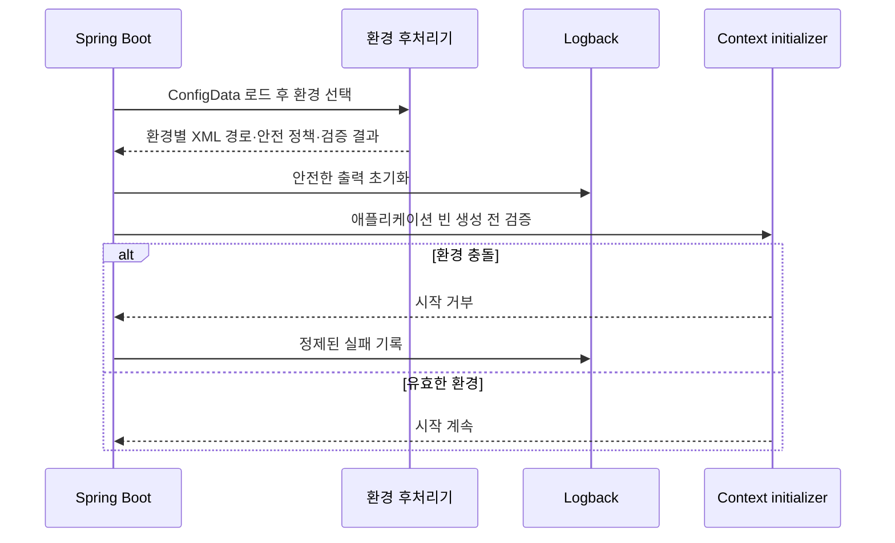
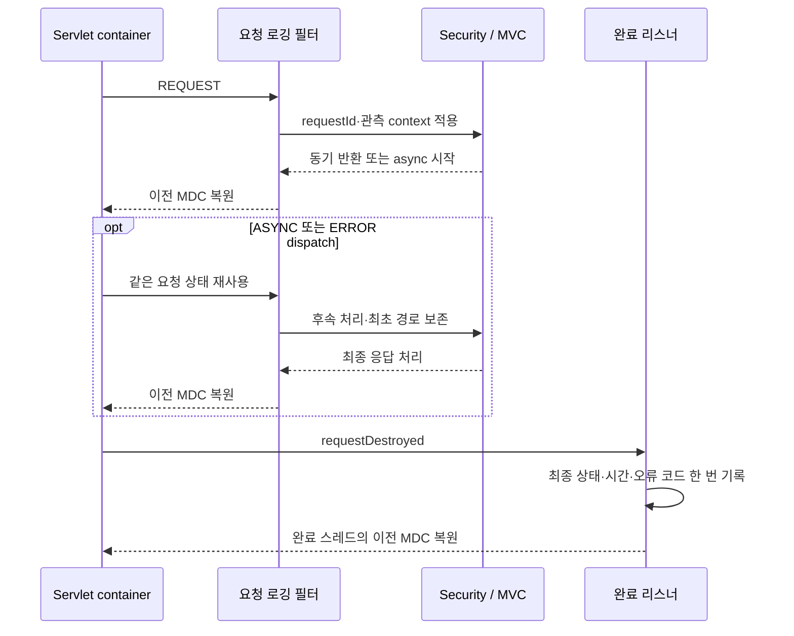

# 첫 설정 슬라이스 구현 기록

2026-09-18 공통 기반을 `77801ac9`로 커밋한 뒤 HTTP 요청 연결을 추가했다. 최신 동작은 아래 HTTP 연결 절과 DR-27을 따른다.

후속 예제 반영으로 타입 설정·요청 로그 객체·정제 분리를 추가했다. 아래의 최초 20개 테스트와 service.ready 단독 허용은 초기 단계 기록이며, 최신 내용은 마지막 절과 DR-24를 따른다.

2026-09-14. 설계는 `de130a92`로 먼저 커밋했다. 이후 사용자 요청에 따라 공통 로깅 설정과 테스트를 구현했다.

## 구현된 흐름

ConfigData를 읽은 뒤 로깅 환경을 선택하고 환경별 XML을 설치한다. 서로 다른 기본 환경이 충돌하면 외부 전송 OFF와 bootstrap XML을 먼저 적용하고, 안전한 로깅 초기화 뒤 애플리케이션 빈 생성 전에 시작을 거부한다.

`LoggingEnvironment`는 프로파일 선택 규칙만 가진다. `LoggingEnvironmentPostProcessor`와 `LoggingEnvironmentInitializer`가 Boot 초기화 순서를 연결한다. 수준과 출력 형식은 환경별 XML에 있으며 LogSanitizer의 정제 결과를 JSON·텍스트 formatter가 출력한다. Servlet·Security·AWS SDK 의존을 공통 설정에 추가하지 않았다.

`support:logging`은 kotlin-logging 8.0.4를 facade API로 제공한다. 직접 의존하는 실행 모듈에서 사용할 수 있으며 Logback·Sentry 구현 의존은 내부에 둔다. 기존 SLF4J 호출도 같은 formatter를 거친다.

## 출력과 설정의 경계

- 배포 환경은 JSON Lines, local/local-dev/test는 정제된 텍스트다. 텍스트에도 유효한 traceId/spanId를 남긴다.
- 기본 환경 충돌·DEPLOYMENT_ENVIRONMENT 불일치는 시작을 거부한다. test/local 상속과 dev/perf 조합을 구분한다.
- 로컬·테스트의 Sentry·OTLP 활성화 요청은 공통 정책에서 차단한다. 배포 환경의 기존 활성화 설정은 유지한다.
- `logging.config` 상위 설정으로 다른 XML을 지정해도 공통 XML을 사용한다. SQL 직접 출력과 SQL bind·HTTP wire logger를 차단한다.
- 현재 사건 허용 목록은 기존 `service.ready`뿐이다. 나머지는 `application.log`/`application.error`로 표시한다. 임의 message·argument·MDC·KV·예외 메시지를 출력하지 않는다.
- 예외는 제한된 타입·프레임만 남긴다. 임의 인자의 `toString()`도 호출하지 않는다. 상세 진단 메시지가 줄어드는 대가는 후속 사건별 코드·필드 정의로 보완한다.

ConfigData 이전의 YAML 파싱·파일 로드 실패는 아직 이 정책의 보장 범위 밖이다. Sentry의 기존 개인정보 필터는 유지했고 새로운 eventCode·fingerprint·연결 필드는 추가하지 않았다. HTTP 필터·비동기 전파·보존·알림·FireLens와 AsyncAppender도 다음 슬라이스다.

## 검증 결과

기존 코드에 실제 Boot 초기화 테스트를 먼저 추가해 5개 중 4개의 실패로 설정 공백을 확인했다. 구현 후 리뷰에서 고정 XML 우회와 첫 부팅 실패의 초기화 순서 문제를 발견해 각각 회귀 테스트를 먼저 추가했다. 새 JVM 테스트가 다른 테스트에서 남은 전역 Logback 상태를 사용하지 않게 했다.

- `:support:logging:test`: 20개 통과. 기존 6개와 신규 14개다.
- `./gradlew test ktlintCheck`: 전체 통과. 최종 실행 205개 task 중 24개 실행, 181개 up-to-date.
- 문서 링크·공백·커밋 전 시크릿/페어링 게이트 통과.
- 읽기 전용 code-reviewer와 qa-reviewer 재검토 통과.

검증에는 실제 Sentry 자동설정을 포함한 local-dev 비활성화, staging/dev-perf 부팅, 환경 충돌, logger 수준과 lazy message 평가, 출력 원문 차단, 최대 크기·원인 체인, 실패 대체 출력이 포함된다. 로컬 JDK 25를 사용했다. 외부 배포나 알림 전송은 하지 않았다.

## 예제 반영 후 동작

타입 설정과 RequestLogEntry/RequestLogWriter, 독립 LogSanitizer를 추가했다. 요청 요약은 kotlin-logging의 typed payload로 전달하고 JSON·텍스트에 안전한 고정 필드를 보존한다. 임의 Map·body 필드는 허용하지 않는다.

새 테스트는 실제 Boot의 Duration 설정 바인딩과 잘못된 값 거부, 설정된 예외 프레임·깊이 적용, 요청 필드 보존, slow 경계, health와 healthcare 구별, health 실패 기록, 임의 payload 차단을 확인한다. HTTP 필터의 자동 수집은 아직 구현하지 않았다.

예제 반영 최종 검증: 로깅 테스트 28개(이번 후속 작업에서 8개 추가)와 루트 `./gradlew test ktlintCheck` 통과. code-reviewer·qa-reviewer 모두 추가 필수 지적 없음. 경로 템플릿의 신뢰할 출처는 후속 HTTP 연결의 책임임을 README와 코드에 명시했다. 변경은 미커밋 상태다.

환경별 XML 유지 요청 반영: local/local-dev/dev/live XML을 복구하고 test/staging/dev-perf/bootstrap XML을 추가했다. 공통 encoder만 include로 공유하며 수준·형식·appender 연결은 환경별 파일이 소유한다. Kotlin enum의 수준·형식 필드는 제거했다. dev,perf와 perf,dev의 같은 파일 선택, test/local 상속, 잘못된 환경의 안전한 부팅 실패를 검증했다. code-reviewer 재검토 통과.

## HTTP 연결

core-api에 HTTP 필터·요청 상태·완료 리스너·매핑 인터셉터·오류 응답 메타데이터 연결을 추가했다. 응답 status/body는 바꾸지 않는다. Security의 401/403과 OAuth 리다이렉트도 필터를 통과하고, 비동기·오류 페이지 처리 뒤 요약을 남긴다. 경로는 등록된 최초 패턴이며 raw URI fallback은 없다.

requestId는 서버가 발급한다. 필터의 요청 스레드와 완료 리스너에서 context를 일시적으로 적용하고 기존 MDC를 복원한다. 실제 OTel sampling=0에서 핸들러와 완료 JSON의 trace 연결을 검증한다. 완료 로그는 HTTP span을 사용하며 내부 Security span과 ID가 다를 수 있다.

Servlet 처리 시간과 상태만 측정하며 마지막 네트워크 flush·클라이언트 수신 여부는 보장하지 않는다. 일반 비동기 작업 내부의 MDC 전파, ErrorType 재분류, S3·알림 배포는 아직 후속 범위다.

HTTP 단위·실제 서버 테스트 14개와 공통 로깅 테스트 29개, 루트 `test ktlintCheck`를 통과했다. 실제 400·404·500 및 Security 401·403, OAuth 리다이렉트, 직접 async complete·timeout·dispatch, body 보존과 requestId·trace 연결을 확인했다. code-reviewer와 qa-reviewer의 최종 판정은 PASS다. 로그 전달 성공·성능이나 외부 배포를 검증했다는 의미는 아니다.
