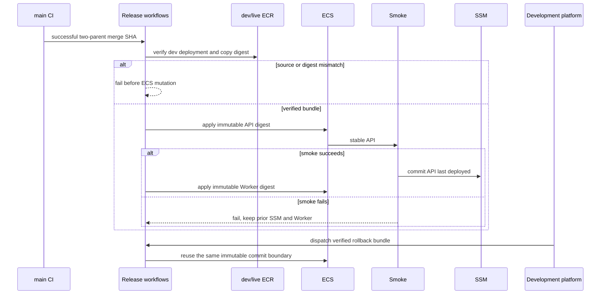
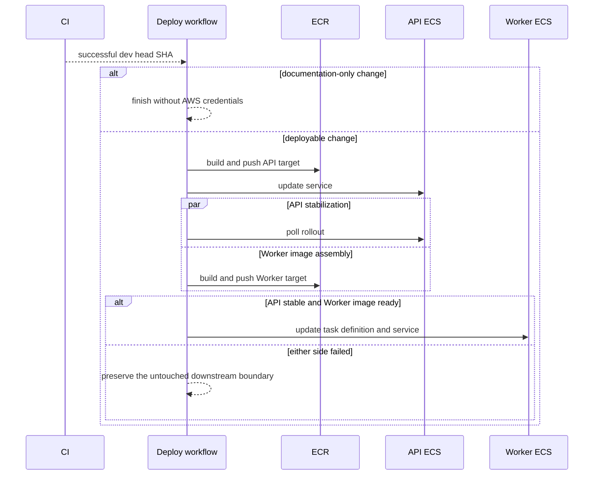

# MOI-432 결정 기록

## DR-001: dev 자동 배포는 CI `workflow_run`으로만 시작

- 결정: `Deploy AWS`는 `CI`가 dev에서 성공했을 때만 깨우고, checkout·이미지 태그 모두
  `github.event.workflow_run.head_sha`를 사용한다.
- 이유: `workflow_run` 자체의 `GITHUB_SHA`는 기본 브랜치 최신 커밋이므로 CI가 검증한 revision과
  다를 수 있다. branch filter뿐 아니라 원 이벤트가 내부 저장소의 `push`인지 검사해 권한 있는 배포 job이
  PR이나 fork의 head를 checkout하지 않게 한다.

## DR-002: live 재빌드 경로를 먼저 닫음

- 결정: main push 자동 배포 분기를 제거했다.
- 이유: dev에서 검증한 digest를 승격하기 전까지 main 재빌드를 유지하면 build once promote 불변식을
  계속 위반한다. live 승격 트리거와 승인자는 TBD이므로 이번 슬라이스에서 새 live 경로를 추측해 만들지 않는다.
- 후속 확정: DR-008이 자동 승격을, DR-015가 main 머지자 책임과 reviewer 없는 실행 정책을 정한다.

## DR-003: API 안정화와 Worker 이미지 조립을 같은 Buildx job에서 겹침

- 결정: API 이미지를 올린 runner에서 ECS API 배포를 시작한 직후 `core-worker` target 빌드를
  백그라운드로 실행하고 API 안정화 polling과 겹친다.
- 이유: 별도 job은 BuildKit 로컬 캐시를 잃고 공통 builder를 다시 실행할 수 있다. 같은 builder를 쓰면
  API target을 위해 이미 만든 두 bootJar를 Worker target이 재사용한다.
- 실패 경계: Worker 빌드 실패는 API 안정화를 취소하지 않는다. API가 안정화된 뒤 워크플로는 실패로
  표시되고 Worker SSM·task definition·service는 변경하지 않는다. API 이미지 SSM은 API 안정화 뒤에만
  갱신하되 Worker 결과를 기다리기 전에 커밋하므로 API 롤백 시 이전 메타데이터를 보존하고 Worker timeout이
  성공한 API 기록을 가리지 않는다. Worker 빌드는 15분 뒤 종료해 API 단계 전체를 무기한 점유하지 않는다.

## DR-004: bootJar 생성과 런타임 이미지를 분리

- 결정: 공통 `builder`가 API와 Worker bootJar를 한 Gradle 호출로 만들고, `core-api-layers`와
  `core-worker-layers`, `core-api`와 `core-worker` target이 각 애플리케이션만 소유한다.
- 이유: 빌드 비용은 공유하지만 최종 이미지와 배포 생명주기는 섞지 않는다.
- 구현 중 확인: Spring Boot 4 tools 추출은 입력 jar 파일명을 application layer에 유지한다.
  두 layer stage에서 입력을 `app.jar`로 정규화해 runtime COPY·ENTRYPOINT 계약을 같게 유지했다.

## DR-005: 문서 전용 변경은 첫 부모 diff로 판정

- 결정: CI head SHA와 첫 부모를 비교해 `docs/**`, `*.md`, `*.mdx`만 바뀌었으면 AWS job을 건너뛴다.
- 이유: 팀의 dev 병합 방식은 merge commit이므로 첫 부모 diff가 해당 PR 전체 변경을 포함한다.
- 재검토 조건: dev에 여러 커밋을 한 번에 직접 push하는 흐름을 허용하면 CI에서 변경 범위를 artifact로
  전달하거나 GitHub API의 push 범위를 사용하는 방식으로 바꾼다.

## DR-006: 완료 순서가 뒤집힌 과거 CI는 배포하지 않음

- 결정: change 판정은 concurrency 밖에서 실행하고 실제 deploy job에만 환경 락을 둔다. 락을 얻은 실행은
  GitHub Actions의 `CI` 성공·push 이력을 읽어 현재 dev first-parent 계보에서 가장 최신인 성공 revision을
  checkout하고 배포한다.
- 이유: `workflow_run`은 커밋 순서가 아니라 CI 완료 순서로 발생한다. 느린 과거 CI가 최신 배포 뒤에
  완료돼도 이전 revision으로 ECS를 되돌릴 수 없어야 한다. 반대로 최신 dev CI가 실패했을 때는 직전 성공
  revision을 막으면 안 된다. 문서 전용 workflow는 deploy job을 만들지 않아 pending 코드 배포를 대체하지 않고,
  pending 성공 실행끼리 대체돼도 남은 실행이 최신 성공 revision을 대신 배포한다.

## DR-007: 이미지 URI SSM은 각 ECS 경계가 성공한 뒤 갱신

- 결정: API SSM은 API 안정화 뒤, Worker SSM은 Worker 안정화 또는 desired count 0 서비스 갱신 뒤에만 쓴다.
- 이유: SSM의 의미가 `last deployed image URI`이므로 task definition 등록·롤아웃 실패 이미지가 기록되면 안 된다.

## DR-008: main 머지가 live 승격 요청을 자동 생성

- 결정: main 머지 시 live 승격 workflow를 자동으로 시작한다. 수동 dispatch는 재시도·긴급 운영용으로만 둔다.
- 승격 원본: main merge commit의 dev 부모와 runtime-equivalent인 가장 최신 dev 배포 bundle의 API·Worker immutable digest.
  dev 부모가 문서 전용 revision이라 자체 ledger가 없으면 first-parent 조상 중 runtime diff가 문서뿐인 최근 bundle을 선택한다.
- 격벽: dev와 live ECR repository 사이에서 manifest를 복사하고 digest 동일성을 확인한다. Docker build는 실행하지 않는다.
- 실패 정책: dev image marker·bundle ledger·main 계보 중 하나라도 맞지 않거나 runtime-equivalent bundle이 없으면
  live ECS를 변경하기 전에 실패한다.
- 실행 정책: main 머지 뒤 별도 reviewer 승인 없이 live 승격을 계속한다. CI·계보·digest 검증 실패는 fail-closed 처리한다.

## DR-009: 롤백 선택 UI는 팀 개발 플랫폼이 소유

- 결정: 팀 개발 플랫폼이 배포 이력을 보여주고 운영자가 rollback deployment bundle을 선택한다.
- deployment bundle: 환경, source SHA, API·Worker image digest, 적용 task definition, 성공 시각.
- 격벽: 브라우저는 AWS 자격 증명을 가지거나 ECS를 직접 호출하지 않는다. 플랫폼 백엔드가 사용자 권한과
  bundle을 검증한 뒤 GitHub rollback workflow를 호출한다.
- 실행 책임: GitHub workflow가 immutable digest 재검증, ECS 갱신, 안정화 확인, SSM commit, Slack 알림을 수행한다.
- 이유: 동적 후보 UI와 팀의 운영 권한·감사 이력을 기존 개발 플랫폼에 모으면서 배포 실행 권한은 CI 경계에 남긴다.
- 호출 권한: 정상 dispatch는 `MOIMYEON_DEVELOPMENT_PLATFORM_ACTOR` 한 계정만 허용하고, 수동 복구는
  명시된 break-glass actor와 필수 reason에 한정한다.
- 복원 단위: caller가 task ARN을 입력하지 않는다. SSM bundle ledger에서 과거 image digest와 exact task definition ARN을
  함께 읽어 현재 Terraform template과 섞지 않고 복원한다.

## DR-010: 배포 알림은 Slack Incoming Webhook 사용

- 결정: dev/live webhook을 분리하고 GitHub secret으로 관리한다. AWS 밖 시크릿만 GitHub에 남긴다는 원칙의 예외가 아니다.
- 메시지: 환경, 결과, API·Worker 상태, SHA·digest, 실행자·main 머지자, 소요 시간, run·진단 링크.
- 실패 정책: 알림 job은 `always()`로 실행하지만 Slack 실패가 배포 결과를 덮지 않으며 workflow warning을 남긴다.
- 전환 조건: thread 갱신·다중 채널·ChatOps 승인이 필요해질 때 bot API를 재검토한다.

## DR-011: blocking smoke는 readiness와 공개 DB read로 구성

- 결정: `/actuator/health/readiness`의 HTTP 200·`UP`, `/v1/terms`의 HTTP 200·공통 성공 응답 구조를 검사한다.
- 제한: 호출당 5초, 최대 3회, 전체 60초 이내. `/health`는 process-only라 blocking 목록에서 제외한다.
- live: traffic 전환 전 실패는 전환 금지, 전환 뒤 실패는 자동 롤백 신호로 연결한다.
- 후속: 인증 synthetic은 읽기 전용 전용 계정·토큰·정리 정책이 정해진 뒤 non-blocking workflow로 분리한다.

## DR-012: deployment controller를 ECS로 통일

- 결정: Core API와 Worker 모두 deployment controller는 `ECS`를 사용한다. 신규 CodeDeploy 제어면은 만들지 않는다.
- 전략: Core API는 native `BLUE_GREEN`, Worker는 ALB traffic 전환 경계가 없으므로 `ROLLING`을 사용한다.
- Core API 선행 조건: 두 target group, weighted listener rule, green 수용 용량, ECS infrastructure role,
  smoke lifecycle hook, CloudWatch rollback alarm.
- Worker 완료 조건: waiter 성공 뒤 요청 task definition이 PRIMARY인지 별도 검증한다.
- 문서 후속: 하네스의 `docs/knowledge/infra.md`가 이 브랜치에 합류하면 CodeDeploy 전제를 native ECS 결정으로 동기화한다.

## DR-013: Terraform은 PR plan과 승인된 exact-plan apply로 운영

- 결정: PR에서 fmt·validate·환경별 plan을 실행하고, merged SHA에서 다시 만든 exact plan만 승인 뒤 apply한다.
- 권한: resource mutation이 없는 plan OIDC role과 환경별 apply OIDC role을 분리한다. fork PR은 fmt·validate만 수행한다.
- plan 전달: raw plan은 공개 GitHub artifact에 두지 않는다. private S3 prefix에 SSE-KMS·24시간 이내 lifecycle로
  저장하고 SHA-256이 같은 artifact만 apply한다. PR에는 redaction한 위험 요약만 게시한다.
- 후속: apply 성공 뒤 GitHub variables를 동기화한다. live/shared는 매일, dev는 주 1회 drift plan을 실행하되 자동 apply하지 않는다.
- 안전 규칙: 로컬·에이전트 apply는 계속 금지한다.

## DR-014: 애플리케이션 시크릿은 사전 생성 SSM을 참조

- 결정: Google OAuth 등 AWS 내 애플리케이션 시크릿은 환경별 사전 생성 SSM SecureString을 원본으로 두고,
  Terraform은 parameter name/ARN과 task role 권한만 관리한다.
- 제외: 일반 sensitive `TF_VAR`로 값을 넘겨 Terraform state에 새 secret 값을 쓰지 않는다.
- 마이그레이션: 기존 state와 versioned state history에 값이 남았을 가능성을 전제로 전환 후 credential을 회전하고
  state bucket의 과거 version 접근 권한·보존 정책을 점검한다.
- 전환 조건: Terraform >= 1.11, provider `value_wo`, version counter와 복구 절차가 검증되면 ephemeral/write-only 소유를 재평가한다.

## DR-015: main 머지자가 live 애플리케이션 배포를 책임

- 결정: 일반 live 애플리케이션 배포에는 required PR approval과 GitHub Environment required reviewer를 두지 않는다.
- 책임 경계: 필수 CI를 통과한 변경을 main에 머지하는 행위가 배포 결정이며, 머지한 사람이 배포·smoke·알림 결과를 확인한다.
- 저장소 경계: PR은 변경 이력과 CI 연결을 위해 유지하고 main 직접 push는 허용하지 않는 방향으로 branch protection을 구성한다.
- `live-app`: main branch·OIDC·환경 변수 범위를 제한하지만 reviewer pause는 두지 않는다.
- 별도 고위험 경계: rollback은 개발 플랫폼 권한·확인 UI·감사 로그를 사용하고, Terraform apply는 `live-infra` 확인 경계를 유지한다.
- 보호 장치: build once promote, source digest fail-closed 검증, native ECS blue/green, blocking smoke, 자동 롤백, Slack 알림을 필수로 둔다.
- 문서 후속: 하네스의 `docs/knowledge/infra.md`가 이 브랜치에 합류하면 required-reviewer 불변식을 이 결정으로 갱신한다.

## DR-016: 승격·롤백은 같은 immutable ECS commit 도구를 공유

- 결정: 자동 live 승격과 개발 플랫폼 rollback은 `deploy-ecs-image.sh`를 공유한다.
- 입력 계약: ECS에는 tag가 아니라 `repository@sha256:digest`만 전달한다.
- commit 순서: task definition 등록 → ECS 안정화 → Core API smoke → SSM `last deployed` 갱신.
- 실패 보존: smoke나 SSM commit이 실패하면 이전 ECS task definition과 이전 SSM image를 복원한다.
- bundle 원자성: live promotion과 `scope=both` rollback에서 Worker가 실패하면 성공했던 API도 직전 bundle로 보상한다.
- 이유: UI·자동 workflow마다 다른 배포 bash를 복제하지 않고 동일한 성공·실패 경계를 사용한다.

## DR-017: live·rollback workflow는 Terraform 선행 전 fail-closed

- 결정: `MOIMYEON_LIVE_DEPLOY_ENABLED`와 `MOIMYEON_ROLLBACK_ENABLED`가 정확히 `true`일 때만 실행한다.
- 이유: native ECS blue/green, `live-app`·`dev-app` OIDC trust, promotion/rollback IAM role이 plan·apply되기 전에
  새 workflow가 기존 운영 리소스를 변경하면 안 된다.
- 활성화 책임: 다음 Terraform plan 승인·사람 apply·GitHub variables 동기화가 끝난 뒤 사람이 flag를 설정한다.
- 런타임 guard: flag가 실수로 먼저 켜져도 live API의 ECS `BLUE_GREEN`·alternate target group·listener rule·infra role과
  API/Worker의 `desiredCount > 0`을 `describe-services`로 확인하기 전에는 승격하지 않는다.

## DR-018: 배포 성공 marker tag가 rollback bundle을 증명

- 결정: API·Worker가 각자 안정화되고 smoke·SSM commit까지 끝난 뒤에만 `deployed-{env}-{sha12}` tag를 추가한다.
- 승격·롤백 입력: build 시점의 `{env}-{sha12}`가 아니라 deployment marker가 존재하는 image만 허용한다.
- 이유: image build 성공과 ECS deployment 성공은 다른 사실이다. marker가 없으면 개발 플랫폼과 break-glass가
  배포에 실패했던 image를 성공 bundle로 오인할 수 있다.
- marker 범위: dev의 API·Worker marker는 각 서비스 성공을 독립적으로 나타낸다. live promotion과 `both` rollback은
  두 marker가 모두 있어야 시작하고 Worker 실패 시 API를 보상해 bundle 분리를 남기지 않는다.

## DR-019: SSM bundle manifest가 배포 이력의 source of truth

- 결정: 성공한 배포마다 `/moimyeon/{env}/deployments/{sha12}`에 API·Worker image digest와 exact task definition ARN을
  하나의 JSON manifest로 기록한다. SSM LastModifiedDate를 성공 시각으로 사용한다.
- 불변성: 같은 key가 다른 내용으로 이미 존재하면 덮어쓰지 않고 실패한다.
- rollback 입력: 개발 플랫폼은 source SHA·환경·scope·reason만 전달한다. workflow가 ledger를 읽고 ECR marker digest와
  일치하는지 재검증한 뒤 exact task definition을 복원한다.
- 원자성: API·Worker가 모두 성공한 뒤 하나의 manifest를 commit한다. manifest commit 실패 시 live promotion은 두 서비스를
  직전 bundle로 보상한다. marker 생성·manifest 기록 중 어느 단계든 실패하면 같은 보상 경계를 사용하며,
  ledger가 없는 marker는 승격·rollback source로 인정하지 않는다.

## DR-020: ECR deployment marker를 registry 수준에서 보존

- 결정: Core API와 Worker ECR repository 모두 immutable tag 정책을 사용한다.
- lifecycle: 자동 만료는 untagged image의 7일 정리만 허용한다. `{env}-{sha12}` candidate와
  `deployed-{env}-{sha12}` marker를 함께 가진 image를 count-based rule로 구분할 수 없으므로 tagged image는 자동 만료하지 않는다.
- 이유: 협조적인 workflow 검사만으로는 marker retarget·삭제를 막을 수 없다. registry policy와 ledger를 함께 확인해야 한다.
- 권한: deployment role에 `ecr:BatchDeleteImage`를 주지 않는다. 이 권한은 candidate뿐 아니라 immutable marker도 삭제한 뒤
  다른 digest로 재생성할 수 있게 하므로 marker 신뢰 경계와 충돌한다.
- 비용: 배포되지 않은 tagged candidate도 보존된다. 두 명 규모의 현재 배포 빈도에서는 신뢰성을 우선하고,
  비용이 실제 문제가 되면 candidate 전용 repository를 분리한 뒤 그 repository에만 retention을 둔다.

## DR-021: AWS provider 6.x로 native ECS blue/green 구성

- 결정: AWS provider `~> 6.57`(lock 6.61.0)을 사용하고 live Core API ECS service strategy를 `BLUE_GREEN`으로 둔다.
- 리소스: alternate target group, weighted production listener rule, ECS load-balancer infrastructure role과 managed policy.
- ownership: ECS가 listener rule weight를 소유하므로 Terraform은 rule action drift를 무시한다. Worker strategy는 `ROLLING`이다.
- bake: 초기 5분. CloudWatch alarm threshold는 실제 baseline·실패 주입 결과가 나오기 전까지 빈 목록으로 두고 circuit breaker와 smoke compensation을 사용한다.

## DR-022: OAuth secret 값을 Terraform state 소유에서 분리

- 결정: 기존 dev SSM SecureString은 `removed { destroy = false }`로 AWS에 보존한 채 Terraform state 추적만 제거한다.
- 이후: Terraform은 `/moimyeon/{env}/core-api/GOOGLE_OAUTH_CLIENT_SECRET` ARN만 구성하며 값을 읽거나 입력받지 않는다.
- live: 최초 apply 전에 사람이 같은 경로의 SecureString을 생성해야 한다.
- 후속 운영: OAuth credential을 회전하고 versioned state 과거본의 접근·보존을 별도 점검한다.

## DR-023: 비민감 환경 설정의 source of truth는 Git

- 결정: `envs/dev/dev.tfvars`, `envs/live/live.tfvars`, `envs/shared/shared.tfvars` 세 파일만 Git에서 추적한다.
- 실행 경계: 공식 local·CI plan은 `terraform-command.sh`를 통해 환경 파일을 명시적인 `-var-file`로 전달한다.
  `terraform.tfvars`, `*.auto.tfvars`, 임의 `-var`·추가 var-file은 공식 실행 경로에서 거부한다.
- 로컬 예외: `local.override.tfvars`는 일회성 실험에만 쓰며 CI·승인 plan·apply의 입력이 아니다.
- 파생값: GitHub OIDC provider ARN은 AWS data source로 조회한다. ECR·ECS·SSM 이름과 ARN은 resource/output에서 계산한다.
- 보호: tracked tfvars 파일과 허용 key를 CI 계약으로 고정하고, pinned Gitleaks와 GitHub secret scanning·push protection을 함께 사용한다.

## DR-024: JWT와 신규 live DB password도 Terraform state 밖에서 소유

- JWT: 기존 dev `random_password`와 SSM resource는 `removed { destroy = false }`로 state 추적만 제거한다.
  dev/live task definition은 사전 생성 `/moimyeon/{env}/core-api/JWT_SECRET` ARN만 참조한다.
- live DB: 신규 RDS admin은 `manage_master_user_password = true`로 RDS가 Secrets Manager secret을 생성·회전한다.
  ECS에는 admin secret read를 주지 않는다. API·Worker는 별도 least-privilege `db_username`과 pre-created SSM
  `DB_PASSWORD`를 사용한다. bootstrap 후 사람이 admin credential로 app user/grant를 만든 뒤에만 ECS capacity를 올린다.
- rotation 격벽: RDS admin rotation은 앱 credential 수명과 분리된다. ECS `valueFrom`이 task 시작 때만 주입되는
  제약 때문에 회전하는 master password를 장기 실행 task에 직접 넣지 않는다.
- dev DB: 기존 RDS password와 SSM reference는 그대로 보존하며 Terraform이 값을 읽거나 변경하지 않는다.
- 마이그레이션 plan: 최초 dev forget plan은 과거 state 값을 포함할 수 있으므로 private artifact로만 취급한다. 적용 후 새 plan부터 값이 사라진다.

## DR-025: Terraform CI는 sanitized summary와 private exact plan을 분리

- PR: fork는 fmt·validate만 실행하고, 내부 PR은 OIDC plan role로 refresh한 뒤 resource address·action만 코멘트한다.
- PR 권한: 내부 PR도 Terraform 코드·script를 제어하므로 `terraform-review-plan` Environment required reviewer와
  self-review 방지를 지난 뒤에만 OIDC와 remote state read를 허용한다.
- drift 권한: schedule은 default branch 전용 `terraform-drift-plan` Environment와 별도 role로 자동 실행해
  PR approval 대기와 분리한다.
- artifact: raw binary plan과 checksum은 KMS-encrypted private S3 prefix에만 저장하고 GitHub artifact로 올리지 않는다.
- artifact trust: review, drift, merged apply-plan writer role을 분리하고 각각 `plans/pr/*`, `plans/drift/*`,
  `plans/apply/*`에만 create-only PutObject를 허용한다. 각 GitHub Environment의 서로 다른 OIDC subject를
  trust하며 role은 상대 prefix write·DeleteObject 권한이 없다.
- apply: dev push는 shared/dev, main push는 live의 merged SHA plan을 새로 만든다. 환경별 `*-infra` 승인 뒤 checksum이 같은 binary plan만 apply한다.
- CI gate: apply workflow는 push에 독립 발화하지 않는다. 내부 dev/main push의 `CI` 성공 `workflow_run`마다
  run-name과 plan source를 그 trigger SHA에 고정하고 shared/dev 또는 live plan을 만든다.
- 누락 방지: trigger commit의 first-parent Terraform diff만 보지 않는다. app/docs 후속 commit이 먼저 성공해도
  그 revision의 전체 Terraform config로 no-op plan까지 수행하고 실제 resource/output change가 있는 root만 apply한다.
- ordering: apply job이 환경 mutation lock을 얻은 뒤 최신 CI-successful branch revision을 다시 계산한다.
  요청 SHA가 더 이상 최신 성공 revision이 아니면 AWS apply credential 전에 stale run을 실패시킨다. stale run을
  boundary success로 보이면 그 run을 기다리던 app workflow가 newer Terraform apply보다 먼저 시작할 수 있기 때문이다.
- run identity: 과거 A-trigger run이 최신 B를 adopt하지 않는다. A와 B가 같은 B plan을 중복 생성해 GitHub pending
  concurrency가 B-title run을 대체하면 app waiter가 잘못 막힐 수 있으므로 run title·source·artifact SHA를 일치시킨다.
- queue: 같은 mutation/plan group은 `queue: max`로 pending run을 최대 100개 보존한다. 기본 single pending의
  새 run 교체로 latest boundary가 사라지는 문제를 막고, 실행 시 freshness 검사로 오래된 run을 실패시킨다.
- shared/dev ordering: dev push는 shared plan→shared apply→dev plan→dev apply 순서다. dev binary plan을
  shared 적용 전에 미리 만들지 않아 old shared state를 캡처하지 않는다.
- cross-workflow lock: dev/live Terraform apply는 app deploy·promotion·rollback과 같은 `deploy-aws-{env}` lock을,
  shared는 `terraform-shared` lock을 사용한다.
- app dependency: dev deploy와 live promotion은 같은 CI SHA의 `Terraform Apply {branch}@{sha}` run 성공을
  확인한 뒤 deploy job을 만든다. lock만으로 순서를 추측하지 않고 Terraform→app 순서를 명시한다.
- docs successor: candidate가 Terraform-ready가 된 뒤 더 최신 CI-success revision이 생겨도 candidate→latest tree diff가
  docs/Markdown뿐이면 runtime-equivalent candidate를 허용한다. runtime surface가 다르면 실패해 newer run이 처리한다.
- drift: 매일 shared/dev/live plan을 실행하고 resource change가 있으면 workflow를 실패시킨다.
- bootstrap: plan/apply role ARN, artifact bucket, KMS key ARN은 GitHub Environment/Repository variable로 사전 설정한다.
- output sync: 기본 `GITHUB_TOKEN`에는 Variables write permission이 없으므로 `dev-infra`·`live-infra`의
  `MOIMYEON_TERRAFORM_VARIABLE_SYNC_TOKEN`을 사용한다. 초기에는 최소 권한·짧은 만료 fine-grained token,
  개발 플랫폼이 준비되면 GitHub App installation token으로 교체한다.
- gate: `MOIMYEON_TERRAFORM_CI_ENABLED`가 정확히 `true`가 되기 전에는 AWS plan·apply job을 만들지 않고
  fork와 내부 PR 모두 fmt·validate·계약 검사만 수행한다. merged CI의 Terraform boundary는 실패로 끝내
  app deploy/promotion을 함께 freeze한다. 비활성 run을 app-ready success로 간주하지 않는다.
- 활성화 선행: dev JWT/OAuth state-forget bootstrap을 사람이 먼저 적용해 현재 state에서 secret-bearing object를 제거한다.

## 구현된 승격·롤백 흐름

## 구현된 시스템 흐름

## Terraform plan 판독

- Terraform 파일 변경 없음
- 자원 요약: `0 add / 0 change / 0 destroy`
- dev/live 리소스 영향: apply 대상 없음
