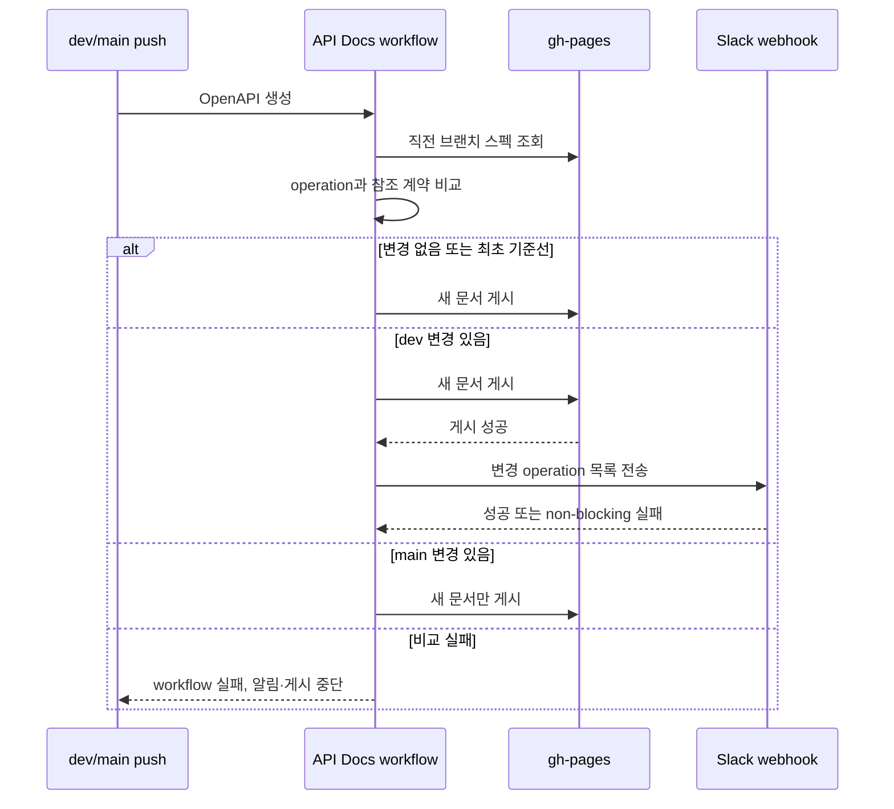

# MOI-484 구현 결정

## 요구사항

- 공개 API 계약이 실제로 달라진 머지에만 변경된 HTTP method·path 목록을 알린다.
- request/response의 공용 스키마 변경을 그 스키마를 쓰는 API까지 추적한다.
- 비교나 문서 생성 실패 시 부정확한 알림을 보내지 않는다.
- Slack의 가용성이 API 문서 게시 결과를 바꾸지 않는다.

## 개념과 격벽

- **공개 API 계약**: gh-pages에 마지막으로 게시된 브랜치별 OpenAPI 스펙이 비교 기준선을 소유한다.
- **API operation 변경**: method·path로 식별하며 operation, path-level 설정, 로컬 `$ref`로 도달하는 계약의 정규화 결과가 수명이다.
- **변경 알림**: operation 변경 목록과 GitHub 실행 문맥을 Slack 메시지로 옮긴다.
- **격벽**: 비교기는 파일 두 개만 받고 네트워크를 모른다. Slack 스크립트는 TSV 변경 목록만 받고 OpenAPI를 모른다.
  GitHub Actions가 gh-pages·Gradle·비교기·Slack·Pages 게시 순서를 조립한다.

## 비즈니스·시스템 흐름

## 구현 결정

1. **merge parent를 다시 빌드하지 않고 직전 gh-pages 스펙을 기준선으로 사용한다.**
   실제 소비자가 보던 계약과 비교하며 빌드를 두 번 하지 않는다. 이전 게시가 실패했다면 다음 성공 실행에서 누적 변경을 알린다.
2. **로컬 `$ref`를 재귀 확장해 operation fingerprint를 만든다.**
   공용 response schema 변경을 놓치지 않으며 사용되지 않는 component 변화는 제외한다. 순환 참조는 cycle 표식으로 종결한다.
   실행 시각처럼 매번 달라질 수 있는 OpenAPI 예시 키워드 `example`·`examples`와
   문서 표현인 `summary`·`description`은 계약 판정에서 제외한다.
   실제 schema property·header·security scheme·OAuth scope·server variable의 이름이 같으면 named-map 문맥으로 보존한다.
3. **최초 기준선은 알림하지 않는다.**
   배포 이력이 없는 브랜치에서 전체 endpoint를 신규 변경으로 보내는 잡음을 피한다.
4. **Slack은 Incoming Webhook 격벽으로 둔다.**
   webhook 값은 repository secret으로만 주입하며 payload는 `jq`로 만든다. 전송 실패는 경고로 남기고 Pages 게시 결과를 유지한다.
   Pages 게시 뒤에만 알림해 게시 실패 후 같은 push를 재실행해도 중복 전송하지 않는다.
5. **변경한 외부 Action은 full SHA로 고정한다.**
   workflow 기본 권한은 `contents: read`, gh-pages 게시 job만 `contents: write`를 가진다.
6. **Slack 변경 알림은 dev에서만 보낸다.**
   main은 브랜치별 API 문서를 계속 게시하지만 dev에서 이미 공유한 계약을 중복 알림하지 않는다.

## 2026-08-27 사용자 결정

- 프론트엔드·백엔드 공용 Slack 채널과 `SLACK_API_SPEC_WEBHOOK_URL` secret 준비 완료
- dev에서만 변경 알림 전송
- `summary`·`description` 변경은 알림 대상에서 제외
