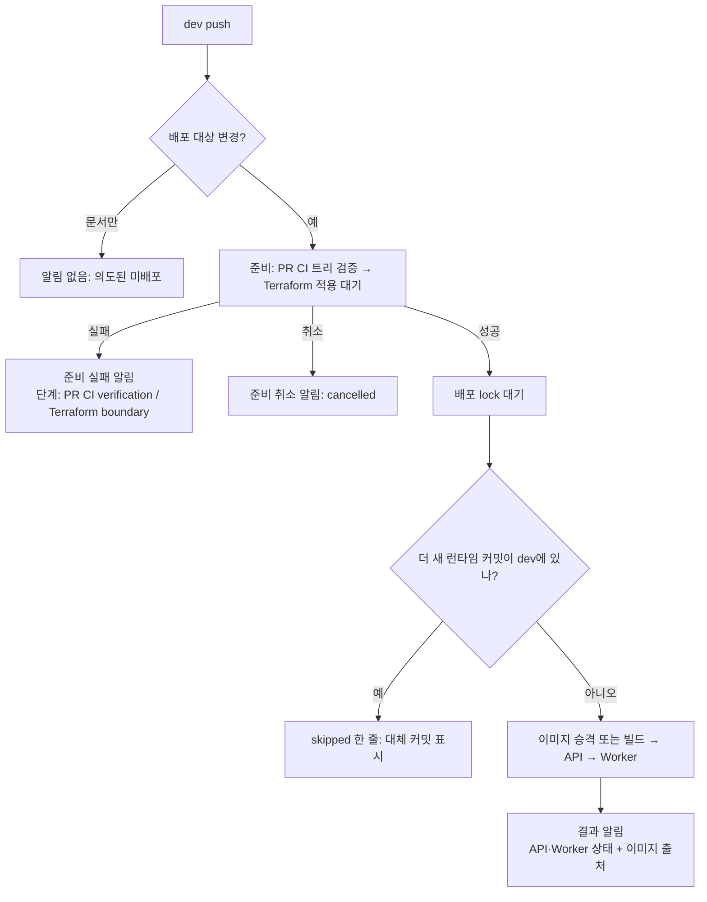
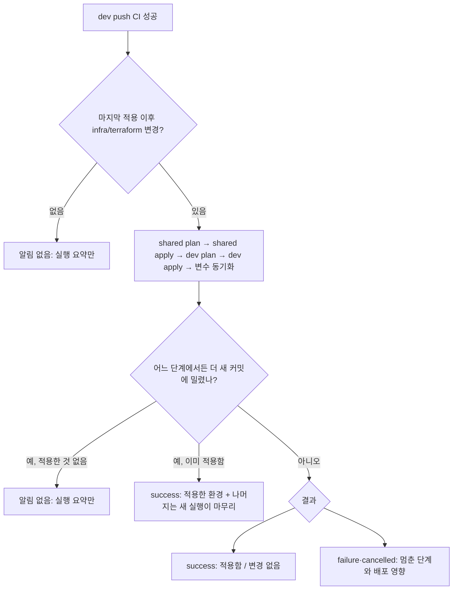

# MOI-490 1번 PR — dev 배포·Terraform 적용 알림 보완

## 배경

MOI-565로 dev 배포가 "dev push 즉시 시작 → PR CI 트리 검증 → 앞선 Terraform 적용 대기 → PR 이미지 승격"으로
바뀌었고, Terraform 적용은 배포와 따로 돈다. 이 구조에서 Slack 알림만으로는 다음을 알 수 없었다.

- 준비 단계가 왜 실패했는지 (PR CI 검증 실패와 Terraform 대기 실패가 같은 문구)
- 준비 단계 취소, 더 새 커밋에 밀려 건너뛴 배포 (알림 없음)
- Terraform 적용이 실패했는지 (Terraform Apply에는 알림이 없어, 배포 쪽에서 최대 90분 대기 뒤 시간 초과로만 보임)
- webhook이 설정되지 않았거나 전송이 실패했는지 (조용히 넘어감)
- Worker 이미지 빌드 실패 (Worker가 `skipped`로만 표시)

이 PR은 MOI-490 네 단계 중 첫 단계로, 저장소 안에서 끝나는 알림 보완만 다룬다. n8n 이력·AI 진단·PR 위험 요약은
후속 PR이다. live 알림 동작은 바꾸지 않는다(MOI-512).

## dev 배포 알림 흐름

- 이미지 출처: PR CI 이미지를 승격했으면 그 이미지를 만든 PR CI 실행(run·attempt) 링크, 아니면 "built during
  deploy" / "existing deploy image"(재시도) / "build failure"·"build cancelled"·"build not finished".
- Worker: API 안정화 뒤 Worker 빌드가 실패하면 `image-build-failed`, Worker 비활성이면 `disabled`.

## dev Terraform Apply 알림 흐름

- plan·apply·변수 동기화 공통 workflow는 밀린 실행을 `current=false`와 **job 실패**로 끝낸다. 그래서 밀림 여부를
  실패 판정보다 먼저 확인한다. 이를 위해 apply·변수 동기화 공통 workflow가 `current`를 출력한다.
- shared(또는 dev)를 이미 적용한 뒤 밀리면, 새 실행은 그 환경을 "변경 없음"으로 보므로 이 실행이 적용을 알린다.
- 변수 동기화는 배포가 기다리는 적용 기록(SSM)을 먼저 남기므로, 동기화 실패는 배포 지연을 단정하지 않는다.
- 실행이 job 사이에서 취소되면 뒤 job은 cancelled가 아니라 skipped로 남는다. 필요한 단계가 성공하지 않았으면
  "변경 없음"이 아니라 cancelled(멈춘 단계)로 알린다.
- main(live) Terraform 알림은 없다(MOI-512).

## 변경 전후

| 상황 | 전 | 후 |
| --- | --- | --- |
| webhook 미설정 | 조용히 성공 종료 | 성공 종료 + Actions 경고 + 실행 요약 |
| 전송 실패 | 스텝 실패(격리) | 같음 + 경고 + 실행 요약 |
| 준비 실패 | 한 문구 | 단계별 문구 |
| 준비 취소 | 알림 없음 | cancelled(멈춘 단계 표시) |
| 더 새 커밋에 밀린 배포 | 알림 없음 | skipped 한 줄 |
| Worker 이미지 빌드 실패 | Worker `skipped` | `image-build-failed` |
| Worker 비활성 환경 | Worker `skipped` | `disabled` |
| 이미지 출처 | 없음 | PR CI 실행 링크 / 배포 중 빌드 |
| dev Terraform 적용 결과 | 알림 없음 | 적용함·변경 없음·실패 단계·취소 |
| live 승격·rollback 알림 | — | 변경 없음(기존 입력의 payload 동일) |

알림 단계가 어디서 실패해도 배포·적용 결과를 덮지 않는다(알림 스텝·job 격리).

## 검증

- 신규 `notify-deployment-test.sh`: 기존 호출자 payload 전체 일치, 미설정·전송 실패, 단계·이미지 필드, Terraform
  필드, skipped 축약, dev 배포 결과 정리 5가지, Terraform 결과 판정 12가지(밀린 실행 5가지, job 사이 취소 2가지 포함), skipped rollback의 전체 메시지 유지
- 밀림 확인을 일부러 제거하면 테스트가 실패함을 확인
- 계약 검사 보강(`release-workflow-contract.sh`, `terraform-ci-contract.sh`), 기존 계약 검사 전부 통과, 약화 없음
- shellcheck 깨끗, actionlint는 dev 대비 새 지적 없음
- `./gradlew test ktlintCheck` 통과
- 리뷰: qa-reviewer·code-reviewer, Codex(gpt-6-astra) 지적 반영, 최종 qa-reviewer 게이트 PASS(권고 반영)

## 제한과 미확인

- 실패한 공통 workflow job의 출력이 호출 쪽 `needs.*.outputs`로 전달되는지는 실제 실행으로 확인하지 못했다.
  전달되지 않으면 밀린 실행이 실패로 잘못 알려진다(알림이 빠지지는 않는다).
- dev 채널 실제 수신은 머지 후 첫 배포에서 확인한다.
- 이 PR은 `infra/terraform/**`를 바꾸므로 PR Terraform plan이 돌고(변경 없음이어야 함), 머지 후 첫 Terraform
  알림은 "No infrastructure changes to apply"가 된다.
