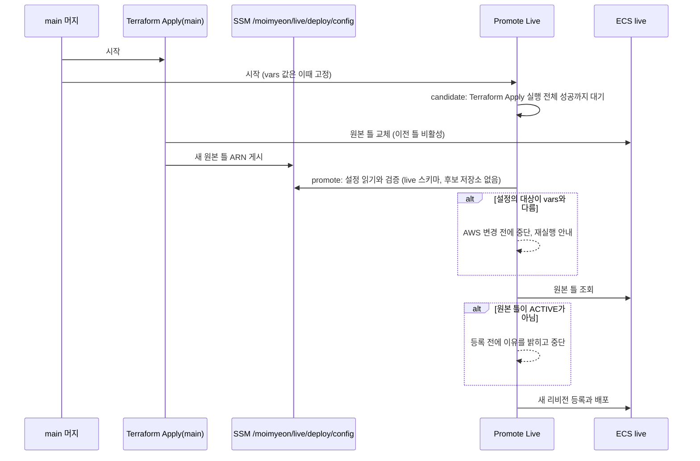

# MOI-512 변경 설명: live 승격이 원본 틀을 SSM에서 읽기

## 배경

2026-10-09 #183 릴리스의 첫 Promote Live가 실패했다. main 머지로 Terraform Apply와 Promote Live가 동시에
시작했고, Terraform이 live task definition 원본 틀을 `:2`에서 `:6`으로 바꿔 `:2`가 비활성화됐다. promote job은
Terraform이 끝난 뒤 시작했지만, GitHub 변수는 workflow 실행이 시작될 때 값으로 고정돼 `:2`를 읽었고,
비활성 틀을 복사해 등록하다 `deregisteredAt` 입력 오류로 멈췄다. 재실행으로 끝났다.
같은 사고가 2026-09-11 dev에서 있었고, dev는 MOI-565부터 Terraform이 SSM에 게시한 배포 설정을 읽는다.

## 처리 흐름

## 바뀌는 것

| | 전 | 후 |
| --- | --- | --- |
| live 원본 틀 출처 | 실행 시작 때 고정된 GitHub 변수 | Terraform 적용 뒤 SSM 배포 설정 |
| 원본 틀을 바꾸는 릴리스 | 첫 승격 실패, 재실행 필요 | 한 번에 승격 |
| 비활성 원본 틀 | AWS CLI 입력 오류로 실패 | 등록 전에 원인을 밝히고 중단 |
| 다른 대상(저장소, 서비스, app_url 등) | 변수만 사용 | 변수와 SSM 설정이 같은지 확인 |

## 배포와 제한

- live plan 예상: `aws_ssm_parameter.deploy_config[0]` 생성, live 배포 role 정책에 그 파라미터 읽기 1문장 추가.
  dev plan 예상: 변경 없음.
- Promote Live는 dev의 YAML과 main_sha의 스크립트를 함께 쓰므로, dev 머지 뒤 첫 승격은 이 PR을 포함한 릴리스여야 한다.
  그 전 소스를 승격하면 설정 읽기 단계에서 AWS 변경 전에 멈춘다.
- 파라미터를 만드는 적용 직후에는 IAM 반영 지연으로 읽기가 거부될 수 있다. 변경 전에 멈추며 재실행으로 해소된다.

## 검증

- `test_deploy_inputs.py`: live 설정 검증(후보 저장소 없음, live 리비전, dev 문서 거부), CLI 출력
- `deploy-ecs-template-test.sh`: 비활성 원본 틀은 등록 전 중단, ACTIVE면 등록 진행, 승격 workflow가 SSM 설정을 읽는지 계약.
  수정 전 스크립트로 돌리면 실패함을 확인
- 모듈 테스트, fmt, 계약 테스트, 하네스 게이트, actionlint(기존 경고 3건 외 없음). envs validate는 CI static에서 확인
- QA 리뷰 CONDITIONAL: 권고(대상 일치 범위 확대, ACTIVE 정상 케이스, README) 반영
