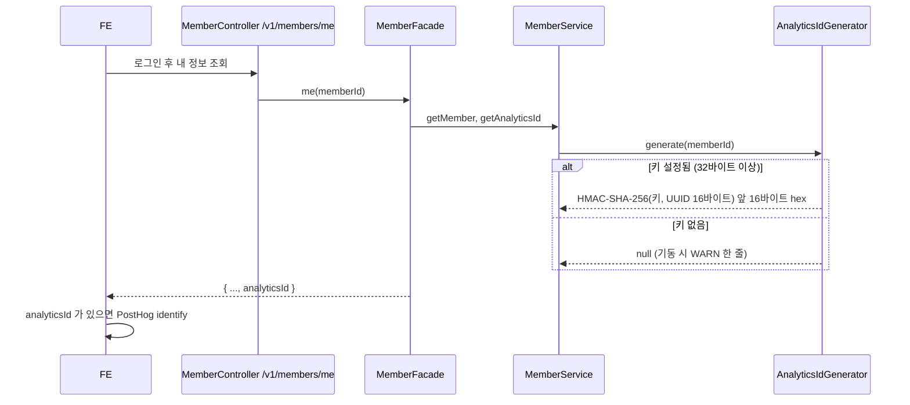
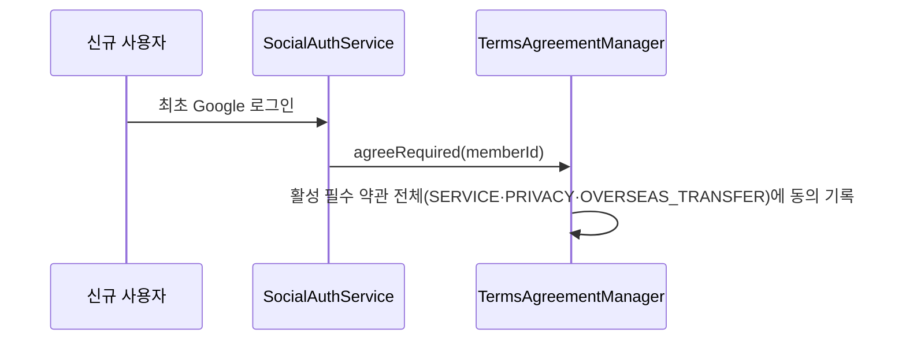

# MOI-521 변경 설명 (PR 2): analyticsId와 국외 이전 필수 약관

## 배경

그로스 사건(PR 3)을 PostHog로 보내려면 두 가지가 먼저 필요하다.

1. 서버 사건과 FE 화면 이벤트를 같은 사람으로 묶을 **가명 회원 식별자**(`analyticsId`, D6).
   원래 회원 ID를 외부로 보내지 않으려고 키로 해시한 값을 쓴다.
2. PostHog(미국)로 개인정보를 보내므로 **국외 이전 동의**. 가입 시 필수 동의로 받기로 했다(D13, PRD 「회원 및 프로필」 R180·R181).

## 처리 흐름

배포 시 Flyway `V36`이 국외 이전 약관 한 행(필수, ACTIVE, 2026-10-10 시행)을 넣고 기존 회원 전원에게 동의 기록을 남긴다.

## 바뀌는 것

| | 전 | 후 |
| --- | --- | --- |
| `GET /v1/members/me` | 회원·프로필 | + `analyticsId`(nullable) |
| `GET /v1/terms` | SERVICE, PRIVACY | + OVERSEAS_TRANSFER |
| 가입 시 동의 기록 | 2건 | 3건 |
| 기존 회원 | | 국외 이전 동의 기록 추가(V36) |
| 키 미설정 | | 기동 정상, `analyticsId` null |

## 제한

- 키 주입(Terraform)은 PR 4다. 그 전까지 dev의 `analyticsId`는 null이다.
- 약관 본문은 법률 검토 전 초안이다(D18). PostHog 연락처·보관 기간은 `[확정 필요]`로 표시했다. live 출시 전에 검토 결과로 새 버전을 낸다.
  시행 중인 처리방침 v1.1 §4·§5 표에 PostHog를 넣은 v1.2도 live 전에 필요하다(tbd 4).
- 기존 회원 일괄 동의는 정식 출시 전이라 가능한 처리다. 출시 후에는 쓰지 않는다(decisions 참고).
- 배포 중 이전 서버가 새 약관 종류를 읽으면 실패할 수 있다. 출시 전 dev라 감수한다.
- 로컬·테스트 `seed.sql`의 시행 시각은 2026-07-01이다(I10). 2026-10-10 이전으로 고정한 약관 테스트가 있기 때문이다.

## FE 전달 사항

- `GET /v1/terms`에 `OVERSEAS_TRANSFER`가 세 번째로 온다. 현재 FE는 가입 다이얼로그에 이용약관·처리방침 링크 2개를 고정 문구로 보여주고,
  약관 페이지는 종류를 `SERVICE | PRIVACY`로 고정한다. 화면은 깨지지 않지만 국외 이전 약관이 보이지 않은 채 서버에 동의가 기록된다.
  **live 전 FE에 국외 이전 약관 링크와 페이지 추가가 필요하다.**
- `analyticsId`는 null일 수 있다. 키 주입(PR 4) 전 dev에서는 항상 null이며, null이면 PostHog `identify`를 호출하지 않는다.

## 검증

- `./gradlew test ktlintCheck` 전체 통과. RestDocs(`MemberControllerTest`, `TermsControllerTest`) 로컬 통과, 스니펫에 `analyticsId`·`OVERSEAS_TRANSFER` 확인.
- `AnalyticsIdGeneratorTest`: 같은 회원 같은 값, 회원·키별 다른 값, 32자리 hex, 고정 기대값, 키 없으면 null, 짧은 키 거부.
- `OverseasTransferTermsMigrationIT`(MySQL): V36 약관 행·시행 시각, 탈퇴 포함 기존 회원 동의, 같은 약관이 이미 있으면 실패하고 아무것도 바꾸지 않음.
- 가입 시 세 약관 동의(`SocialAuthServiceIT`), 약관 목록 세 종류(`TermsHttpContextTest`).
- 컨벤션 리뷰 필수 1건(약관 RestDocs 종류 설명), DB 리뷰 권장 2건 반영.
- QA 리뷰 CONDITIONAL: FE 계약 영향·배포 노트를 이 문서와 PR 본문에 명시, 설정 객체 문자열에서 키를 가림.

## 관련 문서

- PRD: [회원 및 프로필 R180·R181](https://wiki.agent.plady.io/raw/product/회원-및-프로필/) (SSOT 동기화 완료)
- 결정: `.worklog/MOI-521-growth-logging/decisions.md` (D6·D13·D16·D18, I8~I15)
