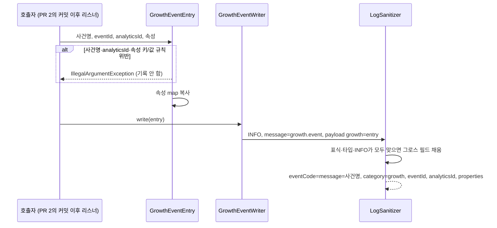

# MOI-521 변경 설명 (PR 1): 그로스 사건 기록 계약

## 배경

그로스 분석은 PostHog로 정했다(D1). 서버는 DB에 확정된 업무 사건 16개를 남기고(D3), 로그 수집기(Fluent Bit)가
S3와 PostHog로 함께 보낸다. 수집기에는 이미 `category=growth`인 INFO 줄을 S3 growth 경로로 보내는 분기가 있지만,
앱에는 그 줄을 만드는 방법이 없었다. `category`는 예약 필드라 일반 로그·MDC로는 넣을 수 없다(MOI-411).

이 PR은 사건을 기록하는 **계약만** 추가한다. 실제 사건 기록(PR 2), 수집기 전달·PostHog 전송(PR 3), 탈퇴 회원 삭제(PR 4)는 이어지는 PR이다.

## 처리 흐름

- 표식이 없거나 INFO가 아닌 로그에 들어온 엔트리는 그로스가 되지 않고, 그 key-value도 버린다(가명 ID 노출 방지).
- MDC·key-value로 `category`·`eventId`·`analyticsId`·`properties`를 넣어도 무시한다.

## 바뀌는 것

| | 전 | 후 |
| --- | --- | --- |
| 그로스 줄 만들기 | 방법 없음 | `GrowthEventWriter.write(GrowthEventEntry(...))`만 가능 |
| 속성 값 | 해당 없음 | Int·Long·Boolean·UUID·enum만. 문자열 불가 |
| 예약 필드 | `category` 등 21개 | `eventId`·`analyticsId`·`properties` 추가 |
| 기존 로그 출력 | | 변화 없음(새 예약 이름을 쓰던 곳 없음) |

출력 예: `{"eventCode":"room.created","message":"room.created","category":"growth","eventId":"…","analyticsId":"<32 hex>","properties":{"roomId":"…","minParticipants":3}, "environment":"dev", …}`

## 제한

- 현재 수집기 v2는 허용 목록 밖 필드를 버린다. 이 PR이 배포돼도 growth 줄의 `eventId`·`analyticsId`·`properties`는
  S3에 남지 않는다. PR 3의 수집기 v3에서 연다. 사건을 기록하는 코드도 아직 없어 실제 출력은 없다.
- 숫자 속성에 전화번호 같은 개인 식별 값을 넣지 않는 것은 형태 검사로 막을 수 없어 호출 지점 리뷰(PR 2)에서 확인한다.

## 검증

- `./gradlew test ktlintCheck` 전체 통과.
- `GrowthLoggingTest` 12개: 출력 필드, analyticsId 생략, 사건명·analyticsId·속성 키/값 거부, 원본 map 변경 무영향,
  예약 필드 주입 무시(일반 로그·그로스 기록 중 MDC), 표식 없거나 INFO가 아닌 엔트리 미승격·미노출, 로컬 텍스트 한 줄.
- 컨벤션 리뷰: 필수 0건. 권장 3건(문자열 금지, map 복사, 표식 없는 엔트리 버림) 반영.
- QA 리뷰: CONDITIONAL. 조건(리뷰 patch 재생성, 로깅 가이드 Wiki 갱신) 해결, 참고 중 INFO 수준 제한 반영.

## 관련 문서

- 결정: `.worklog/MOI-521-growth-logging/decisions.md` (D1~D17, I1~I7)
- Wiki: [로깅 가이드 그로스 사건 절](https://wiki.agent.plady.io/topics/t-moimyeon-로깅-아키텍처와-사용-가이드/), [그로스 로깅 결정 요약](https://wiki.agent.plady.io/sources/s-moimyeon-growth-logging-decisions/),
  [추천안 요약](https://wiki.agent.plady.io/sources/s-moimyeon-growth-logging-recommendation/)
