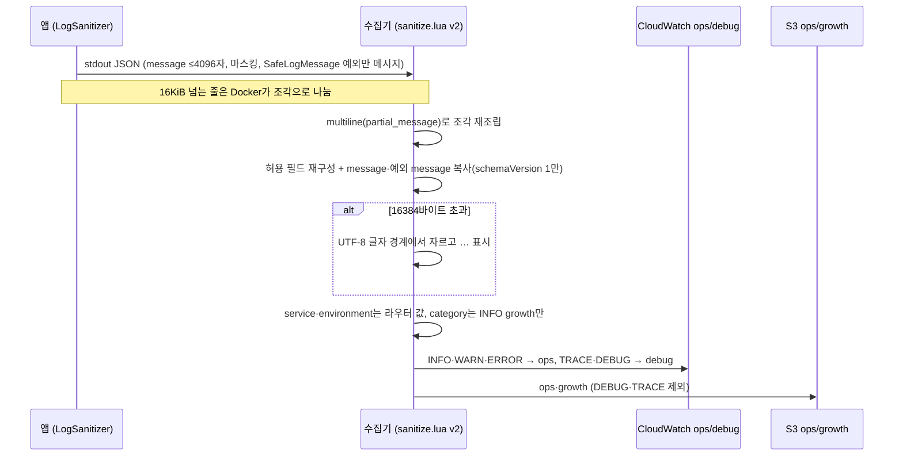

# MOI-527 변경 설명: 운영 로그에 메시지 전달

## 배경

live에서 오류가 나면 CloudWatch에 "어떤 예외가 어디서 났는지"(타입, 코드 위치)만
남고 "왜 났는지"(메시지)가 없다. 앱은 MOI-525부터 마스킹을 거친 메시지를 출력하지만,
로그를 CloudWatch·S3로 옮기는 수집기(Fluent Bit)가 MOI-411 때 허용 목록으로 메시지를
버린다. live에는 Sentry도 없고, Sentry 필터도 메시지를 지운다.

## 처리 흐름

잘못된 JSON, 일반 텍스트, 알 수 없는 스키마는 지금처럼 버린다.

## 바뀌는 것

| | 전 (v1) | 후 (v2) |
| --- | --- | --- |
| 로그 메시지 | 버림 | 전달 |
| 앱 예외(`SafeLogMessage`) 메시지 | 버림 | 전달 |
| 프레임워크·드라이버 예외 | 타입·코드 위치 | 같음(앱이 메시지를 넣지 않음) |
| body, 임의 MDC, 프레임의 허용 외 필드 | 버림 | 버림 |
| 16KiB 넘는 로그 줄 | 조각마다 파싱 실패로 통째로 유실 | 조각을 다시 합쳐 처리 |
| 과대 메시지 | 해당 없음 | 16384바이트에서 자름 |

## 배포

- 이미 배포한 v1 설정은 수정하지 않고 v2를 추가한다. 이전 task definition은 계속 v1을 읽는다.
- Terraform이 dev·live에 v2 설정 객체를 만들고 API·Worker task definition 틀을 교체한다.
  실제 적용은 다음 배포(dev push, live는 main 머지 후 승격)부터다.
- 되돌리기: 이전 배포 기록의 task definition(v1 설정 참조)으로 롤백하거나, revert PR.

## 제한

- S3 ops 보관본(90일)에도 메시지가 남는다. 개인정보 방어는 앱의 마스킹과 호출 지점 규칙이 맡는다.
- smoke는 실제 AWS 수신을 증명하지 않는다. dev 배포 후 requestId로 CloudWatch를 조회해 확인한다.

## 검증

- 모듈 tftest: v1·v2 설정 보존, 새 task가 v2를 읽음
- 실제 Fluent Bit smoke: 메시지·예외 메시지 전달, 예약 필드 덮어쓰기 불가, 조각 재조립, UTF-8 자름(상한 정확히·4바이트 문자·비문자열),
  기존 차단·분류·복구. 같은 smoke를 v1에 돌리면 실패하고, 재조립 필터를 빼면 실패함을 확인
- QA 리뷰(CONDITIONAL) 지적 반영: 16KiB 조각 재조립, schemaVersion 한정, 경계 테스트 추가.
  live 틀 교체 영향 확인: Terraform 틀은 API·Worker `:2`, 실행 중은 파이프라인 리비전(`:5`, `:3`)이라 교체돼도 실행·롤백 대상은 그대로
- 계약 테스트, 하네스 게이트, logging 모듈 테스트
