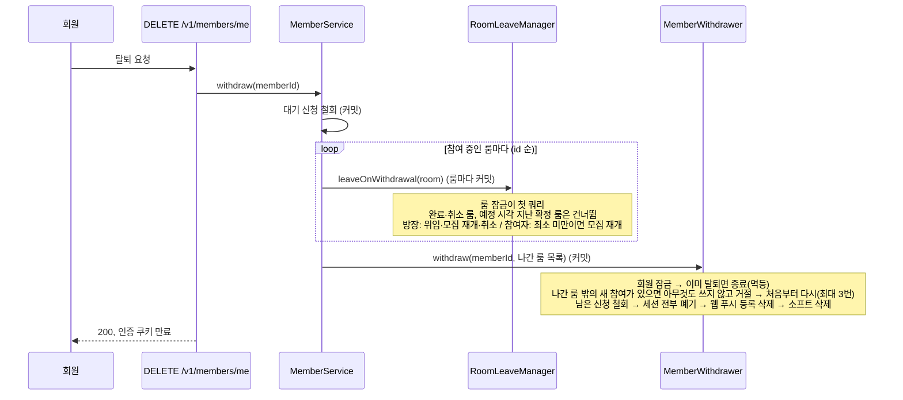
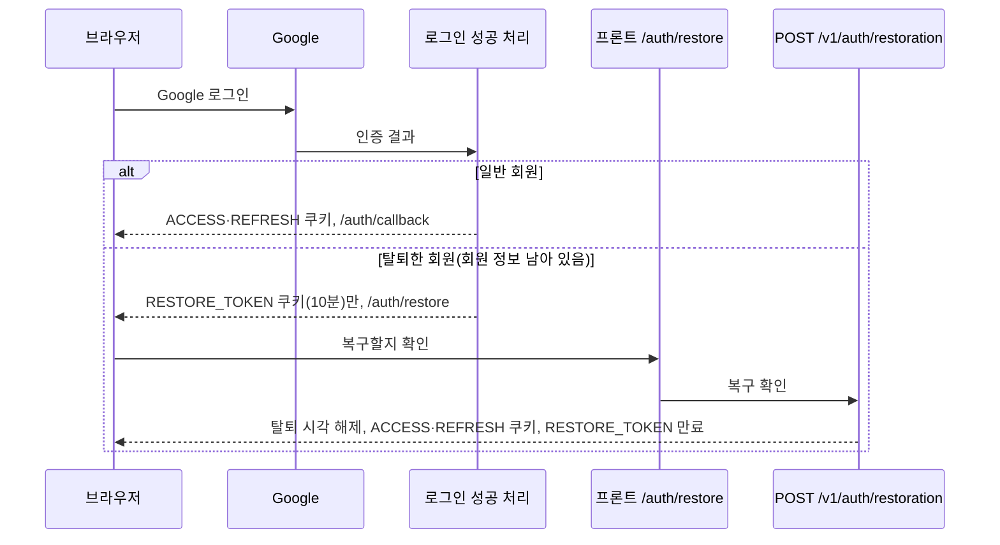

# MOI-540 변경 설명: 회원 탈퇴와 재로그인 복구

두 PR로 나눠 올린다. ① 탈퇴(`feat/MOI-540-member-withdraw`) → ② 복구(`feat/MOI-540-member-restore`).
둘 다 MOI-561(#146, 확정 룸 참여자 이탈 시 모집 재개) 위에 쌓인다.

## 배경과 이유

실서비스에 회원 탈퇴가 없었다. PRD 「회원 및 프로필」 §4.8 은 활성 룸이 있어도 즉시 탈퇴를 허용하고(R95),
방장이면 방장 나가기 로직이 동작한다고 정한다(R96). 2026-10-02에 비어 있던 정책을 정해 Wiki에 반영했다.

- 탈퇴 요청 한 번으로 대기 신청 철회·활성 룸 나가기·모든 기기 로그아웃·웹 푸시 등록 삭제를 처리한다(R169~R172).
  "직접 다 나온 뒤 탈퇴"는 룸별 결과가 같고 수고만 늘어 택하지 않았다. 영향은 탈퇴 전 화면에서 안내한다(R94).
- 진행 예정 시각이 지난 확정 룸은 나가지 않는다(R170). 면접이 열렸을 수 있어 "확정 후 이탈"로 남기면 사실과 다르다.
- 탈퇴한 Google 계정으로 다시 로그인하면 확인을 거쳐 계정을 복구한다(R174~R178). 이용 제한은 탈퇴와 별개 값이라
  복구 뒤에도 남는다(DEC-013).
- 7일 이력서 삭제·30일 개인정보 마스킹은 런칭 이후 MOI-562에서 한다.

## ① 탈퇴: 처리 흐름

**한 트랜잭션으로 묶지 않은 이유.** 한 트랜잭션에서 여러 룸을 차례로 잠그면 MySQL 기본 격리 수준에서 뒤 룸의 조회가
앞서 만든 스냅샷을 봐, 다른 요청이 방금 커밋한 나가기·내보내기를 덮어쓴다. 격리 수준을 낮추는 방법은 규칙을 설정 한 줄에
숨겨 택하지 않았다. 룸마다 따로 커밋하면 사용자가 나가기를 누를 때와 같은 경로를 탄다(DEC-016).
대신 탈퇴 전체가 하나로 묶이지 않는다. 중간에 실패해도 각 단계는 정상 상태이고, 다시 요청하면 남은 룸부터 이어서 끝난다.
룸을 나가는 사이 본인이 다른 탭에서 룸을 만들거나 신청이 수락되면, 회원 정리 단계가 회원을 잠근 뒤 이를 감지하고 처음부터
다시 돈다. 세 번 시도해도 끝내지 못하면 409(E1014)로 다시 시도를 요청한다.

## ② 복구: 처리 흐름

- 복구 확인 토큰은 액세스 토큰과 같은 키로 서명하므로 `purpose` claim 으로 구분한다. 액세스 토큰 검증은 `roles` 가
  있어야 통과시켜, 복구 토큰을 Bearer 로 보내도 API 인증이 되지 않는다.
- 복구 API는 `Content-Type: application/json` 요청만 받는다(아니면 400). 다른 사이트가 폼·단순 요청으로 대신 보내는 것(CSRF)을 막는다.
- 쿠키가 없거나 10분이 지났거나, 토큰을 받은 뒤 다시 탈퇴했다면 401(E1105). 프론트는 다시 로그인으로 보낸다.
  이미 복구된 회원의 재요청은 로그인만 다시 된다(멱등).
- 복구 확인 화면 주소는 프로파일별 고정값이다(live `moimyeon.plady.io/auth/restore`, dev `dev.moimyeon.plady.io/auth/restore`).

## 변경 전후

| 상황 | 전 | 후 |
| --- | --- | --- |
| 탈퇴 요청 | API 없음 | `DELETE /v1/members/me` 200, 쿠키 만료 |
| 탈퇴 직후 같은 토큰으로 다시 탈퇴 | - | 200(아무것도 하지 않음) |
| 확정 룸의 방장이 탈퇴 | - | 다음 참여자에게 위임, 모집 중으로 복귀 |
| 예정 시각 지난 확정 룸의 참여자가 탈퇴 | - | 참여자로 남고 "탈퇴한 회원"으로 표시 |
| 탈퇴한 계정으로 Google 로그인 | `?authError=login_failed` (재가입 차단 E1001) | 복구 확인 화면 → 확인하면 로그인 |
| 탈퇴 작성자 표시 | "탈퇴한 회원" / "탈퇴한 사용자" / "탈퇴 회원" 혼재 | "탈퇴한 회원" |

남는 제약: 탈퇴 직후 이미 발급된 액세스 토큰은 최대 30분 유효하다. 쿠키는 응답에서 만료되고, 회원을 조회하는 요청은
탈퇴 회원을 빼고 찾아 실패한다(결정 15).

프론트 영향: 탈퇴 버튼과 사전 안내(영향받는 룸·신청 목록), E1014 시 다시 시도 안내, `/auth/restore` 복구 확인 화면,
복구 API 호출(`credentials: include`, `Content-Type: application/json`), E1105 처리, 표시 문구 "탈퇴한 회원".

## 검증

- `./gradlew test ktlintCheck`, `restDocsTest` 통과(두 PR 각각의 최종 상태)
- 탈퇴: 서비스 흐름 순서, 룸 단위 판정 경계(예정 시각 정각·직전), 방장·참여자·혼자 방장 IT, 회원 정리 커밋 롤백 IT
- 탈퇴: 새 참여 감지 후 재시도·3회 실패 시 E1014
- 복구: 토큰 왕복·만료·위조·용도 분리 양방향, 로그인 분기, 복구 후 이용 제한 유지, 재탈퇴 뒤 토큰 거절, 나간 룸 미복구 IT,
  실제 보안 필터 체인을 거친 복구 요청(만료된 액세스 쿠키 동반 200, 위조 토큰 E1105)
- 리뷰: db-reviewer·code-reviewer 지적 반영(필수: 룸 잠금 뒤 낡은 스냅샷 → 룸 단위 커밋으로 해소),
  qa-reviewer 권고 반영(탈퇴 중 새 참여, 복구 CSRF, 토큰 재사용, 필터 체인 테스트)

## 관련 명세 (team-wiki)

- 「회원 및 프로필」 R89·R94·R96·R97·R128 개정, R168~R179 신설 / 「룸 진행」 R55·R85 문구
- 상태 SSOT: `D.member.withdrawn`, `G/C/T.member.restore`, `X.withdraw.leave_active_rooms`, DEC-013~017
