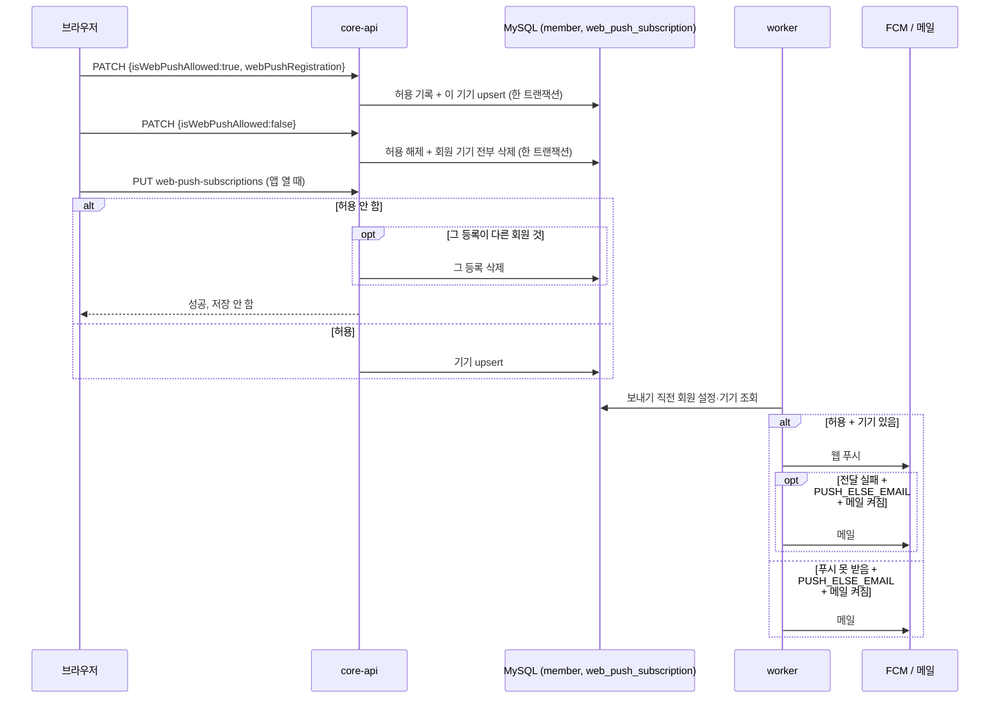

# MOI-544 알림 수신 설정 — 변경 설명

## 배경과 이유

- 웹 푸시를 한 번 허용하면 서비스 안에서 끌 방법이 없었고, 메일도 같았다.
- 회원이 "서비스 활동 알림(웹 푸시)", "서비스 활동 알림(메일)", "광고성 정보 수신"을 켜고 끌 수 있게 한다(회원 PRD §4.10, 설정 화면까지 MVP).
- 알림마다 정해 둔 발송 정책(PUSH_ONLY · PUSH_ELSE_EMAIL · PUSH_AND_EMAIL · EMAIL_ONLY)은 바꾸지 않는다. 수신 설정은 회원이 받지 않는 채널을 **보내기 직전에** 뺄 뿐이다. 그래서 알림을 만드는 쪽(`NotificationComposer`)은 그대로다.
- 웹 푸시는 "회원이 끄지 않았는가"(`is_web_push_allowed`)만 저장한다. 실제 수신은 기기(브라우저) 등록이 함께 있어야 한다. 끄면 모든 기기 등록을 지우고, 끈 동안 들어온 기기 등록 요청은 받지 않는다 — 다른 기기의 브라우저 권한은 서버가 지울 수 없어 등록이 다시 올 수 있기 때문이다.

## API (전후)

| 전 | 후 |
| --- | --- |
| `PUT /v1/members/me/web-push-subscriptions` 기기 등록 | 같은 경로·요청. 웹 푸시를 끈 상태면 저장하지 않고 성공 |
| `DELETE /v1/members/me/web-push-subscriptions` 기기 하나 해지 | 제거. 끄기는 아래 PATCH 가 맡는다 |
| 없음 | `GET /v1/members/me/notification-setting` 조회 |
| 없음 | `PATCH /v1/members/me/notification-setting` 보낸 항목만 변경. 켤 때는 `webPushRegistration` 동봉 |

응답 필드: `isWebPushAllowed`, `isActivityEmailEnabled`, `isMarketingEmailAgreed`, `marketingEmailAgreedAt`.

## 실제 처리 시퀀스

- 끈 회원의 기기 등록 갱신이라도 그 등록이 다른 회원 것이면 지운다. 같은 브라우저를 쓰던 앞사람의 알림이 계속 뜨지 않게 한다.
- 빈 PATCH, `isWebPushAllowed=true` 인데 토큰 없음, 켜지 않으면서 토큰만 보냄 → 400 `E400`. 토큰 공백 → 400 `E1601`.
- 켜기 중 기기 등록이 실패하면 허용 기록도 롤백된다(같은 트랜잭션, 테스트로 재현하지 않음).

## 변경 전후 결과

| 회원 설정 | PUSH_ONLY (후기·댓글) | PUSH_ELSE_EMAIL | PUSH_AND_EMAIL |
| --- | --- | --- | --- |
| 푸시 받음 · 메일 켜짐 (기존과 같음) | 푸시 | 푸시, 안 닿으면 메일 | 푸시 + 메일 |
| 푸시 못 받음 · 메일 켜짐 | 없음 | 메일 | 메일 |
| 푸시 받음 · 메일 꺼짐 | 푸시 | 푸시만 | 푸시 |
| 둘 다 꺼짐 | 없음 | 없음 | 없음 |

- 기존 회원은 V32 컬럼 기본값으로 웹 푸시 허용·메일 켜짐·광고 미동의가 된다. 따라서 배포 직후 발송 결과는 기존과 같다.
- 광고성 정보는 동의 여부와 마지막 동의 시각만 저장한다. 발송 기능과 2년 재확인은 범위 밖이다.
- `MemberEntity` 에 `@DynamicUpdate` 를 붙였다. 전체 컬럼 UPDATE 로 로그인 같은 다른 쓰기가 수신 설정(특히 광고 철회)을 옛 값으로 덮는 것을 막는다.

## 프론트 영향

- `DELETE /web-push-subscriptions` 호출 제거. 로그아웃 때 이 호출로 이 브라우저 등록을 풀고 있었다면 대신 FCM `deleteToken()` 을 부른다(무효 토큰은 다음 발송 때 worker 가 지운다).
- 켜기: 브라우저 허용 → `PATCH` 에 `isWebPushAllowed=true` + 이 브라우저 토큰. 끄기: `PATCH` 에 `isWebPushAllowed=false`(필요하면 브라우저에서 `deleteToken()`).
- 앱을 열 때: `GET` 후 허용 상태이고 권한이 있으면 `PUT /web-push-subscriptions`.
- 화면의 웹 푸시 토글은 `isWebPushAllowed` + 브라우저 권한 + 이 브라우저 등록 여부로 정한다. 둘 다 끌 때 "중요한 소식도 받지 못한다" 안내.

## 배포 순서

- core-api(Flyway V32) 먼저, worker 나중. worker 는 Flyway 를 돌리지 않아 먼저 뜨면 새 컬럼이 없어 회원 조회가 실패한다.

## 알려진 제한

- 끄기와 기기 등록 갱신이 동시에 오면 끈 뒤 토큰 한 건이 남을 수 있다(받아들임, 발송은 허용값을 보므로 나가지 않음).
- 끄기와 "같은 브라우저를 다른 계정으로 넘기는 등록"이 동시에 오면 드물게 InnoDB 교착으로 한쪽이 500 을 받을 수 있다(정합성 유지).
- 끈 회원의 기기 등록 갱신이 앞사람 등록을 지우는 사이 worker 가 같은 무효 토큰을 먼저 지우면 그 요청이 드물게 500 을 받는다(정합성 유지, 다음 갱신에서 정상).

## 검증

- `./gradlew test restDocsTest ktlintCheck :core:core-api:openapi3` 통과.
- `NotificationSettingServiceIT`(DB 포함 10건), `ResponseSerializationContractIT`(수신 설정 요청·응답 이름 2건 추가), `NotificationSettingServiceTest`(흐름 5건), `NotificationSettingControllerTest`(RestDocs 13건), `ChannelNotificationSenderTest`(설정 조합 5건 추가), `MySqlSchemaValidationIT`(MySQL 8.4 + Flyway V32, 기본값 검사).
- 리뷰: code-reviewer 필수 0(권장 4 반영), db-reviewer 중간 1(`@DynamicUpdate`) 반영, qa-reviewer 필수 2(다른 회원 등록 정리, 직렬화 계약 테스트)·권고 2(배포 순서, 401 테스트) 반영.

## 관련 문서

- 명세: Wiki 회원 및 프로필 PRD §4.10(R137~R167), 상태 SSOT `P.notification.receive_setting`.
- 결정: `decisions.md`, 설계 기록: `design.md`, 명세 대조: `wiki-sync.md`.
