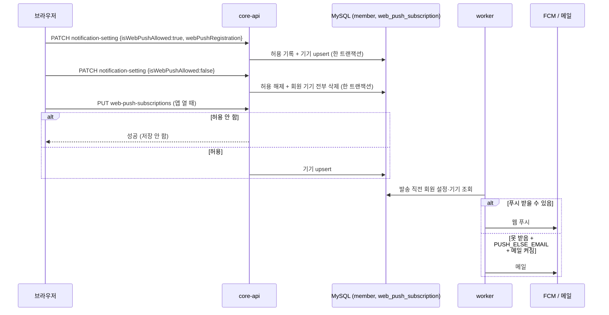

# MOI-544 설계 기록 — 구현을 따라 갱신한다

구현 전에는 요구사항과 자연어 흐름만 적는다. 개념·컴포넌트는 슬라이스가 동작한 뒤 채운다.

## 요구사항 (회원 PRD §4.10)

- 회원은 서비스 활동 알림(웹 푸시)·서비스 활동 알림(메일)·광고성 정보 수신을 켜고 끈다.
- 발송 정책은 알림마다 정해져 있고, 수신 설정은 받지 않는 채널을 뺄 뿐이다.
- 웹 푸시는 끈 여부만 저장한다. 끄면 모든 기기 등록을 지우고, 끈 동안의 기기 등록 요청은 받지 않는다.
- 광고성 정보는 처음(또는 다시) 동의할 때 시각을 남기고, 철회해도 그 시각은 지우지 않는다.

## 자연어 흐름 (테스트로 옮길 메모)

- 발송: worker 가 보내기 직전에 회원의 웹 푸시 허용·메일 설정을 읽는다. 푸시는 허용이고 기기가 있을 때만, 메일은 켜져 있을 때만 나간다. 푸시가 안 닿아 대신 보내는 메일도 메일 설정을 따른다.
- 변경: 보낸 항목만 바뀐다. 웹 푸시 켜기는 허용 기록과 이 기기 등록이 한 커밋이다 — 등록이 실패하면 허용 기록도 남지 않는다. 끄기는 허용 해제와 기기 전부 삭제가 한 커밋이다.
- 갱신: 허용하지 않은 상태면 아무것도 남지 않고 성공한다. 아니면 이 기기 등록이 남는다.
- 조회: 저장된 값 그대로. 웹 푸시는 "켜져 있는가"로 뒤집어 보여 준다.

## 개념과 격벽 (구현 기준, 2026-10-02)

| 개념 | 수명·소유 | 코드 |
| --- | --- | --- |
| 알림 수신 설정 | 회원과 같다(가입~탈퇴). 저장은 `member` 행 컬럼, 규칙은 알림 개념 | `core.domain.notification.NotificationSetting`·`NotificationSettingChange`·`WebPushChange` |
| 웹 푸시 구독(기기 등록) | 기기마다 따로 생기고 물리 삭제된다. 회원당 0..N | `WebPushSubscriptionManager`(`register` upsert·해시 충돌 검사, `unregisterAll`), `web_push_subscription` |
| 알림 수신자(worker) | 발송 한 번 동안만 존재하는 읽기 모델 | `worker...delivery.NotificationRecipient` |

- 상태: "웹 푸시 허용", "광고성 정보 동의"는 수신 설정이 가진 값이지 개념이 아니다.
- 행위: 켜기·끄기·갱신은 수신 설정에 속한 행위다. 켜기·끄기는 기기 등록 개념까지 한 커밋으로 건드린다.
- 무개념: FCM·SES/Gmail 은 그대로 worker 바깥 클라이언트 모듈에 있다. 이번 변경은 그 앞에서 채널을 거른다.
- 참조 방향: 알림 개념(`NotificationSettingFinder`·`Manager`)이 `MemberRepository` 를 직접 본다. 수신 설정 값이 회원 행에 있기 때문이며, 회원 개념의 로직 클래스는 거치지 않는다(회원 쪽에 위임할 규칙이 없다). 회원 개념은 알림을 모른다.
- worker 는 core-api 를 모르고 db-core 의 `MemberEntity` 에서 같은 값을 읽는다.

## 비즈니스 흐름과 실패 시 남는 것

- 변경(`PATCH`): 요청 → `toChange()`(빈 요청·짝 위반 E400, 등록 식별자 공백 E1601) → `NotificationSettingManager.change` 한 트랜잭션 → 재조회 응답.
  - 켜기: 허용 기록 → 기기 upsert. upsert 가 실패하면 허용 기록도 롤백된다(같은 트랜잭션). 이 실패 경로는 자연스럽게 일으킬 방법이 없어 테스트하지 않았다.
  - 끄기: 허용 해제 → 회원 기기 일괄 삭제. 둘 다 남거나 둘 다 남지 않는다.
- 갱신(`PUT /web-push-subscriptions`): 허용하지 않은 상태면 아무것도 쓰지 않고 성공. 끄기와 동시에 들어와 끈 뒤 토큰 한 건이 남을 수 있음 — 받아들임(tbd.md).
- 발송(worker): 보내기 직전에 회원 행·기기 목록을 읽는다. 푸시는 허용이고 기기가 있을 때만, 메일(직접·대신 메일)은 메일이 켜져 있을 때만.

## 결정과 TBD (구현에서 확정)

- 수신 설정은 별도 엔티티 없이 `MemberEntity` 상태 변경 메서드로 다룬다(`allowWebPush`·`disallowWebPush`·`changeActivityEmail`·`changeMarketingEmail`). `MemberEntity` 는 `@DynamicUpdate` — 다른 회원 쓰기가 설정을 옛 값으로 덮지 않게 한다.
- 기기 등록 쓰기는 `WebPushSubscriptionManager` 한 곳에 있다. 수신 설정 Manager 는 그것을 호출만 한다.
- 서비스 단위(mockk) 테스트 `NotificationSettingServiceTest` 로 흐름(변경 후 재조회 순서, 실패 시 재조회 없이 전파)을 보고, DB 를 포함한 결과는 `NotificationSettingServiceIT` 가 본다.
- 남은 확인: 켜기 중 upsert 실패 시 롤백(테스트 없음), 끄기·갱신 동시 요청(받아들임).
