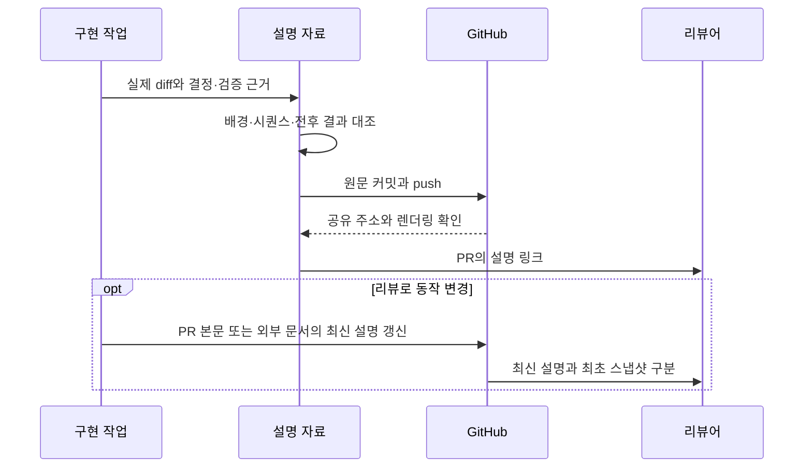

# 변경 이유와 동작을 함께 전달하기

PR의 파일 목록과 테스트 통과만으로는 팀원이 변경 이유나 실패할 때의 흐름을
파악하기 어렵다. change-brief는 실제 diff와 검증 근거를 읽어 배경·시퀀스·전후
결과를 설명하고 PR에서 접근할 수 있게 한다.

Claude Artifact를 우선하지만 다른 공유 문서도 허용한다. 이번 하네스 변경은
저장소 Markdown을 공유 자료로 쓴다. 제품 스펙·ADR이 관련되지 않아 Wiki는 만들지 않는다.

파일만 생성한 상태는 게시 완료가 아니다. 실제 주소와 접근·그림 표시를 확인한다.
PR 뒤에는 worklog 스냅샷을 수정하지 않고 최신 설명을 PR 본문에 반영할 수 있어
기존 기록 규칙과 충돌하지 않는다. 명세 갱신이 필요한 경우 설명 자료로 대신할 수 없다.

근거: [change-brief 스킬](../../.agents/skills/change-brief/SKILL.md),
[게시 절차](../../.agents/skills/change-brief/references/publishing.md).
