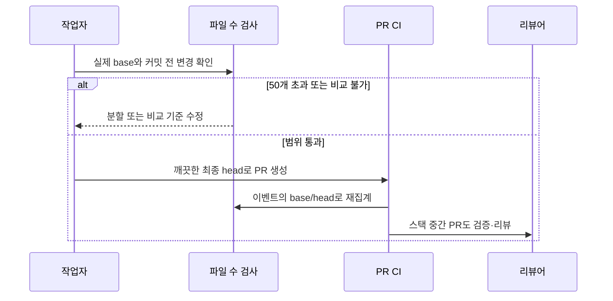

# 작은 PR과 스택 검증

큰 변경을 나눠도 중간 브랜치를 base로 한 PR에 CI가 실행되지 않으면 리뷰 부담만
옮겨간다. 파일 수 기준과 스택 검증을 먼저 연결해 이후 하네스 변경을 나눠 전달한다.

이전에는 스택 PR을 권장했지만 수치 기준이 없었고 CI·리뷰는 dev/main 대상에서만
실행됐다. 이제 실제 PR base의 merge-base부터 파일을 세어 20개까지 통과,
21~50개는 분할 검토를 권고하고 51개부터 차단한다. 이름 변경은 한 건이며
worklog·생성 파일도 포함한다. push 이벤트는 PR 파일 수 검사 대상이 아니다.

새 이벤트 범위는 PR 검증에만 적용한다. 배포는 기존처럼 dev push CI 성공 경계를
유지하며 Terraform 구성·자원 변경이 없어 plan은 비대상이다. Actions만 수정할 때
actionlint와 관련 계약 검사로 확인하도록 infra-change의 검증 분기도 명확히 한다.

근거: [Git 규칙](../../docs/conventions/git.md),
[승인된 계획](plan.md). 제품 스펙·ADR과 무관한 하네스 변경이므로 Wiki는 비대상이다.

검증: 파일 수·스택·base 이동·rename·커밋 전 변경·잘못된 ref와 이벤트 연결을
임시 Git 이력에서 검증했다. actionlint와 기존 배포·릴리스 계약 검사도 통과했다.
