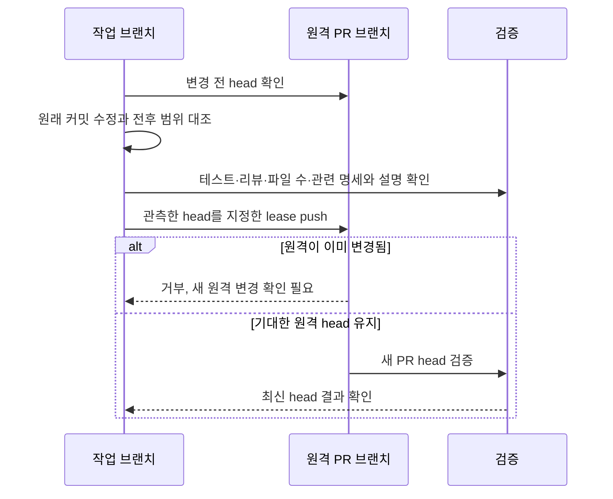

# 리뷰 수정도 원래 커밋에서 읽기

리뷰마다 수정 커밋이 쌓이면 하나의 관심사를 이해하려고 여러 커밋을 왕복하게 된다.
이제 최신 대상은 amend, 이전 대상은 fixup/autosquash로 반영하고, 임시 fixup은
push 전에 정리한다. 각 커밋의 빌드 가능성과 변경 의미는 유지한다.

기존에는 로컬과 PR의 계보가 갈라지면 모두 중단했지만 amend도 원래 그런 분기를
만든다. 사전에 관측한 원격 head와 비교 범위, range-diff 및 실제 변경으로 의도한
리라이트인지 확인한다. 증거 없는 분기는 여전히 중단한다.

다른 사람이 먼저 push했으면 기대값만 바꿔 덮어쓰지 않는다. main/dev에는
리라이트 push를 하지 않는다. 상위 PR이 바뀌면 하위 PR도 자기 변경만 새 base로
옮기고 각각 lease와 검증을 확인한다. 커밋 해시·PR/CI 상태는 worklog에 복제하지 않는다.

근거: [리라이트 절차](../../.agents/skills/ship-pr/references/review-rewrite.md),
[Git 규칙](../../docs/conventions/git.md). 제품 명세와 무관한 하네스 변경이다.

검증: 임시 bare 저장소의 5개 리라이트 시나리오와 전체 하네스 게이트를 통과했다. 실제 원격에서 시험용 force push는 수행하지 않았다.
