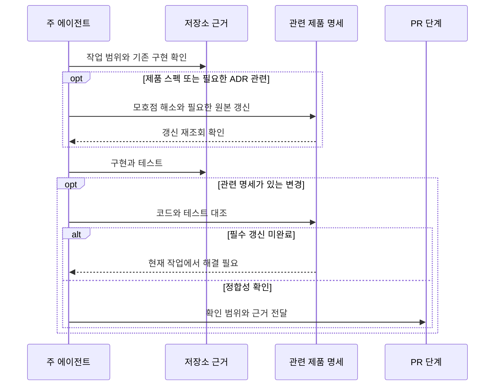

# 필요한 명세를 현재 작업에서 맞추기

구현과 제품 명세가 어긋난 채 PR에 “나중에 문서 수정”을 남기면 다음 작업자는
어느 쪽을 믿을지 다시 판단해야 한다. 관련 제품 명세의 모호점은 구현 전에
해결하고, 구현 후 실제 코드·테스트와 대조해 그 판단을 같은 작업에서 끝낸다.

Wiki는 제품 요구사항·스펙이나 필요한 ADR에만 적용한다. 하네스나 컨벤션처럼
저장소 문서로 충분한 변경에는 조회·링크·결과 파일을 만들지 않는다. issue-context는
읽기 전용 수집을 유지하고, wiki-sync가 갱신과 대조를 맡는다. ship-pr은 마지막
완료 확인을 맡으며 필요한 갱신이 남으면 PR 생성·리뷰 완료로 진행하지 않는다.

재실행은 관련 변경만 다시 대조한다. PR 생성 후에는 worklog 대신 임시 경로로
증거를 전달하되 필요한 Wiki 원본 갱신은 그대로 수행한다. 접근 실패나 재시도
소진도 후속 TODO로 넘기는 근거가 될 수 없다.

근거: [승인된 계획](../MOI-549-pr-scope/plan.md),
[wiki-sync](../../.agents/skills/wiki-sync/SKILL.md). 하네스 변경이므로 Wiki는 비대상이다.

검증: 스킬 구조 검사, 독립 새 세션의 호출 경계와 7개 가상 실패/정상 시나리오를 확인했다. 외부 Claude CLI 평가는 실행 승인을 받지 못해 미측정이며 네이티브 평가로 대체했다.
