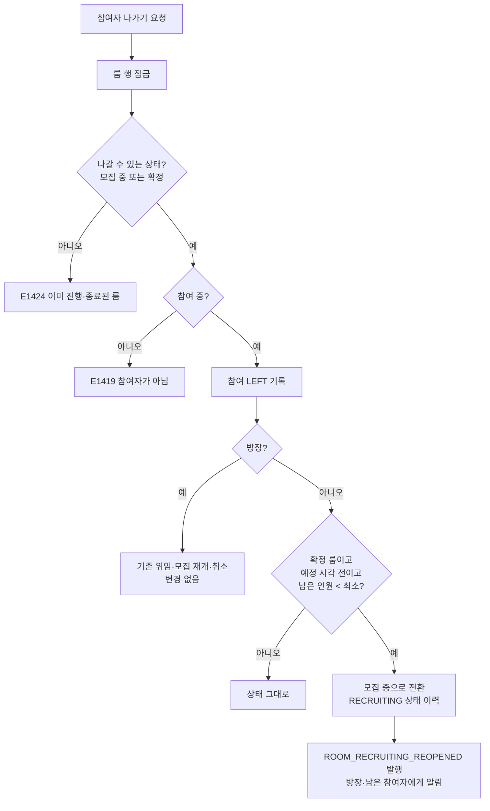

# MOI-561 변경 설명: 확정 룸 참여자 이탈 시 모집 재개

## 배경과 이유

확정된 룸에서 방장은 인원과 관계없이 나갈 수 있고, 나가면 위임 후 룸이 모집 중으로 돌아간다(MOI-541).
일반 참여자는 현재 인원이 최소 진행 인원과 같으면 나갈 수 없었다(E1423, MOI-397).
처음에는 둘 다 막았지만 MOI-541에서 방장만 풀려 비대칭이 남았다.

- 묶인 참여자는 노쇼로 빠질 수밖에 없고, 노쇼는 제재 대상이라 결과가 더 나쁘다.
- 회원 탈퇴의 "활성 룸이 있어도 즉시 탈퇴"(「회원 및 프로필」 R95, MOI-540)와 충돌한다.

그래서 "확정 약속이 깨지면 모집 중으로 돌아간다"는 한 규칙으로 방장과 참여자를 맞춘다.
8/11에 기각한 "자동 무산"과는 다르다. 남은 참여자는 자리를 지키고 룸을 다시 모집한다.

## 실제 처리 흐름

모든 단계가 룸 행 잠금 아래 한 트랜잭션이다. 동시에 나가는 요청은 차례로 처리돼 인원 판정이 어긋나지 않는다.

## 변경 전후

| 상황 | 전 | 후 |
| --- | --- | --- |
| 확정 룸, 인원 == 최소, 참여자 나가기 | 409 E1423 | 나감. 룸은 모집 중, 방장·남은 참여자에게 알림 |
| 확정 룸, 인원 > 최소, 참여자 나가기 | 나감, 확정 유지 | 같음 |
| 확정 룸, 예정 시각 지남, 인원 == 최소 | 409 E1423 | 나감. 확정 유지(확정 후 이탈로 기록, 출석에서 처리) |
| 방장 나가기 | 위임·모집 재개·취소 | 같음 |

예정 시각이 지난 뒤 되돌리지 않는 이유: 일정이 지나 신청을 받을 수 없고 최소 미달로 재확정도 못 해,
룸이 모집 중에 멈추고 이미 열렸을 수 있는 면접이 완료·출석·후기로 이어지지 않는다.

프론트 영향: 참여 취소 버튼의 비활성·E1423 사유 표시가 필요 없다. 새 알림 종류(모집 재개)가 생긴다.

## 검증

- `./gradlew test ktlintCheck` 통과, `restDocsTest`(RoomParticipantControllerTest) 통과
- 단위: 최소와 같을 때 나가고 모집 재개 / 최소 이상 유지 / 예정 시각 정각·직전 경계 / 모집 중 룸
- 통합: 모집 재개 후 상태 이력·재확정, 재확정 뒤 확정 참여자 명단에서 나간 사람 제외,
  예정 시각 이후 이탈자는 확정 참여자로 남음, 알림 대상에서 나간 사람 제외, 재개 없으면 이벤트 없음
- 리뷰: code-reviewer(필수 1·권장 2 반영), qa-reviewer PASS

## 관련 명세 (team-wiki, 2026-10-02 갱신)

- 「룸 참여 및 참여자 관리」 R23·R36·R58·R120 개정, R183(예정 시각 예외)·R184(알림) 신설
- 「룸 진행 확정」 R32 개정
- 상태 SSOT: `X.participation.reopen_below_min`, `P.notification.room_recruiting_reopened`
