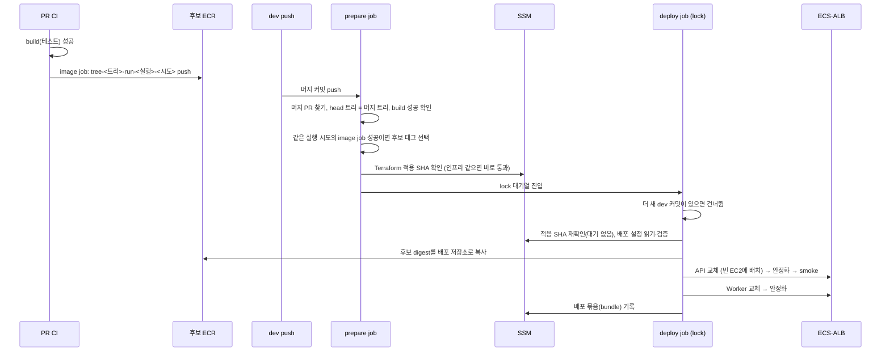

# MOI-565 배포 속도 개선 — 변경 설명

## 배경

dev 배포 한 번에 약 30분이 걸렸다(2026-10-05~06 배포 10회 측정).

| 구간 | 시간 | 원인 |
| --- | --- | --- |
| dev push CI | 5~7분 | PR에서 이미 같은 코드로 통과한 검사를 다시 수행 |
| Terraform Apply 대기 | 약 9분 | 인프라 변경이 없어도 매번 plan·apply, 변수 동기화가 값마다 `terraform init`(6.5분) |
| 이미지 빌드 | 약 4.7분 | 머지 후 Docker 안에서 처음부터 컴파일 |
| API 교체 | 약 5.9분 | 빈 EC2가 없어 새 인스턴스 기동을 약 4분 대기 |
| Worker 교체 | 약 2.8분 | API 안정화 뒤 순서대로 진행(팀 규칙 유지) |

## 무엇을 바꿨나

- dev ruleset이 PR·`build` 필수·머지 전 branch update(strict)를 강제하므로, 머지 커밋의 코드는 PR CI가 검증한
  코드와 같다. 배포는 dev push로 바로 시작하고, AWS에 접근하기 전에 그 사실을 API로 증명한다.
- 이미지는 PR CI에서 한 번 빌드해 후보 ECR에 올린다. 배포는 검증한 `build`와 같은 CI 실행의 이미지 작업이
  성공했을 때만 그 이미지를 그대로 복사하고, 아니면 직접 빌드한다.
- Terraform은 마지막으로 적용한 커밋 이후 `infra/terraform`이 바뀐 경우에만 실행한다. 배포는 적용되지 않은
  인프라 변경이 앞에 있을 때만 기다린다.
- dev에 빈 EC2 1대를 상시 둔다(최소 4대). ALB 헬스체크 간격·연결 정리 대기를 dev만 10초로 줄인다.
- 이미지에 JDK AOT 캐시를 넣어 앱 기동을 줄인다.

## 처리 순서 (앱만 바뀐 PR)

## 결과를 바꾸는 분기

| 상황 | 결과 |
| --- | --- |
| 머지 PR이 없음, head 트리 ≠ 머지 트리, `build` 실패·없음 | AWS 접근 전에 배포 실패 |
| 후보 이미지 없음(fork·Dependabot PR, image job 실패, 다른 실행이 태그 선점) | 배포가 직접 빌드(기존 경로, 느림) |
| 적용되지 않은 `infra/terraform` 변경이 앞에 있음 | prepare가 lock 밖에서 적용을 기다림(최대 90분) |
| 대기 중 더 새 런타임 커밋이 dev에 들어옴 | 오래된 실행은 건너뛰고 새 실행이 배포 |
| 배포 재실행 시 배포 태그가 이미 있음 | 기존 이미지를 그대로 사용 |
| AOT 캐시를 쓸 수 없음(JVM 옵션 불일치 등) | JVM이 캐시 없이 평소대로 기동 |

## 전후 비교 (추정)

| 구간 | 전 | 후(예상) |
| --- | --- | --- |
| CI 재실행 + Terraform 대기 | 약 16분 | 0 (인프라 변경 커밋 제외) |
| 이미지 준비 | 약 4.7분 | 복사 수십 초 |
| API 교체 | 약 5.9분 | 1.5~2분 |
| Worker 교체 | 약 2.8분 | 1.5~2분 |
| 합계 | 약 30분 | 약 3분 |

실제 배포로 확인하지 않은 추정치다. 인프라를 바꾸는 PR은 Terraform 적용(약 8~10분)을 기다린다.

## PR 구성과 머지 순서

1. Terraform PR(`chore/MOI-565-deploy-speed`): 후보 ECR·PR 이미지 역할·배포 설정 SSM, dev 최소 4대·ALB 10초,
   변수 동기화 init 1회, 적용 SHA 기록. 기존 배포 경로는 그대로 동작한다. **머지 = Terraform 자동 적용.**
2. 워크플로 PR(`chore/MOI-565-deploy-workflow`): 배포 흐름 전환, PR CI 이미지 빌드, Terraform 생략, AOT 캐시.
   Terraform PR이 적용되어 GitHub 변수·SSM이 생긴 뒤에 머지한다.

## 검증

- Terraform 1.15.9 fmt·validate(dev·live), actionlint, `infra/terraform/tests` 계약 8종(워크플로 PR에서 시나리오 테스트 1종 추가로 9종), 단위 테스트 17건,
  `./gradlew test ktlintCheck` 통과. 커밋마다 계약 테스트 통과 확인.
- 시나리오 테스트(가짜 gh·aws, 실제 git 이력): 트리 불일치·build 실패·PR 없음·다른 브랜치 거부, 후보 태그를
  같은 실행에 묶음, 앱 전용 커밋 즉시 통과, 미적용 인프라 뒤 커밋 대기.
- AOT 캐시: 로컬 arm64 이미지에서 캐시 강제 모드로 기동 확인. 컨텍스트 준비 시간 API 5.7→3.6초,
  Worker 4.1→2.7초(3회 평균).
- 미확인: 실제 Terraform plan(PR CI에서 판독 예정), 실제 배포 시간, dev 평소 EC2 대수.
