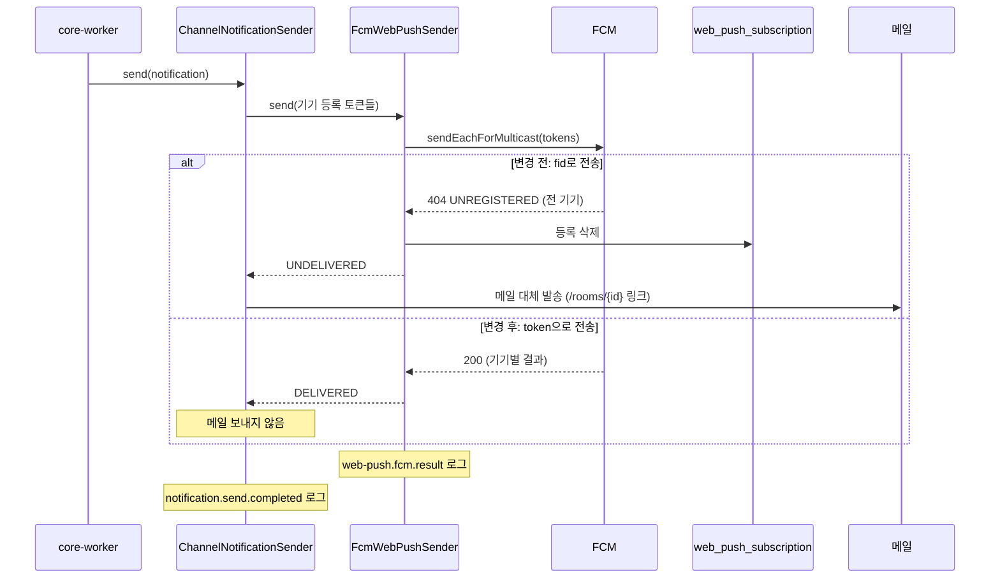

# 웹 푸시 발송 실패 수정과 알림 추적 로그 (MOI-567, MOI-568, MOI-566)

## 배경

dev에서 방에 참가 신청을 했지만 방장에게 새 참가 신청 알림(`ROOM_APPLICATION_SUBMITTED`) 웹 푸시가 오지 않고
메일로 대체 발송됐다. 메일의 링크도 프론트에 없는 `/rooms/{roomId}` 경로였다.
worker 로그에는 처리 흔적만 있어 FCM이 토큰을 받았는지 알 수 없었다.

## 원인

프론트가 등록하는 값은 FCM 등록 토큰이다. 백엔드는 이를 FID(Firebase 설치 ID) 대상으로 보냈다.
같은 서비스 계정·토큰으로 직접 확인한 결과 `token`으로 보내면 200, `fid`로 보내면 `404 UNREGISTERED`였다.

## 처리 시퀀스 (참가 신청 알림, PUSH_ELSE_EMAIL)



푸시가 실제로 실패하는 경우(기기 없음, 웹 푸시 꺼짐, 토큰 만료)에는 이전과 같이 메일로 대체한다.
메일과 웹 푸시 링크는 모두 `/interviews/{roomId}`로 바뀐다.

## 전후 결과

| 항목 | 변경 전 | 변경 후 |
| --- | --- | --- |
| 웹 푸시 | 전 기기 404, 등록 삭제 | 정상 전달 |
| 클릭·메일 링크 | `/rooms/{roomId}` (프론트에 없는 경로) | `/interviews/{roomId}` |
| worker 로그 | 처리 시작만 | 채널별 결과·건너뛴 이유, FCM 수락·거절 건수와 오류 코드, 등록 삭제 건수 |

로그 예:

```text
web-push.fcm.result eventId=... eventType=ROOM_APPLICATION_SUBMITTED recipientMemberId=... registrations=2 success=1 unregistered=1 retryableFailure=0 permanentFailure=0 errorCodes=UNREGISTERED:1
notification.send.completed eventId=... channel=WEB_PUSH policy=PUSH_ELSE_EMAIL recipientMemberId=... registrations=2 webPush=DELIVERED email=NOT_REQUIRED
```

등록 토큰과 이메일 주소는 로그에 남기지 않는다. 수준은 DEBUG로 dev에서만 보이고 staging·live에서는 기존 WARN(`web-push.fcm.rejected`)만 남는다.

## 제한과 배포 후 확인

- 변경 전 실패로 이미 삭제된 기기 등록은 복구되지 않는다. 방장 브라우저에서 알림을 다시 등록해야 한다.
- 배포 후 같은 시나리오(참가 신청)로 방장 웹 푸시 수신과 위 로그를 확인한다.

## 검증

- `FirebaseAdminFcmGatewayTest`: 등록 값을 토큰 목록으로 보내고 FID 목록은 비어 있음(수정 전 실패 확인)
- `FcmWebPushSenderTest`, `ChannelNotificationSenderTest`: 로그 내용과 토큰·이메일 미포함
- `./gradlew test ktlintCheck` 통과
