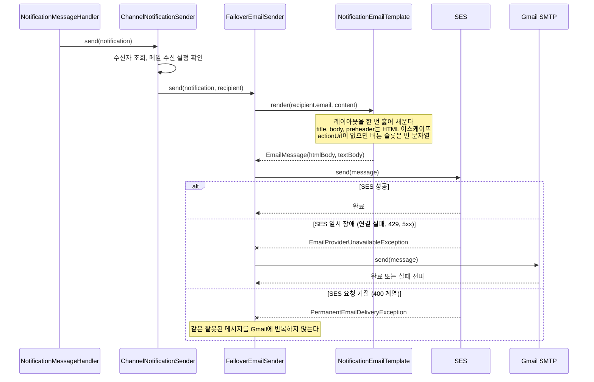

# 알림 메일에 공통 HTML 템플릿 적용 (MOI-569)

## 배경

알림 메일이 제목 한 줄과 본문, 빈 줄 두 개, 링크만 담은 평문으로 나갔다.
dev에서 받은 실제 메일이 이렇다.

```
'[QA] 준비 작업 룸 fe8280'에 참가 신청이 들어왔어요. 신청 내용을 확인해 주세요.

https://dev.moimyeon.plady.io/rooms/e89da2d2-...
```

[MOI-569](https://linear.app/100-thieves/issue/MOI-569/메일-전송-template-추가)의
요구는 한 줄이다. "단순 텍스트가 아닌, 약간의 디자인이 적용된 이메일 템플릿을
적용하여 전송한다."

## 무엇을 선택했나

**공통 레이아웃 한 장을 쓴다.** 알림 종류별 템플릿은 만들지 않는다(사람 결정).

이 선택으로 변경이 `clients:email-client` 안에서 끝난다. worker가 메일에 넘기는
값은 `NotificationContent(title, body, actionUrl)` 셋뿐이고, 그 셋을 담는 슬롯만
정하면 되기 때문이다. `NotificationComposer`(core-api)와 redis-core 메시지 형식을
건드리지 않으므로 **API를 worker보다 먼저 배포하는 현재 순서에서 호환성 문제가
없다.**

알림 종류별로 다른 정보(모임 날짜, 신청자 이름)를 넣으려면 그 세 값을 늘려야
하고, 변경이 core-api와 redis-core까지 번진다. 지금 요구에는 필요하지 않다.

**템플릿 엔진을 넣지 않았다.** 템플릿 한 장에 값 셋을 끼우는 일에
`spring-boot-starter-thymeleaf` 의존을 발송 격벽으로 들이는 비용이 더 크다.
자리표시자를 치환하는 함수 하나로 끝난다. 알림 종류별 템플릿이 생겨 조건 분기와
반복이 필요해지면 그때 Thymeleaf를 넣는다.

**HTML과 평문을 함께 보낸다(multipart/alternative).** HTML만 보내면 평문
클라이언트에서 깨지고 스팸 점수가 올라간다. 평문 본문은 지금 형식을 그대로
유지했다.

## 실제 처리 시퀀스



메일을 만드는 지점은 `FailoverEmailSender` 하나다. 여기서 템플릿을 호출하므로
SES와 Gmail은 같은 `EmailMessage`를 받는다. 폴백해도 받는 사람이 보는 메일이
달라지지 않는다.

## 변경 전후 결과

| 보는 쪽 | 전 | 후 |
| --- | --- | --- |
| HTML 메일 클라이언트 | 평문 한 덩이, 생 URL 노출 | 워드마크·제목·본문·버튼·푸터가 있는 카드. 버튼 아래 생 URL은 대체 경로로 남김 |
| 평문 전용 클라이언트 | 평문 한 덩이 | **같다** (형식 유지) |
| 프론트 | 영향 없음 | 영향 없음 (링크 경로 그대로) |
| 운영·인프라 | - | 영향 없음. SES 설정·환경 변수·IAM 권한 변경 없음 |

생김새는 [미리보기](#게시)에서 네 경우(기본, 본문 두 줄, 이동 링크 없음,
룸 제목에 HTML 특수문자)로 확인할 수 있다.

## 조심한 것

**룸 제목은 사용자 입력이고 알림 본문 문구에 그대로 들어간다**
(`NotificationComposer`의 `'${payload.roomTitle}'`). 이스케이프를 빠뜨리면 룸
제목에 넣은 태그가 메일에서 살아난다.

치환 함수가 `text`(이스케이프)와 `html`(날것) 두 인자를 가르므로, 새 슬롯을
늘리는 사람이 기본적으로 안전한 쪽을 집는다. `href` 속성은 모두 쌍따옴표이고
`"`·`&`를 막으므로 속성 탈출 경로가 없다.

**치환은 템플릿을 한 번만 훑는다.** 처음에는 슬롯별로 차례차례 치환했는데,
리뷰에서 구멍이 나왔다 — 룸 제목에 `{{action}}`이라는 글자가 있으면 그 텍스트가
본문에 채워진 뒤 다음 패스에서 버튼으로 치환됐다. XSS는 아니지만(끼워지는 건
우리 HTML) 본문 안에 버튼이 끼어든다. 한 번만 훑으면 채운 값이 재스캔되지 않아
이 구멍과 슬롯 순서 의존이 함께 사라진다. 회귀 테스트 2건을 걸었다.

**제목은 한 줄로 합친다.** 메일 제목(`subject`)에도 적용했다. 제목에 줄바꿈이
섞이면 메일 헤더 주입 경로가 된다. 지금 문구에는 줄바꿈이 없지만 값의 성질에
기대지 않는다.

## 운영에서 드물게 도는 경로

Gmail 공급자가 `SimpleMailMessage`에서 직접 조립한 `MimeMultipart("alternative")`로
바뀌었다. `MimeMessageHelper`는 첨부·인라인 이미지를 위해 mixed/related를 한 겹 더
감싸는데, 같은 내용을 두 형식으로만 싣는 메일에는 쓸모없는 층이다.

**이 경로는 SES가 죽었을 때만 돈다.** 단위 테스트로 MIME 구조까지 확인했다
(`multipart/alternative`, 평문 먼저, 두 파트의 Content-Type).

조립 실패(주소 파싱 등)는 **영구 실패**로 분류했다. 같은 입력에 결정적으로
반복되므로 재시도가 의미 없고, backoff 5회를 태운 뒤 DLQ로 가는 낭비를 막는다.
SES의 400 계열 거절을 영구 실패로 보내는 기준과 맞췄다. 발송 실패(SMTP 일시 장애)는
재시도 가능으로 그대로 둔다.

## 검증

- `./gradlew test ktlintCheck` 통과
- `clients:email-client` 26건: 렌더링 14, SES 4, Gmail 4, 폴백 4
- `code-reviewer` 위임: 필수 지적 없음. 권장 2건·제안 2건·참고 2건 반영
- PR 범위 게이트: 변경 파일 16개 (상한 50개)

확인하지 않은 것 — **실제 메일 클라이언트에서의 렌더링.** 미리보기는 브라우저
기준이다. Outlook 데스크톱(Word 엔진)은 `max-width`를 무시해 창이 넓으면 카드가
퍼질 수 있다. 조건 주석(ghost table)으로 막는 정석 해법이 있으나 가독성 비용이
커서 쓰지 않았다. dev에서 실제 수신으로 확인할 몫이다.

## 범위 밖

- 발신자 표시 이름(`모이면 <no-reply@...>`) — 템플릿과 독립적이다
- 푸터의 수신 설정 링크 — 프론트 경로를 몰라 추측하지 않았다. 안내 문구만 넣었다
- `List-Unsubscribe` 헤더 — 광고성 메일이 생길 때 필요해진다
- 알림 문구, 발송 정책, 수신 설정, 웹 푸시
