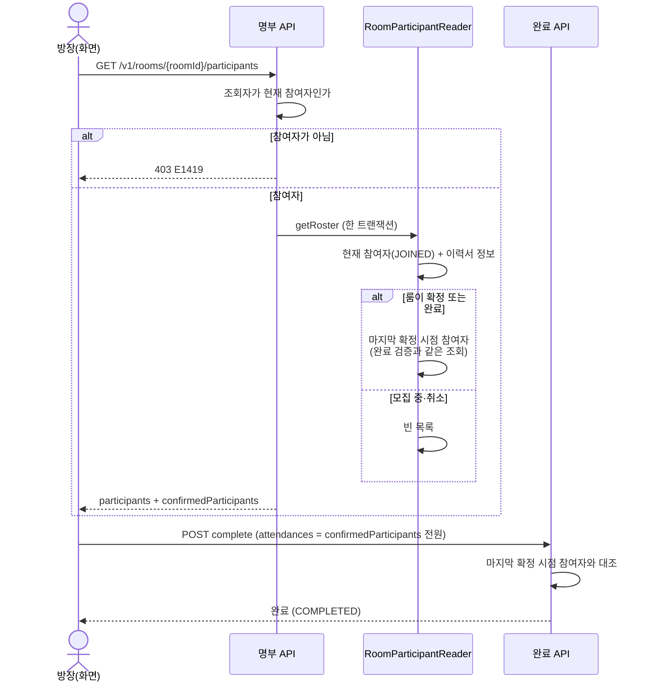

# MOI-571 변경 설명: 출석 입력용 확정 참여자 명단

## 배경과 이유

방장이 면접을 완료할 때 `POST /v1/rooms/{roomId}/complete`는 **마지막 진행 확정 시점의 참여자 전원**의 출석을 요구한다.
그런데 화면이 받을 수 있는 명단은 `GET /v1/rooms/{roomId}/participants`의 **현재 참여자(JOINED)** 뿐이었다.

확정 후 일반 참여자가 나가도, 남은 인원이 최소 진행 인원 이상이거나 진행 예정 시각이 지났으면 룸은 확정 상태로 남는다(MOI-561).
이 룸에서 화면이 현재 명단으로 출석을 만들면 나간 사람이 빠져 E1706(출석 명단 불일치)이 난다.
다시 조회해도 같은 명단이 와서 사용자가 스스로 복구할 방법이 없었다.

그래서 명부 응답에 **출석 입력 대상 명단**(`confirmedParticipants`)을 추가한다.
이 명단은 완료 API가 대조에 쓰는 조회를 그대로 재사용한다. 화면이 받은 명단과 서버가 검증하는 명단이 항상 같다.

## 실제 처리 흐름

현재 명단과 확정 명단은 한 트랜잭션에서 함께 읽는다. 두 조회 사이에 누가 나가도 두 명단의 시점이 갈리지 않는다.

## 변경 전후

| 상황 | 전 | 후 |
| --- | --- | --- |
| 확정 후 이탈 없음 | 현재 명단으로 완료 가능 | 같음. `confirmedParticipants`는 현재 명단과 같은 사람들 |
| 확정 후 1명 이탈, 룸은 확정 유지 | 현재 명단으로 완료 시 E1706, 복구 불가 | `confirmedParticipants`에 나간 사람 포함, 그대로 완료 가능 |
| 확정이 풀렸다가 다시 확정 | 해당 없음 | 마지막 확정 시점 명단 |
| 모집 중·취소 룸 | 해당 없음 | `confirmedParticipants`는 빈 배열 |
| 확정 후 탈퇴한 참여자 | 해당 없음 | 닉네임 "탈퇴한 회원"으로 포함 |

- 확정 명단에는 `memberId`·`nickname`만 싣는다. 나간 사람의 이력서 접근은 회수되므로(「룸 참여」 R177) 직무·AI 요약·이력서 정보는 싣지 않는다.
- 기존 `participants`의 의미(현재 참여자)와 이력서 열람 판정, 조회 권한(현재 참여자만, E1419)은 바뀌지 않는다.
- 응답 필드 추가라 기존 클라이언트와 호환된다. 프론트(MOI-570)는 출석 다이얼로그를 `confirmedParticipants`로 만든다.
- 이탈이 없는 흔한 경우 같은 사람의 `memberId`·`nickname`이 두 배열에 중복으로 나간다. 프론트가 출석 명단을 그대로 받는 형태를 요청했고, 정원 상한이 8명이라 중복은 작다.

## 검증

- `./gradlew test ktlintCheck` 통과, `restDocsTest`(RoomParticipantControllerTest) 통과
- Reader 통합 테스트: 확정 후 이탈자 포함 / 확정 전 이탈자 제외 / 모집 중·취소 빈 목록 / 완료 룸 / 재확정 룸 / 탈퇴 회원 / 두 명단 한 번에 조회 / 참여자 수와 무관한 쿼리 수
- Service 단위 테스트: 권한 확인 후 두 명단 반환, 참여자가 아니면 E1419로 거부하고 명단을 읽지 않음
- 재현 회귀 테스트: 실제 나가기 → 명부 조회 → 완료 경로에서 현재 명단으로는 E1706, 확정 명단으로는 완료 성공
- 리뷰: code-reviewer 필수 0, 권장 1(한 트랜잭션 조회) 반영

## 관련 명세 (team-wiki, 2026-10-06 갱신)

- 「룸 진행 마무리 및 출석」 R76 신설: 확정 상태로 남은 룸의 확정 후 이탈자는 출석 대상, 재확정 룸은 마지막 확정 시점 명단
- 「룸 참여 및 참여자 관리」 R185 신설: 확정·완료 룸의 상세 참여자 목록에 확정 참여자 명단(닉네임만) 제공
- 상태 SSOT: `D.participation.confirmed_member`, `G.room.read_participants`, `G.room.complete` 인용 갱신
