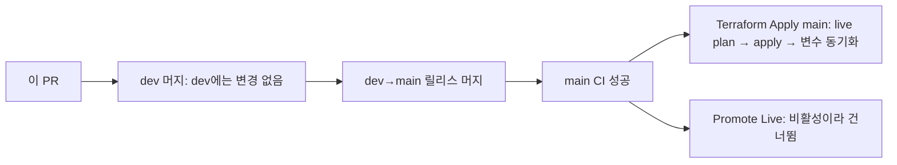

# MOI-581 1단계 — live 신규 환경 설정

## 배경

dev 인프라는 구성을 마쳤고 live는 아직 없다(원격 state 없음). live는 main 머지 때만 적용되며, 첫 적용은 용량 0의
신규 환경 생성이다. 이 PR은 그 첫 적용에 들어갈 비밀이 아닌 live 설정을 정한다. HTTPS(2단계)와 용량·Redis·Worker
활성화(3단계)는 후속 PR이다.

## 변경

| 설정 | 전 | 후 |
| --- | --- | --- |
| 업로드 CORS 오리진 | 없음 | `https://moimyeon.plady.io` |
| Google OAuth client ID | 없음 | live 전용 클라이언트(공개 식별자) |
| SES 발신 주소 | 없음 | `no-reply@moimyeon.plady.io`(dev와 같은 계정의 같은 도메인) |
| 로그 수집 | `disabled` | `enabled`(dev와 같음) |

용량(ECS·ASG·서비스 0), Redis 꺼짐, Worker 0, HTTPS 꺼짐은 그대로다. 시크릿은 저장소에 없고 SSM에 사람이 미리 만들었다
(JWT 서명 키, OAuth 클라이언트 비밀).

## 적용 흐름

## 검증

- 설정 계약 검사, `terraform fmt -check`, live `validate` 통과
- PR CI의 live plan 판독(신규 생성만, 삭제·교체 없음, 공개 노출·IAM 범위)
- 적용 뒤: 다음 plan 무변경, live 변수 동기화

## 제한

- live 앱은 아직 뜨지 않는다(용량 0, live 이미지 없음). 첫 실행은 3단계와 첫 승격(MOI-512)에서다.
- HTTPS는 Cloudflare에 인증서 검증 레코드를 등록한 뒤 2단계에서 켠다.
- 로그 수집 자원은 삭제 방지가 걸려 있어 끌 때는 `disabled`가 아니라 `provision`으로 바꾼다.
- 1단계 적용 전까지 매일 drift 감지는 live 전체 생성 때문에 실패한다(예상된 상태).
