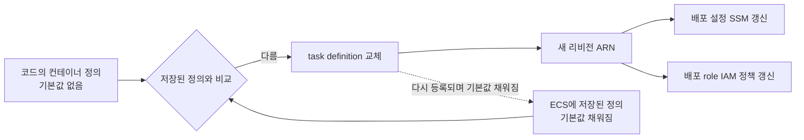

# MOI-581 첫 PR — ECS task definition 영구 diff 제거

## 배경

dev drift plan이 2026-09-20부터 매일 실패했다. 원인은 API·Worker task definition이 적용 직후에도 매번 "교체"로
계획되는 영구 diff다. MOI-565 이후에는 그 ARN을 담는 배포 설정 SSM과 배포 role IAM 정책까지 함께 갱신 대상이 되어,
`infra/terraform`을 건드리는 머지마다 같은 5건이 다시 적용됐고 PR plan 판독도 매번 이 잡음을 걸러야 했다.
live 인프라(MOI-581)는 같은 모듈을 쓰므로 첫 적용 전에 해소한다.

## 원인

ECS는 task definition을 등록할 때 비어 있는 항목에 기본값을 채워 저장한다. FireLens는 log-router 컨테이너에
`user = "0"`도 넣는다. 코드에는 이 값들이 없어 provider가 정의를 다르다고 판정하고 교체를 계획한다. 교체해도 ECS가
다시 기본값을 채우므로 끝없이 반복된다. 2026-09-20 log-router 추가 시점부터 시작됐다.

## 변경

ECS가 저장하는 기본값을 코드에 명시한다. 실제 동작 값(이미지·환경변수·자원량·로그 설정)은 바꾸지 않는다.

| 대상 | 명시한 값 |
| --- | --- |
| log-router | `user = "0"`, `portMappings`·`systemControls`·`volumesFrom` 빈 배열 |
| core-api | `mountPoints`·`systemControls`·`volumesFrom` 빈 배열 |
| core-worker | 위와 같고, 포트가 없으므로 `portMappings` 빈 배열도 |
| 로그 버퍼 볼륨 | `configure_at_launch = false` |

로그 수집이 꺼진 환경(live 기본값)도 같은 정의를 쓰므로 첫 생성부터 수렴한다.

## 변경 전후

| | 전 | 후(기대) |
| --- | --- | --- |
| 적용 직후 dev plan | task definition 2개 교체 + SSM·IAM 갱신 | 변경 없음 |
| 매일 drift 감지 | 실패 | 성공 |
| `infra/terraform` 머지 | 같은 5건 재적용 | 실제 변경만 적용 |
| 실행 중인 ECS 서비스 | 영향 없음(task definition 변경 무시) | 같음 |

## 검증

- 모듈 테스트: application-logging 4개, moimyeon-environment 7개 통과. 기본값 명시를 확인하는 검사를 추가했고,
  log-router의 `user`를 일부러 빼면 실패함을 확인했다.
- `terraform fmt -check`, shared/dev/live `terraform validate` 통과(CI와 같은 1.15.9).
- 저장소 infra 계약 검사 통과.

## 제한과 미확인

- 원인 판단의 확정은 PR CI dev plan이다. 기대 결과는 task definition 교체·SSM·IAM 갱신이 모두 사라지는 것이다.
- 머지 후 다음 drift 감지 성공으로 수렴을 최종 확인한다.
