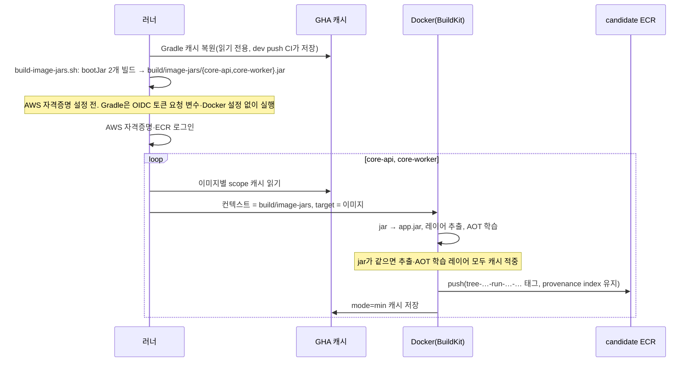

# MOI-588 이미지 빌드 캐시 복구 — 설명 자료

## 배경

PR CI의 `image` job이 약 6분 30초 걸렸다. API 이미지 하나에 5분 27초가 들었고, 그중 Gradle 빌드가 2분 47초,
GHA 캐시 내보내기가 1분 49초였다(MOI-584 실측).

- Docker 안에서 Gradle을 돌렸다. Gradle 캐시는 BuildKit cache mount였는데, GitHub 러너는 매번 새것이라
  이 캐시가 늘 비어 있었다. 실행할 때마다 Gradle 배포판과 의존성을 다시 받았다.
- 빌드 컨텍스트가 저장소 전체(`COPY . .`)여서 문서·하네스 파일 하나만 바뀌어도 그 뒤 레이어 캐시를 쓰지 못했다.
- 쓰지도 못하는 중간 레이어를 `mode=max`로 매번 내보냈다.

## 선택

러너에서 bootJar를 만들고 Docker에는 jar만 넘긴다. 러너의 Gradle 캐시는 `setup-gradle`로 이미 `build`
job에서 이어지고 있다. 다른 안(Docker 안 빌드 + 캐시 저장·복원 단계 추가, 검증 job의 jar 재사용)과의 비교는
`decisions.md` D-1.

## 실제 흐름

### PR CI `image` job

### dev 배포의 대체 빌드(후보 이미지를 못 믿을 때만)

1. 후보 승격 뒤 "Decide fallback bootJars"가 아직 없는 이미지를 고른다. API는 기존 "Check for existing
   Core API image" 결과, Worker는 Worker 활성 여부와 배포 태그 존재로 판단한다.
2. 고른 것이 있을 때만 JDK·Gradle(캐시 읽기 전용)을 준비하고 필요한 jar만 만든다. 둘 다 이미 있으면 이
   단계들은 모두 건너뛴다(평소 배포 시간 변화 없음). 이 job은 이미 AWS 자격증명이 있으므로, 스크립트가
   AWS 키·OIDC 토큰 요청 변수를 뺀 환경과 빈 Docker 설정으로 Gradle을 실행한다.
3. API 이미지 빌드와, API 안정화 대기와 병렬로 도는 Worker 이미지 빌드는 모두 `build/image-jars`를 컨텍스트로 쓴다.
   Worker 이미지를 만들지는 1단계 판단을 그대로 따른다(다시 조회하지 않음).

실패 분기: jar 빌드가 실패하면 API 교체 전에 배포가 멈춘다. 이전에도 API 이미지 빌드 한 번에 두 jar를 함께
컴파일했으므로 실패 시점의 결과는 같다. Worker 이미지 조립 실패는 기존처럼 Worker 배포 gate로 전달된다.

## 전후

| 항목 | 전 | 후 |
| --- | --- | --- |
| Gradle 실행 위치 | Docker 안(캐시 없음) | 러너(캐시 복원) |
| Docker 빌드 컨텍스트 | 저장소 전체 | jar 디렉터리 |
| 앱과 무관한 파일 변경 | 레이어 캐시 무효 | 영향 없음 |
| Docker 캐시 | 공용 scope, `mode=max`, Worker는 읽기만 | 이미지별 scope, `mode=min`, 둘 다 저장 |
| `docker build .`(루트 컨텍스트) | Core API 이미지 | 동작 안 함. 쓰는 곳 없음. `Dockerfile.dockerignore`가 jar 두 개 외에는 컨텍스트로 보내지 않음 |
| Gradle이 닿는 권한 | 없음(Docker 안) | AWS 키·OIDC 토큰 요청 변수는 Gradle 환경에서 뺀다. ECR 로그인 파일은 CI에서는 아직 없고, 배포 대체 빌드에서는 이미 써진 뒤라 파일 수준으로 막지 못한다. 같은 job이라 프로세스·파일 수준 격리는 아님(D-3) |

예상 효과: PR 이미지 job 6분 30초 → 3~4분(MOI-584 추정). 실제 시간은 이 PR의 CI 실행에서 확인한다.
첫 실행은 새 캐시 scope라 Docker 캐시가 비어 있다.

## 지킨 것

- jar를 추출 전에 `app.jar`로 바꾸는 처리(operations.md 2026-08-25).
- 후보 이미지의 provenance index(operations.md 2026-10-07), 실행별 후보 태그, live 재빌드 금지.
- 이미지별 AOT 학습(MOI-565).

## 검증

- 계약 테스트 12종 + `test_deploy_*.py` 통과. `deploy-workflow-contract.sh`에 새 계약 추가: 러너 jar 빌드,
  Dockerfile 안 Gradle 금지, 빌드 컨텍스트 허용 목록, 고정 jar 이름 정규화, Gradle 환경에서 자격증명 제외,
  CI jar 빌드가 자격증명보다 앞, 대체 빌드 판단·jar 빌드·이미지 빌드 순서. 컨텍스트·Worker 판단 계약은
  일부러 어긴 사본에서 실패하는 것을 확인.
- `./gradlew test ktlintCheck` 통과.
- qa-reviewer: CONDITIONAL(필수 1: Gradle과 자격증명 분리) → D-3으로 반영.
- 로컬: 스크립트로 jar 2개 생성 → 두 target 이미지 빌드 성공, `/app/app.jar`·`lib/`·`app.aot` 확인(AOT 학습 성공).
  같은 jar로 다시 빌드 시 모든 레이어 `CACHED`. clean 뒤 재빌드한 Worker jar의 SHA-1 동일(재현 가능).
  루트 컨텍스트로 빌드하면 2B만 전송되고 `core-api.jar not found`로 실패.
- actionlint: 새 지적 없음(기존 shellcheck info·`queue` 키 미인식만 남음). shellcheck(새 스크립트) 통과.
- 로컬 이미지는 arm64로 빌드했다. linux/amd64 빌드와 CI 캐시 적중은 PR CI에서 확인한다.
