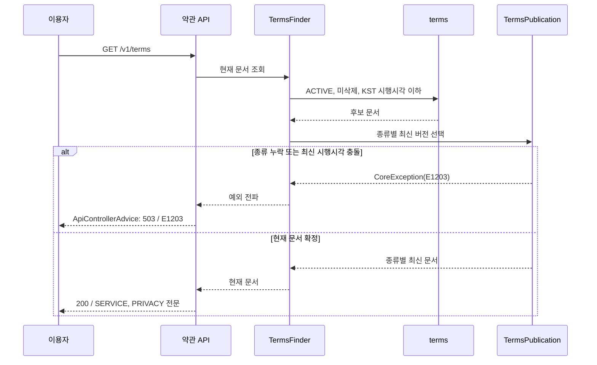

# 약관 전문 적재와 시행 버전 조회 (MOI-575)

## 무엇이 달라지는가

기존 조회·가입 자동 기록은 ACTIVE 문서를 모두 사용했다. 새 문서를 미리 등록하면 시행 전에도 동의 대상으로 선택되거나 같은 종류의 여러 버전이 섞일 수 있었다. 이제 한국 시행시각이 지난 문서 중 종류별 최신 버전을 고르고, 목록·가입 기록·필수 동의 판정에 같은 기준을 적용한다.

| 상황 | 변경 후 결과 |
|---|---|
| 새 버전 시행 전 | 기존 버전 유지 |
| 한국 시행시각 정각 | 새 버전 선택 |
| 최신 버전이 선택 문서 | 이전 필수 버전으로 돌아가지 않음 |
| 현재 문서 종류 누락·최신 시행시각 충돌 | 503/E1203으로 임의 기록 차단 |
| DRAFT·미시행·삭제 문서 상세 | 미존재와 동일한 404/E1202 |
| 시행된 과거 버전 | termsId로 전문 조회 가능 |

## 실제 처리 흐름

가입 자동 기록과 동의 판정도 같은 TermsPublication 선택 함수를 사용한다. 가입은 별도 동의 API를 추가하지 않고 기존 자동 기록 방식을 유지한다. 상세 API는 ACTIVE/DEPRECATED 중 시행된 문서만 조회하며, UUID 형식 오류는 400/E400이다.

## DB와 배포 경계

V33과 local seed는 이용약관·처리방침 v1.1 전문 두 건을 DRAFT로 넣는다. 담당자 연락처와 시행 예정일은 반영했지만 공급자 계약·국외 처리·보유/파기 사실이 미확정이라 공개하지 않는다. DRAFT는 날짜가 지나도 공개되지 않는다. 기존 v1.0과 동의 기록을 보존한다.

운영에서는 기존 절차에 따른 새 Flyway 적용이 필요하며 seed.sql을 수동 실행하지 않는다. 예약 발행할 때 구버전은 새 버전 시행일까지 ACTIVE로 유지해야 한다. 이번 데이터는 미발행이므로 현재 앱의 ACTIVE 조회와 구버전 동시 운영에 영향을 주지 않는다. 공개 발행은 별도 검증이 필요하다.

## 검증과 제한

서비스의 시행 경계·자동 기록 일치, 비로그인 HTTP와 초안 차단, RestDocs 성공/오류 계약, 실제 MySQL 전체 마이그레이션과 긴 한글 본문 적재를 검증했다. 전체 test·ktlint·OpenAPI·Asciidoctor 생성이 통과했고 코드·DB·QA 리뷰 지적을 반영했다.

원본 Wiki 도구 부재로 명세 대조는 미확인이다. 사용자가 확정한 이번 구현 범위는 Linear MOI-575에 정리했으며 Wiki 검증 완료를 주장하지 않는다. 운영 DB 변경·실제 배포·메일 발송은 수행하지 않았다.

후속 이슈는 [MOI-576](https://linear.app/100-thieves/issue/MOI-576) 최종 발행·화면 연결, [MOI-577](https://linear.app/100-thieves/issue/MOI-577) 제공 동의, [MOI-578](https://linear.app/100-thieves/issue/MOI-578) 공유 종료, [MOI-579](https://linear.app/100-thieves/issue/MOI-579) 중요 변경 이메일이다. 기존 [MOI-562](https://linear.app/100-thieves/issue/MOI-562) 파기, [MOI-574](https://linear.app/100-thieves/issue/MOI-574) 문의 주소, [MOI-370](https://linear.app/100-thieves/issue/MOI-370) 재동의도 연결한다.
