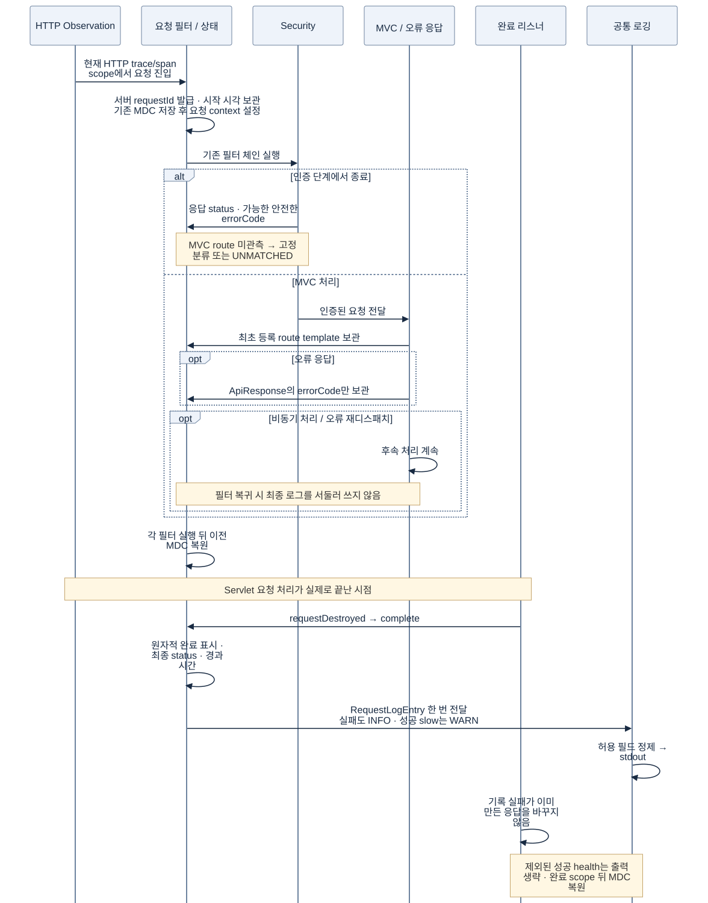
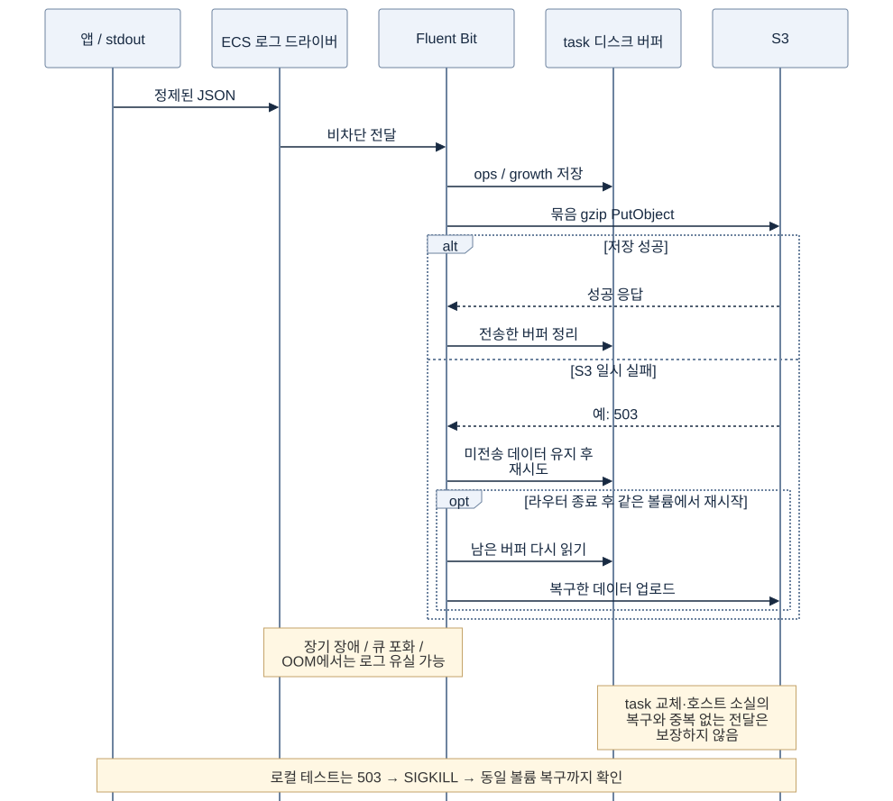
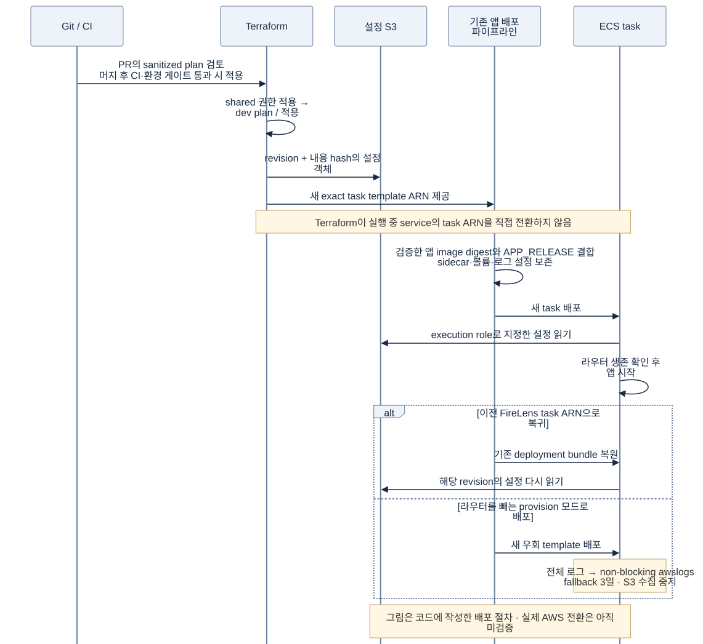

# MOI-411 로깅 기반 작업 보고서

2026-09-20 · 설계의 목적, 현재 구현, 선택의 대가와 사용 방법

## 1. 이번 작업이 만드는 변화

이번 작업은 API와 Worker가 **무슨 일을 겪었는지 안전한 형식으로 남기고, 요청 처리와 로그 저장을 나누는 기반**을 만든다. 개발자는 필요한 사건과 허용할 값을 정하고, 공통 로깅 모듈은 출력 규칙을 지킨다. ECS의 수집기는 전송·묶음 저장·보존을 맡는다.

장애가 나면 최근 요청을 CloudWatch에서 찾고, 더 오래된 기록은 S3에서 꺼내 분석하는 구조다. 로그를 많이 쌓는 것이 목적은 아니다. 필요한 단서를 남기면서 개인정보 노출, 조회 비용, 저장 장애가 서비스에 미치는 영향을 제한하려는 작업이다.

현재 상태를 먼저 구분한다. 이 보고서의 아키텍처는 **브랜치에 구현한 구조이며 실제 AWS 배포를 마쳤다는 뜻은 아니다.**

| 구분 | 2026-09-20 확인 상태 |
| --- | --- |
| 공통 로깅 설정·정제·환경별 XML | 구현·테스트 완료, 로컬 커밋 `f86b13cb` |
| HTTP 요청 완료 수집 | 구현·테스트 완료, 로컬 커밋 `c32d2569` |
| FireLens·S3·CloudWatch·권한·보존 | 코드와 로컬 검증 완료, 미커밋·미적용 |
| 실제 AWS plan·ECS 배치·수신·롤백 | 미검증. PR CI와 dev 배포 후 확인 필요 |
| ERROR/WARN 알림·일일 보고 | 정책은 결정, 연결·동작 검증은 미완료 |
| SID·UTM·사용자 활동 사건·감사 원장 | 후속 범위. 현재 기반이 자동으로 제공하지 않음 |

보고서 작성 기준은 `origin/dev`의 `0a257c27`을 반영한 `feat/MOI-411-logging-config` 작업 트리다. 실제 배포 상태를 추가로 조회하거나 리소스를 변경하지 않았다. 기존 설계의 목표와 코드가 다른 곳은 아래에서 현재 코드를 기준으로 설명한다.

## 2. 해결하려던 문제

### 필요한 로그와 위험한 로그가 같은 통로에 있었다

기존 호출부는 예외 메시지, 객체, 외부 URL 같은 자유 형식 데이터를 기록할 수 있었다. 이 내용에는 이메일·토큰·사용자 입력이 섞일 수 있다. 나중에 수집기에서 가리더라도 원문은 이미 stdout과 버퍼를 지난다. `hibernate.show_sql`처럼 Logback을 거치지 않는 출력 경로도 있었다.

요청/응답 전체를 저장한 뒤 정규식으로 가리는 방법도 가능하다. 하지만 필드가 늘 때마다 누락을 확인해야 하고 자유 문장에 들어간 개인정보까지 판별하기 어렵다. 이번에는 요청 본문을 읽지 않고, 출력할 필드를 미리 제한하는 쪽을 택했다.

### 오류 한 건을 찾는 기준이 없었다

문장이 제각각이면 같은 요청의 기록을 모으기 어렵고, HTTP 상태·소요 시간·릴리스를 집계하려면 문자열을 다시 파싱해야 한다. 단순 필터 `finally`에서 기록하면 비동기 요청이 끝나기 전에 200으로 남거나 오류 재디스패치 때 중복될 수도 있다.

고정된 필드와 요청 식별자를 만들고, 실제 Servlet 처리 완료 시점에 요약을 한 번 기록하도록 했다. 사용자의 전체 여정을 잇는 일은 요청 한 건의 추적과 구분했다.

### 저장을 앱에 넣으면 운영 책임도 앱으로 들어왔다

앱의 S3 Appender나 업로드 스케줄러를 쓰면 자격 증명, 네트워크 오류, 재시도, 종료 시 flush를 JVM이 맡는다. 현재 서비스에 Kafka나 검색 클러스터를 추가하면 운영할 시스템도 늘어난다.

기존 ECS EC2 배포에 FireLens를 연결하는 방법을 골랐다. 다만 sidecar도 CPU·메모리·디스크를 쓰므로 비용과 장애가 완전히 사라지는 것은 아니다.

### 설계가 늘어날수록 구현 범위를 오해하기 쉬웠다

Sentry와 Grafana가 있다는 사실이 S3 보관이나 반복 오류 알림까지 완성됐다는 뜻은 아니다. `category=growth`를 저장할 수 있어도 사용자의 전환 사건이 자동으로 만들어지지는 않는다. 이 보고서는 기반이 제공하는 기능과 앞으로 사건 소유자가 구현할 기능을 나눠 설명한다.

## 3. 전체 아키텍처와 책임



*그림 1. dev에 적용하도록 작성한 시스템 구조. 파란 영역은 이번 저장 경로이며 실환경 전환 전이다. [편집 가능한 Mermaid 원본](assets/logging/system.mmd).*

로그, 오류 이벤트, 메트릭은 같은 데이터를 세 번 보내는 경로가 아니다.

| 경로 | 답하려는 질문 | 현재 역할 |
| --- | --- | --- |
| CloudWatch ops | 그 시각에 어떤 요청이 끝났고 무엇이 실패했나 | 최근 사건을 필드로 조회 |
| S3 | 지난 기간의 사건을 다시 분석할 수 있나 | 압축한 사건 기록을 보관 |
| Sentry | 어떤 예외가 발생했고 어느 코드에서 시작됐나 | 기존 전용 개인정보 필터를 거친 오류 이벤트 |
| Grafana·Prometheus | 오류율·지연·자원 사용 추세가 변했나 | 기존 OTLP 메트릭 경로 |

Sentry는 JSON 로그를 자동으로 복제하지 않는다. 현재 Sentry 이벤트 필터는 별도로 데이터를 재구성하며, 이 작업에서 요청 식별자·trace 연결을 추가하지 않았다. trace ID가 로그에 있다고 곧바로 분산 추적 화면이 생기는 것도 아니다. 기존 trace sampling 0 설정에서 ID 생성은 테스트했지만 span export와 시각화는 별개다.

코드의 경계도 이 역할에 맞췄다.

| 경계 | 맡은 일 | 맡지 않는 일 |
| --- | --- | --- |
| `support:logging` | kotlin-logging 제공, 안전한 필드·형식·환경 정책, `RequestLogEntry`와 writer | Servlet·Security 요청 처리, S3 업로드 |
| `core-api`의 logging 패키지 | HTTP 상태·등록 경로·식별자·완료 시각 수집 | 본문 덤프, 비즈니스 성공 판단 |
| 기존 Security 오류 응답 경계 | 인증 실패의 안전한 오류 코드 전달 | 공통 로거에 토큰 전달 |
| `core-worker` | 기존 작업 로그가 공통 출력 정책을 사용 | HTTP 필터 적용, 새 작업별 사건 계약 자동 생성 |
| Terraform `application-logging` | 저장소·권한·FireLens 설정·버퍼·보존 | 앱 업무 처리, 사용자 여정 생성 |

실제 Docker 배포 대상은 `core-api`와 `core-worker`다. `core-batch`도 공통 출력 설정을 사용하지만 이 모듈을 위한 별도 ECS 저장 경로를 이번에 만든 것은 아니다. 모듈 경계를 나눴어도 같은 ECS task 안의 앱과 라우터는 호스트 자원과 task IAM role을 공유한다.

## 4. 무엇을 로그로 남기는가

### 출력 계약

공통 출력은 원문 메시지를 일부 가리는 방식이 아니라 허용된 값으로 새 기록을 만든다. 현재 구현의 핵심 필드는 다음과 같다.

| 필드 | 출처와 의미 |
| --- | --- |
| `schemaVersion`, `timestamp`, `level` | 스키마 1, UTC 사건 시각, 로그 수준 |
| `service`, `environment`, `release` | 서비스·정규화한 실행 환경·배포 릴리스 |
| `logger`, `eventCode` | 호출 코드 위치와 고정 사건 분류 |
| `requestId` | 서버가 발급한 요청 한 건의 UUID |
| `traceId`, `spanId` | 형식을 검증한 현재 OTel/MDC 식별자. 없으면 생략 |
| `method`, `route`, `status`, `durationMs` | HTTP 완료 요약에만 추가 |
| `errorCode` | 기존 응답 객체/인증 응답 경계에서 얻은 안전한 코드 |
| `exceptions` | 제한된 예외 타입과 코드 위치. 메시지는 제외 |

현재 의미를 보존하는 사건은 `service.ready`와 타입이 있는 `http.request.completed`·`http.request.slow`다. 새 문자열을 로그에 쓰는 것만으로 고유한 사건 코드가 등록되지는 않는다.

`category`는 현재 일반 앱 formatter의 공통 출력 필드가 아니다. 라우터가 일반 사건에 `ops`를 붙이며, 향후 발행기가 보낸 INFO growth 사건을 별도 분류할 준비가 돼 있다. 전체 설계에 나온 `eventId`, `actorId`, SID, UTM, 앱 버전도 아직 일반 로그에 추가하지 않았다.

출력 모양을 설명하기 위한 합성 예시다. 실제 장애나 운영 데이터가 아니다. 실제 출력은 한 줄 JSON이다.

```json
{
  "schemaVersion": 1,
  "timestamp": "2026-09-20T01:00:00Z",
  "service": "core-api",
  "environment": "dev",
  "release": "example-release",
  "level": "INFO",
  "logger": "io.plady.moimyeon.support.logging.RequestLogWriter",
  "eventCode": "http.request.completed",
  "method": "GET",
  "route": "/v1/terms",
  "status": 200,
  "durationMs": 42,
  "requestId": "7f4f32a2-2b70-4e8c-92a7-8ce1b38b7a24"
}
```

주소 `/v1/rooms/123`을 기록하는 대신 서버에 등록된 `/v1/rooms/{roomId}`를 남긴다. 객체 생성자의 정규식은 경로 문법만 검사할 뿐 개인정보를 템플릿으로 바꿔주지 않는다. 그래서 원문 URI 대신 MVC의 등록 매핑을 전달하는 책임을 HTTP 어댑터에 뒀다.

### 의도적으로 버리는 정보와 그 대가

| 입력 | 현재 결과 | 감수하는 점 |
| --- | --- | --- |
| 요청/응답 body, query, 쿠키, 임의 헤더, IP | 요청 로그 수집 대상에서 제외 | 사용자 입력값으로 장애를 재현할 수 없음 |
| 자유 형식 message·포맷 인자 | `application.log` 또는 `application.error`로 대체 | 기존 진단 문장의 구체적 의미가 사라짐 |
| 임의 MDC·key-value·객체 | 허용된 식별자와 타입이 있는 요청 payload 외에는 제외 | MDC에 값을 넣기만 해서는 새 검색 필드가 생기지 않음 |
| 예외 message·suppressed 원문 | 제외, 예외 타입·코드 위치만 기록 | 외부 서비스가 준 상세 오류 문구를 볼 수 없음 |
| SQL·bind·HTTP wire, Hibernate 직접 SQL 출력 | 지정한 경로 차단 | 기존 콘솔 SQL 디버깅 습관을 바꿔야 함 |

공통 stdout 출력의 예외는 루트 포함 최대 5단계, 전체 프레임 최대 30개다. 설정으로 더 줄일 수 있지만 안전 상한을 늘릴 수는 없다. 식별자도 길이와 문자 규칙을 적용하므로 일부 이름이 대체값으로 바뀔 수 있다.

이 정책은 stdout에 나오기 전에 적용한다. Sentry는 기존 별도 필터를 사용하고 라우터는 다시 허용 필드를 검사한다. **본문·이메일을 부분 마스킹해 보존하는 기능은 이번 구현에 없다.** 임의의 모든 개인정보를 정규식으로 찾아내는 기능도 아니다. Java의 직접 출력, 초기 ConfigData 읽기 이전 실패, ALB·WAF·DB 서버 로그까지 이 formatter가 통제한다고 보지 않는다.

## 5. 요청 한 건이 기록되는 과정



*그림 2. 코드와 내장 Tomcat 테스트에서 확인한 HTTP 완료 흐름. [Mermaid 원본](assets/logging/request.mmd).*

필터는 HTTP observation 다음, Security 이전에서 실행된다. 요청 상태는 request attribute에 두고 서버가 발급한 requestId, 처음 캡처한 HTTP trace/span, 단조 시계의 시작값을 보관한다. 외부 `X-Request-Id`를 그대로 믿지 않으며 응답에 새 식별자 헤더를 추가하지도 않는다.

MVC에 들어오면 인터셉터가 최초 등록 경로를 저장한다. 오류 페이지와 async 재디스패치가 다른 핸들러로 가도 최초 경로를 유지한다. 인증 단계에서 끝나 MVC 매핑을 못 얻은 요청은 OAuth·health의 고정 분류 또는 `UNMATCHED`로 남긴다. `UNMATCHED`가 반드시 404라는 뜻은 아니다.

`requestDestroyed`에서 최종 status와 경과 시간을 읽는다. 원자적 완료 표시로 중복을 막고, 기존 응답 코드와 status가 일치할 때만 errorCode를 붙인다. ResponseBodyAdvice는 이미 만들어진 오류 객체에서 코드만 얻는다. response wrapper는 body를 읽거나 캐싱하거나 바꾸지 않는다.

MDC는 각 scope 이전 값으로 복원한다. 한 요청의 식별자가 다음 요청에 남는 것을 막기 위한 조치다. Servlet async 완료는 처리하지만 일반 `Callable`·`@Async` 작업 내부로 MDC를 전달하는 기능까지 구현한 것은 아니다.

이 완료 기록은 Servlet 처리 결과다. 프록시 대기·클라이언트 왕복시간·최종 수신 성공까지 의미하지 않는다. 따라서 `durationMs`와 사용자가 체감한 전체 응답시간을 같은 수치로 비교하지 않는다.

### 상태 코드와 로그 수준은 구분한다

| 조건 | 현재 요청 요약 수준·출력 |
| --- | --- |
| 정상 요청 | `INFO`, `http.request.completed` |
| HTTP 400 이상 | `INFO`, `http.request.completed`, 최종 status 기록 |
| HTTP 400 미만이고 1초 이상 | `WARN`, `http.request.slow` |
| 제외 경로의 정상 요청 | 요약 생략 |
| 제외 경로라도 HTTP 400 이상 | 실패 요약 기록 |

500을 INFO로 기록하는 것은 실패를 정상으로 간주해서가 아니다. 요청 요약은 결과를 남기고, 원인 진단의 WARN/ERROR는 기존 핸들러가 맡게 했다. 요청 필터까지 같은 실패를 ERROR로 쓰면 같은 장애를 두 번 알릴 수 있다. **5xx를 찾을 때는 `level = "ERROR"`만 검색하지 말고 `status >= 500`도 확인한다.**

기존 업무 예외의 WARN 분류는 아직 전부 고치지 않았다. 합의한 알림 기준을 곧바로 연결하면 정상적인 업무 거절도 경보가 될 수 있다. 수준 분류 정리가 알림 구현보다 먼저 필요한 이유다.

## 6. 주요 선택과 트레이드오프

| 해결할 문제 | 비교한 방법 | 이번 선택과 이유 | 남는 비용·재검토 조건 |
| --- | --- | --- | --- |
| 개인정보 노출 | 본문 덤프 후 정규식 / 수집 최소화 | 허용 필드로 재구성. 원문이 출력 경계를 넘지 않게 함 | 진단 정보 감소. 필요한 사건은 타입 계약으로 추가 |
| 앱과 저장의 결합 | JVM S3 Appender / 파일 수집 / 관리형 전달 / FireLens | 기존 ECS의 stdout을 FireLens로 전달. 앱에 로그 업로드 책임을 넣지 않음 | sidecar 운영. 실제 EC2 비용이 크면 Firehose 경로 재검토 |
| 최근 검색과 장기 보관 | CloudWatch 장기 보관 / S3만 / 검색 클러스터 | 최근 ops 7일은 CloudWatch, 90일은 S3 | 두 목적지 비용. S3 조회 준비도 별도로 필요 |
| 정확한 완료 기록 | 필터 finally / AsyncListener 직접 조합 / Servlet 완료 훅 | 현재 Tomcat에서 확인한 requestDestroyed 사용 | 다른 서버·업그레이드 때 완료 계약 재검증 |
| 중복 오류 경보 | HTTP 상태별 WARN/ERROR / 요약과 진단 분리 | 실패 요약 INFO, 진단은 핸들러 | 조회자는 status도 봐야 함. 기존 진단 수준 정리 필요 |
| 환경별 변경 | 단일 XML / 환경별 XML | 환경별 XML을 유지하고 encoder만 공유 | 파일 수 증가. 환경 enum과 XML을 함께 관리 |
| 저장 장애 전파 | blocking·무손실 지향 / 유한 비차단 | 일반 로그 유실 허용. 요청 가용성을 우선 | 감사·정산 원장으로 사용 불가 |
| 라우터 종료 | essential / non-essential | non-essential + 재시작. 종료가 앱 task를 직접 끝내지 않게 함 | 로그 없이 서비스가 계속될 수 있어 별도 감시 필요 |
| 설정 롤백 | 같은 키 덮기 / hash만 교체 / revision 보존 | revision과 hash 키, 과거 객체·권한 유지 | 이전 설정 정리 비용. 활성 파일을 제자리 수정하지 않음 |
| 보존 정책을 지키는 우회 | 기존 30일 awslogs 복귀 / 별도 fallback | 전체 수준을 3일 보존하는 non-blocking fallback | 우회 중 ops 7일·S3 수집 포기 |
| 이미지 안정성 | stable 태그 의존 / 버전 고정과 실패 시험 | AWS 3.4.17 digest 고정, 복구 시험 통과 | 업데이트마다 같은 실패 시험 필요 |

S3 객체는 gzip NDJSON을 PutObject로 묶어서 쓴다. 10MiB 또는 1분을 시작값으로 삼았지만 도착 시간 SLA는 아니다. multipart 대신 PutObject를 선택해 필요한 권한과 업로드 관리 범위를 줄였고, 작은 객체 수에 따른 PUT 비용을 감수했다.

MAU만으로 CloudWatch를 버리거나 ELK를 도입하는 기준은 두지 않았다. 비용 판단에는 실제 로그 bytes, 복제량, PUT 수, 조회 범위와 sidecar 때문에 필요한 EC2 자원을 함께 넣는다. 예를 들어 1MiB/s가 계속 쌓이면 256MiB 버퍼는 단순 계산으로 약 4분 분량이다. 현재 버퍼는 장기 장애용 저장소가 아니다.

## 7. 환경과 저장 정책

### 앱 환경은 파일 선택과 안전 정책을 결정한다

| 프로파일 | 파일 | 앱 기본 수준·형식 | 외부 관측 전송 |
| --- | --- | --- | --- |
| 없음·local | `logback-local.xml` | DEBUG·정제된 text, 라이브러리 INFO | OFF |
| local-dev | `logback-local-dev.xml` | INFO·정제된 text | OFF |
| test 및 허용된 상속 조합 | `logback-test.xml` | WARN·정제된 text | OFF |
| dev | `logback-dev.xml` | INFO·JSON | 기존 설정 유지 |
| dev,perf / perf,dev | `logback-dev-perf.xml` | INFO·JSON | dev 설정 유지 |
| staging | `logback-staging.xml` | INFO·JSON | 기존 설정 유지 |
| live | `logback-live.xml` | INFO·JSON | 기존 설정 유지 |

단순히 `spring.profiles.active` 문자열 전체를 파일명으로 쓰지 않는다. `dev,perf`와 `perf,dev`가 같은 파일을 고르게 정규화한다. 파일별 수준·형식·appender는 독립적으로 바꿀 수 있고, 공통 encoder와 지정된 민감 logger 차단만 include로 공유한다.

서로 충돌하는 기본 환경은 시작을 거부한다. 잘못된 설정을 발견하면 안전한 bootstrap 로깅과 외부 전송 OFF를 먼저 적용한 뒤 시작 검증에서 실패시킨다. local·local-dev·test는 외부 전송을 명시적으로 켜도 OFF가 우선한다. `logging.config`, 지정 SQL·wire 로그 차단 같은 안전 정책도 일반 설정 덮어쓰기보다 우선한다. 동작이 안 바뀐다고 환경변수만 계속 추가하기 전에 이 우선순위를 확인할 필요가 있다.

`logging.yml`과 환경별 YAML을 없애는 구조가 아니다. 공통 설정 타입은 Boot Binder와 `@ConfigurationProperties`가 공유한다. Logback이 일반 Bean보다 먼저 초기화되기 때문에 초기 출력에 필요한 값만 먼저 읽는다.

### 실제 저장 경로는 Terraform 모드가 결정한다

| 모드·로그 | 저장 경로 | 보존 |
| --- | --- | --- |
| enabled의 TRACE·DEBUG | CloudWatch debug만 | 3일 |
| enabled의 일반 INFO·WARN·ERROR | CloudWatch ops + S3 ops | 7일 + 90일 |
| 향후 INFO growth 사건 | S3 growth만 | 90일 |
| 라우터 자체 진단 | 별도 CloudWatch router | 7일 |
| provision 우회 | 전체 수준 → CloudWatch fallback | 3일 |
| disabled | 이 모듈의 자원 없음, 기존 수집 설정 | 기존 정책 |

현재 tfvars는 dev `enabled`, live `disabled`다. **파일에 enabled를 적었다고 실제 dev가 이미 전환된 것은 아니다.** staging 전용 Terraform root는 없고, dev/perf는 별도 XML을 쓰더라도 저장소·환경 태그는 dev를 공유한다. perf 전용 비용·알림 격리가 완성됐다고 해석하지 않는다.

DEBUG는 S3에 쓰지 않고 메모리에서 CloudWatch로만 전달한다. 원래 사건 시각을 유지하며 3일보다 오래된 DEBUG/TRACE는 버린다. 보존 기간은 저장소의 만료 정책이다. CloudWatch·S3·복제본이 정확히 그 시각에 모두 물리 삭제된다는 보장은 아니다.

로그 버킷과 설정 버킷은 비공개·TLS·SSE-S3·소유권 강제를 적용한다. 일반 로그는 90일 만료, 설정은 versioning을 켜고 과거 revision을 보존한다. 3년 Glacier 저장은 만들지 않았다. 별도 보존 근거가 필요한 감사 기록을 일반 운영 로그 정책에 섞지 않기 위해서다.

## 8. 저장 실패와 배포 변경



*그림 3. S3 전송과 복구의 경계. 디스크에 남은 데이터만 복구 시험의 대상이다. [Mermaid 원본](assets/logging/failure.mmd).*

| 자원·동작 | 이번 시작값·한계 |
| --- | --- |
| Docker 로그 드라이버 | non-blocking 4MiB, Fluent logger 대기열 256개 |
| Fluent Bit | CPU 64 shares, 메모리 hard limit 128MiB |
| rewrite emitter | 메모리 5MiB |
| S3 버퍼 | ops 224MiB, growth 32MiB. 플러그인 상한이며 파일시스템 quota는 아님 |
| CloudWatch 엔진 재시도 | debug 2회, ops 5회. S3는 자체 재시도 사용 |
| 정상 종료 | 컨테이너 stop timeout 30초, Fluent Bit Grace 25초 |
| 라우터 재시작 | 60초 이상 실행된 뒤 종료한 경우를 포함한 ECS 정책. 모든 종료·전송 정체를 복구하지 않음 |

FireLens가 생성하는 Forward input에는 별도 `Mem_Buf_Limit`을 넣지 않았다. 메모리 고갈 때 컨테이너 hard limit이 라우터를 종료시킬 수 있다. ops·debug가 같은 프로세스와 emitter를 공유하므로 한 목적지의 장애가 다른 목적지와 완전히 격리되지는 않는다.

JVM에는 현재 동기 ConsoleAppender가 있다. 기존 목표 설계에 나온 Logback AsyncAppender는 추가하지 않았다. Docker 드라이버의 비차단과 JVM 안의 비동기 출력을 혼동하면 안 된다. 로깅 비용이 요청 지연에 전혀 영향을 주지 않는다는 주장도 아직 하지 않는다.

API task 메모리는 1600→1760MiB, Worker는 768→928MiB가 되도록 작성했다. 앱 메모리는 그대로 두고 라우터와 드라이버 계획 여유를 더했다. task CPU 총량은 유지하며 앱 shares 중 64를 라우터에 배분한다. EC2 배치 가능 여부·교체 중 동시 task 수·ENI·실제 부하는 별도 확인 대상이다.

### 배포와 롤백도 로그 계약의 일부다



*그림 4. 기존 배포 파이프라인이 소비하도록 작성한 절차. 실환경 검증 전이다. [Mermaid 원본](assets/logging/deployment.mmd).*

Terraform은 설정 버킷과 task template을 만들지만 현재 service가 실행할 task ARN은 기존 앱 배포 파이프라인이 바꾼다. 이미지·`APP_RELEASE`를 바꾸면서 라우터·로그 설정·볼륨을 보존하는 회귀 테스트를 추가했다.

설정 키는 `revisions/v1/<service>/<내용 hash>/fluent-bit.conf`다. 배포 후 수정할 때는 v2를 추가하고 v1을 남긴다. versioning만 켜놓고 이전 키를 삭제하면 과거 task ARN이 설정을 읽지 못한다. 그래서 객체와 버킷의 `prevent_destroy`, 과거 경로 읽기 권한을 함께 유지한다.

처음 도입하지 않은 환경은 disabled다. 도입한 환경에서 라우터만 빼려면 provision을 사용한다. 설정·저장소·권한은 남기고 새 task를 별도 3일 fallback 그룹에 연결한다. 이전 exact task ARN으로 즉시 복귀하면 그 ARN의 과거 로그 정책까지 돌아간다. 도입 전 30일 경로 복귀와 이번 provision 우회는 같은 작업이 아니다.

IAM은 runtime role의 자기 서비스 prefix 쓰기, execution role의 설정 읽기, CI plan role의 dev 설정 객체 refresh를 나눴다. 앱과 sidecar의 task role 자체는 공유하므로 앱의 로그 버킷 접근을 IAM으로 완전히 격리한 것은 아니다. 이 경계가 필요해지면 별도 수집기나 관리형 전달을 다시 비교한다.

## 9. 개발자가 실제로 사용하는 방법

### 새 HTTP API에는 요청 로거를 다시 심지 않는다

현재 core-api에 등록하는 일반 MVC 엔드포인트는 공통 필터·완료 리스너의 수집 대상이다. 컨트롤러마다 시작/끝 로그를 복사하면 양과 중복이 늘어난다. 업무 코드는 기존 응답과 예외를 만들고, 공통 어댑터가 결과를 요약하도록 둔다.

`RequestLogWriter`는 자동 Bean이며 `RequestLogEntry`를 받는다. HTTP 어댑터를 확장할 때 쓰는 계약이지 모든 Controller에서 직접 호출해야 하는 API가 아니다. 직접 사용할 때도 `routeTemplate`에는 등록된 매핑을 주어야 한다. 본문을 넣기 위해 임의 Map으로 우회하면 formatter가 허용하지 않는다.

로컬에서 이미 실행 중인 API의 `/v1/terms`를 호출한 뒤 `http.request.completed`를 찾으면 상태·시간·requestId가 기록되는지 확인할 수 있다. 정상 health 요청은 기본 제외 대상이라 첫 확인용으로 적합하지 않다. test 프로파일은 WARN 기본이므로 INFO 요약을 일반 콘솔에서 못 보는 것이 정상이다. 자동 테스트는 로거 수준을 조절하거나 이벤트를 캡처해 검증한다.

### 자유 형식 로그의 의미는 달라졌다

kotlin-logging을 사용하는 방식은 유지되지만 메시지 본문이 그대로 출력된다고 기대하면 안 된다. 예외를 전달한 ERROR 호출은 `application.error`와 예외 타입·코드 위치를 남기며, 문자열만 전달한 ERROR에는 예외 스택이 생기지 않는다. 필요한 경우 예외 객체를 전달하되 사용자 데이터가 담긴 문자열을 만들지 않는 것이 원칙이다.

`log.info { "room.created" }`처럼 사건명을 쓰거나 MDC에 `memberId`를 넣는 것만으로 그로스 로그가 만들어지지 않는다. 미등록 메시지는 `application.log`가 된다. 새 사건을 추가할 때는 그 사건의 필수 값·길이·허용 범위를 담은 타입과 writer를 만들고, 최종 출력에서 민감값이 빠지는 테스트를 먼저 추가한다. 기존 요청 로그를 위해 만든 타입을 비즈니스 사건의 범용 Map으로 바꾸지 않는다.

### 설정을 조정할 때 보는 곳

요청의 slow 시작값과 제외 경로는 `moimyeon.logging.policy`다. slow 기준은 1ms~5분, 제외 경로는 최대 32개·각 256자이며 실패 요청은 제외하지 않는다. 경로 목록을 재정의할 때 기본 목록을 유지할지 확인한다. 로그 수준을 DEBUG로 올려도 금지한 본문·메시지는 출력하지 않는다.

새 기본 환경이 필요하면 환경 enum, 개별 XML, 부팅 테스트를 같이 바꾼다. dev와 perf가 지금 같은 INFO를 쓰더라도 파일을 합치지 않는다. 장래 설정 차이를 독립적으로 관리하기로 한 결정이다.

## 10. 운영·분석에서 사용하는 방법

### 최근 장애를 요청 단위로 좁힌다

다음 쿼리는 **dev 전환 후 해당 로그 그룹에 데이터가 들어온 상태**를 전제로 한다. 현재 AWS에서 실행한 결과는 아니다. CloudWatch Logs Insights에서 `/ecs/moimyeon-dev/core-api/ops`와 필요한 시간 범위를 선택한다. 필드 인덱스는 이번 Terraform에서 만들지 않았으므로 시간과 그룹 범위를 먼저 줄인다.

먼저 5xx 완료 기록을 찾는다.

```text
fields @timestamp, release, method, route, status, durationMs, errorCode, requestId
| filter eventCode = "http.request.completed" and status >= 500
| sort @timestamp desc
| limit 100
```

그중 requestId를 골라 같은 요청의 진단을 모은다. 아래 ID는 합성 예시다.

```text
fields @timestamp, level, logger, eventCode, status, errorCode, exceptions
| filter requestId = "7f4f32a2-2b70-4e8c-92a7-8ce1b38b7a24"
| sort @timestamp asc
| limit 200
```

완료 요약의 traceId가 있다면 `filter traceId = "..."`로 같은 trace의 기록을 더 찾는다. 자식 span은 spanId가 달라도 같은 trace로 연결한다. 일반 비동기 작업 내부와 Sentry의 요청 키 보존은 아직 빈틈이 있으므로 결과가 없다는 이유만으로 작업이 없었다고 판단하지 않는다.

requestId는 응답 헤더에 추가하지 않았다. 사용자가 신고한 requestId를 바로 받는 지원 흐름도 이번에 만든 것은 아니다. 우선 발생 시각·경로·상태로 찾고, 내부 로그에 있는 식별자로 좁히는 순서다. 필터 문법은 [CloudWatch 공식 문서](https://docs.aws.amazon.com/AmazonCloudWatch/latest/logs/CWL_QuerySyntax-Filter.html)를 따른다.

### 느린 요청과 릴리스 차이를 확인한다

```text
filter eventCode in ["http.request.completed", "http.request.slow"]
| stats count(*) as observedRequests,
        avg(durationMs) as avgMs,
        pct(durationMs, 95) as p95Ms
  by route, release
| sort p95Ms desc
| limit 30
```

이 값은 조회 범위에 **도착한 요청 로그의 분포**다. DEBUG 수준, health 제외, 미매칭 경로, 수집 손실과 조사 기간의 영향을 고려한다. SLO와 전체 오류율 판단은 기존 메트릭과 대조한다. 이 보고서의 소량 테스트에서 p95나 성능 개선을 측정했다는 뜻은 아니다. 집계 문법은 [CloudWatch stats 문서](https://docs.aws.amazon.com/AmazonCloudWatch/latest/logs/CWL_QuerySyntax-Stats.html)를 참고한다.

`http.request.slow`만 검색하면 현재 정책상 느린 4xx·5xx는 빠진다. 실패 요청의 느림까지 확인하려면 위처럼 두 사건을 함께 집계하거나 `durationMs >= 1000`을 직접 조건으로 사용한다.

### 오래된 로그는 필요한 범위만 꺼낸다

S3 키는 `env=dev/service=core-api/retention=ops/dt=2026-09-20/hour=01/<uuid>.json.gz` 형태다. 서비스·날짜·시간으로 다운로드 범위를 좁히고, 압축을 푼 JSON의 timestamp로 실제 사건 시각을 거른다. 한 객체에 인접 시간대의 사건이 섞일 수 있으므로 경계 근처는 인접 파티션도 본다. 키의 UUID는 객체 구분용이지 요청 ID나 사용자 ID가 아니다.

아래는 필요한 gzip 파일을 권한 있는 운영 경로로 로컬 `logs/`에 내려받았다고 가정한 분석 예시다. 클라우드 다운로드나 Athena 테이블 생성은 포함하지 않는다.

```python
import gzip
import json
from datetime import datetime
from pathlib import Path

request_id = "7f4f32a2-2b70-4e8c-92a7-8ce1b38b7a24"
matched = []
for path in Path("logs").glob("*.json.gz"):
    with gzip.open(path, "rt", encoding="utf-8") as source:
        for line in source:
            event = json.loads(line)
            if event.get("requestId") == request_id:
                matched.append(event)

for event in sorted(matched, key=lambda row: datetime.fromisoformat(row["timestamp"].replace("Z", "+00:00"))):
    print(event["timestamp"], event["eventCode"], event.get("status"))
```

소량의 파일을 조사하는 예시다. 많은 기간을 반복 분석한다면 Athena 테이블·파티션·조회 한도·운영자 읽기 권한을 따로 구성한다. 이번 Terraform에 Athena가 이미 준비된 것은 아니다. 로컬로 내려받은 복사본도 조사 후 정리할 대상이다. AI에는 전체 로그를 반복 전송하기보다 이런 분석 코드를 작성하게 하고, 검토한 집계 결과를 사용하는 방식이 맞는다.

## 11. 알림과 그로스로 이어지는 다음 사용

### ERROR와 WARN 알림

합의한 정책은 ERROR 첫 발생과 해결 후 재발을 즉시 알리고, 같은 오류가 계속되면 최소 10분 간격으로 묶는 것이다. WARN은 환경·서비스·사건 기준 고정 60초 창에서 5회 이상, 일일 보고는 오전 9시 KST다. live 수신자는 팀원 3명 전원이다.

현재 formatter와 저장소만으로 이 규칙은 실행되지 않는다. 같은 오류를 묶는 기준, 기존 업무 WARN의 재분류, 실제 수신 채널, 보고 실패와 중복 처리 검증이 남아 있다. `application.error`라는 공통 사건명 하나로 모든 오류를 같은 문제로 묶어서도 안 된다. 사건 코드·예외 타입·코드 위치 등 허용된 신호로 오류 구분 기준을 정해야 한다.

SLF4J/Logback 출력에 별도 FATAL 수준을 추가하지 않았다. 운영 지속 불가를 ERROR와 별도 영향 정보로 구분한다는 목표는 있지만, 현재 앱 formatter가 일반 `impact` 필드를 보존하는 계약까지 만든 것은 아니다.

### 사용자 활동과 그로스

예를 들어 모임 참가가 DB에 확정된 뒤 `참가 확정 사건`을 남기면 릴리스별 성공 흐름을 분석할 재료가 된다. 이 기반을 활용하려면 업무 코드가 성공 시점을 정하고, 허용 필드가 있는 사건 타입과 writer를 추가해야 한다. 사용자 입력 DTO나 인증 세션을 통째로 넘기지 않는다.

그로스 구현에서는 DB commit 이후 기록하는 방식과 업무 사건의 중복 기준이 필요하다. commit 전에 성공 로그를 쓰면 롤백된 작업을 전환으로 셀 수 있고, commit 직후 앱이 죽으면 일반 로그에는 사건이 빠질 수 있다. 정확한 건수는 DB 확정 상태와 대조해야 한다. 현재 로깅만으로 과금·정산·법적 감사의 증거를 보장하지 않는다.

SID·UTM도 FE가 전달할 값, 분석 쿠키 범위·수명, 최초/최근 유입, 가명 식별자 키 회전을 정한 뒤 추가한다. 현재 requestId는 요청마다 바뀌므로 같은 사용자의 여러 요청을 엮는 SID 역할을 할 수 없다. route template 역시 리소스의 실제 ID를 버리므로 특정 모임 한 건의 전체 이력을 복원하는 키가 아니다.

## 12. 무엇을 확인했고 무엇이 남았는가

| 검증 | 확인한 사실 | 이 결과로 주장하지 않는 것 |
| --- | --- | --- |
| 공통 로깅 테스트 | 환경 선택·충돌 거부·외부 전송 OFF·안전한 출력·SQL 우회 차단 | 모든 라이브러리의 직접 출력과 부팅 전 단계까지 통제 |
| 실제 내장 Tomcat 테스트 | 성공·오류·인증·OAuth·미매칭·async 완료·한 번 기록·실제 trace 연결 | 클라이언트 최종 수신, 일반 비동기 작업 MDC 자동 전파 |
| 전체 Gradle test·ktlintCheck | 현재 브랜치의 애플리케이션 회귀·스타일 검사 통과 | 운영 데이터·최대 부하 검증 |
| Terraform fmt·3개 환경 validate·mock plan 4개 | 구성 문법·참조·자원/보존/모드 계약 | 실제 AWS plan과 IAM 허용 여부 |
| 배포 입력 테스트 17개·인프라 셸 계약 | 이미지 교체 시 sidecar·볼륨·설정 보존, 파이프라인 계약 | 실제 ECS의 용량·배치·다운로드 성공 |
| 실제 Fluent Bit + 격리된 S3/CW 대역 | gzip·분류·만료된 DEBUG 제거·원문 필드 제거·503·강제 종료 후 같은 볼륨 복구 | AWS 수신, 호스트 소실 복구, 포화 시 무손실, 처리량·p99 |

이미지 선택은 이 실패 시험에서 바뀌었다. AWS for Fluent Bit 2.34.3.20260918의 복구 파일에 NUL 문자가 섞여 JSON 파싱이 실패했고, 3.4.17에서는 같은 시나리오를 통과했다. 내부 원인을 확정한 것은 아니다. 해당 사례는 [운영 지식](../knowledge/operations.md)에 남겼다. 새 프로세스의 메트릭 생성에 의존하지 않도록 라우터 생존 확인은 HTTP `/`를 사용한다.

다음 완료 기준은 실제 plan 판독, dev의 설정 다운로드·CloudWatch/S3 수신, API/Worker 교체 배치, 장애·포화 중 서비스 영향과 누락량, 이전 설정 롤백 확인이다. 라우터가 살아 있다는 신호와 S3에 기록이 도착한다는 신호는 다르므로 도착 canary 감시도 연결해야 한다.

이 저장소는 머지 후 push CI가 성공하고 환경별 Terraform 적용 게이트가 활성화돼 있으면 자동 plan·apply가 이어진다. 최신 revision·plan 검사도 통과해야 하며 live에는 별도 활성화 게이트가 있다. 따라서 PR의 sanitized plan 검토와 사람의 머지는 실제 적용으로 이어질 수 있는 판단 지점이다. 이번 보고서 작성은 문서와 그림 작업이며 커밋·push·PR 생성·AWS 적용을 추가로 수행하지 않았다.

## 13. 이후 작업자가 찾아볼 곳

| 확인하려는 내용 | 코드·기록 |
| --- | --- |
| 이 보고서의 선택 이력 | [결정 기록 DR-13~30](../../.worklog/MOI-411-logging-config/decisions.md) |
| 초기 전체 목표와 미구현 항목 | [목표 설계](../../.worklog/MOI-411-logging-config/design.md), [남은 확인 사항](../../.worklog/MOI-411-logging-config/tbd.md) |
| 로거의 허용 필드 | [LogSanitizer](../../support/logging/src/main/kotlin/io/plady/moimyeon/support/logging/LogSanitizer.kt) |
| 환경과 설정 사용법 | [공통 모듈 README](../../support/logging/README.md) |
| 완료 요약의 수준·제외 규칙 | [RequestLogWriter](../../support/logging/src/main/kotlin/io/plady/moimyeon/support/logging/RequestLogWriter.kt) |
| HTTP 완료·MDC·경로 수집 | [core-api logging 패키지](../../core/core-api/src/main/kotlin/io/plady/moimyeon/core/api/logging) |
| 저장·권한·버퍼·롤백 | [application-logging README](../../infra/terraform/modules/application-logging/README.md) |
| 재현 가능한 수집기 실패 시험 | [logging_smoke.py](../../infra/terraform/tests/logging_smoke.py) |

새 사건을 추가할 때는 사건의 성공 시점과 꼭 필요한 값부터 정한다. 저장 문제라면 라우터 모듈을 보고, 요청 완료 문제라면 HTTP 어댑터를 본다. 개인정보 정책을 풀어 사건별 문제를 해결하거나, 일반 로그에 감사 원장의 책임을 추가하는 변경은 이 경계를 다시 검토할 신호다.
