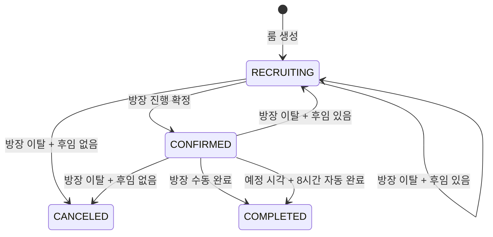

# MOI-541 MVP 룸 생명주기 변경 보고서

이 문서는 MVP 축소에 맞춰 룸 상태, 방장 이탈, 완료, 출석, 알림, 공개 API를 어떻게 변경했는지 정리한다.
구현 범위의 기준은 [MOI-541](https://linear.app/100-thieves/issue/MOI-541/mvp-룸-자동-완료-및-완료-후-출석-분리)이다.

## 변경 요약

- `IN_PROGRESS`를 제거하고 룸의 정상 흐름을 `RECRUITING → CONFIRMED → COMPLETED`로 단순화했다.
- 방장의 명시적 취소를 없애고 룸 나가기 결과로 위임 또는 취소를 결정한다.
- 완료는 방장의 수동 완료와 예정 시각 8시간 후 자동 완료로 처리한다.
- 출석은 완료 전이와 분리해 `COMPLETED` 이후 방장이 한 번 기록한다.
- 진행 화면 관련 API는 삭제하지 않고 `dev` 프로필에서만 등록한다.
- 확정, 완료, 취소와 리뷰 요청 알림을 룸 생명주기 이벤트로 통합했다.

## 최종 상태 전이

`COMPLETED` 이후의 출석 기록은 룸 상태 전이가 아니다. 출석은 완료된 룸에 부가 데이터를 한 번 저장하는 별도 행위다.

## 방장 이탈

방장은 룸을 명시적으로 취소하는 대신 룸에서 나간다. 이탈 시 기존 참여자를 먼저, 이후 승계 가능한 신청자를 후임으로 선택한다.

| 이탈 전 상태 | 후임 | 결과 |
| --- | --- | --- |
| `RECRUITING` | 있음 | 방장을 위임하고 `RECRUITING` 유지 |
| `RECRUITING` | 없음 | `CANCELED` 전환 |
| `CONFIRMED` | 있음 | 방장을 위임하고 `RECRUITING`으로 복귀 |
| `CONFIRMED` | 없음 | `CANCELED` 전환 |

확정 후 방장이 바뀌면 참여 구성이 달라질 수 있으므로 기존 확정을 유지하지 않는다. 새 방장은 예정 시각이 지난 뒤에도 룸을 다시 확정할 수 있다.

후임 없이 취소되는 경우 남은 신청은 방장 반려가 아니라 시스템 종료로 처리한다.

## 완료와 출석

### 수동 완료

방장이 `POST /v1/rooms/{roomId}/complete`를 호출하면 룸을 즉시 완료한다.

- 룸 행을 잠근 뒤 방장 권한과 현재 상태를 다시 확인한다.
- `CONFIRMED`인 룸만 완료할 수 있다.
- 상태, 상태 로그, 완료 알림 대상을 한 커밋 단위로 처리한다.
- 수동 완료와 자동 완료가 경합해도 terminal 상태는 한 번만 기록된다.

### 자동 완료

worker는 `startAt + 8시간 <= now`인 `CONFIRMED` 룸을 완료한다.

- 한 번에 최대 100개 후보를 조회한다.
- 각 룸을 잠근 뒤 자동 완료 조건을 재검증한다.
- 완료 상태, `SYSTEM` 상태 로그, 참여자별 알림 Outbox를 같은 트랜잭션에 저장한다.
- 후보 조회 후 수동 완료나 방장 이탈이 발생한 경우 재검증에서 제외한다.

### 출석 기록

방장은 완료 후 `POST /v1/rooms/{roomId}/attendances`로 가장 최근 확정 참여자 전원의 출석을 기록한다.

- 룸 상태가 `COMPLETED`여야 한다.
- 최신 확정 참여자 집합과 요청의 회원 집합이 정확히 같아야 한다.
- 상태는 `ATTENDED` 또는 `ABSENT`다.
- 룸별 출석은 한 번만 기록할 수 있다.
- 참석자가 2명 이상이면 참석자들에게 리뷰 요청 알림을 발행한다.
- 참여자는 `GET /v1/attendances/me`로 자신의 출석 결과를 조회한다.

## API 변경

### 요구사항 변경으로 제거한 API

| Method | 경로 | 변경 이유 |
| --- | --- | --- |
| `POST` | `/v1/room-progresses` | 진행 시작과 출석 입력을 묶던 흐름을 폐기 |
| `POST` | `/v1/rooms/{roomId}/cancellation` | 취소를 방장 이탈 결과로 통합 |

두 API는 새 요구사항과 의미가 충돌하므로 프로필로 닫지 않고 계약과 구현 진입점을 제거했다.

### 신규 API

| Method | 경로 | 권한 | 기능 |
| --- | --- | --- | --- |
| `POST` | `/v1/rooms/{roomId}/complete` | 방장 | `CONFIRMED` 룸 수동 완료 |
| `POST` | `/v1/rooms/{roomId}/attendances` | 방장 | 완료 후 확정 참여자 전원 출석 기록 |

`GET /v1/attendances/me`는 기존 조회 계약을 유지한다.

### MVP 제외 API

진행 화면 관련 기능은 향후 재사용할 수 있도록 코드에 남겨두되, 아래 컨트롤러에 `@Profile("dev")`를 적용했다.

- `ProgressRailController`
- `QuestionCommentController`
- `QuestionProgressController`
- `RoundController`
- `RoundFeedbackController`

`dev` 프로필이 활성화된 경우에만 다음 15개 API가 등록된다.

| 영역 | Method | 경로 |
| --- | --- | --- |
| 진행 레일 | `GET` | `/v1/progress-rails` |
| 질문 댓글 | `GET` | `/v1/question-comments` |
| 질문 댓글 | `POST` | `/v1/question-comments` |
| 질문 댓글 | `PATCH` | `/v1/question-comment-types/{commentId}` |
| 질문 댓글 | `PATCH` | `/v1/question-comments/{commentId}` |
| 질문 댓글 | `DELETE` | `/v1/question-comments/{commentId}` |
| 진행 질문 | `POST` | `/v1/questions` |
| 진행 질문 | `POST` | `/v1/follow-up-questions` |
| 진행 질문 | `PATCH` | `/v1/questions/{questionId}` |
| 라운드 | `GET` | `/v1/rounds` |
| 라운드 피드백 | `GET` | `/v1/question-records/me` |
| 라운드 피드백 | `POST` | `/v1/final-feedbacks` |
| 라운드 피드백 | `PUT` | `/v1/self-feedbacks` |
| 라운드 피드백 | `GET` | `/v1/round-feedbacks` |
| 라운드 피드백 | `PUT` | `/v1/feedback-disclosures/{feedbackId}` |

모든 핸들러는 `@LoginMember CurrentMember` 인증 계약을 유지한다. `live` 단독 프로필에서는 컨트롤러가 등록되지 않는다. Spring의 프로필 조건은 활성 프로필 집합을 기준으로 하므로 운영 환경에서 `dev`와 `live`를 동시에 활성화하면 안 된다.

## 상태 이력과 데이터베이스

방장 위임 후 재확정할 수 있으므로 `RECRUITING`과 `CONFIRMED` 상태 로그는 반복될 수 있다.

Flyway `V28__allow_repeated_room_status_transitions.sql`은 다음을 적용한다.

- 모든 활성 상태 종류에 적용하던 기존 유니크 제약 제거
- `COMPLETED`, `CANCELED`에만 적용되는 terminal 생성 컬럼과 유니크 제약 추가
- 룸, 상태, 발생 시각, ID 순서의 조회 인덱스 추가
- 가장 최근 활성 `CONFIRMED` 로그를 기준으로 확정 참여자 조회

`COMPLETED`와 `CANCELED`는 합쳐서 룸당 하나만 존재할 수 있다. 상태 이력은 append-only로 유지한다.

## 알림

룸 생명주기 알림은 수신자별 이벤트로 발행한다.

| 이벤트 | 수신자 | 발행 시점 |
| --- | --- | --- |
| `ROOM_CONFIRMED` | 확정 참여자 | 진행 확정 후 |
| `ROOM_COMPLETED` | 확정 참여자 | 수동 또는 자동 완료 후 |
| `ROOM_CANCELED` | 룸 대상자 | 후임 없는 방장 이탈로 취소 후 |
| `ROOM_REVIEW_REQUESTED` | 참석자 | 출석 저장 후 참석자가 2명 이상일 때 |

새 이벤트 생산 전에 worker가 새 envelope와 이벤트 종류를 읽을 수 있도록 소비자 호환 처리를 함께 반영했다.

## 코드 구조

| 구성요소 | 책임 |
| --- | --- |
| `RoomService` | 룸 비즈니스 흐름 조립 |
| `RoomManager` | 확정과 취소 상태 변경 |
| `RoomLeaveManager` | 방장 이탈, 위임, 취소 결정 |
| `RoomProgressManager` | 완료와 출석 기록 트랜잭션 |
| `RoomProgressFacade` | 출석과 진행 레일 응답 조립 |
| `OverdueRoomCompleter` | 잠금과 재검증을 포함한 자동 완료 |

`Manager`는 상태 변경과 트랜잭션을 소유하고, `Service`는 검증 도구와 Manager 호출 순서가 보이도록 유지한다.

## 검증 범위

다음 동작을 자동화 테스트로 고정했다.

- `IN_PROGRESS` 없는 상태 전이
- 방장 이탈 시 위임, 모집 복귀, 취소 분기
- 확정 반복과 최신 확정 참여자 조회
- 수동 완료 권한과 잠금 후 재검증
- 완료 후 출석 일회 기록과 참여자 집합 검증
- 8시간 자동 완료 경계와 한 번에 100개 처리
- 자동 완료 시 상태 로그와 알림 Outbox 원자성
- `dev`와 비-`dev` 프로필별 컨트롤러 등록 여부
- dev 전용 API 15개의 정확한 method/path 집합
- 모든 dev 전용 핸들러의 로그인 회원 요구와 미인증 401

MVP 제외 컨트롤러의 RestDocs 테스트는 공개 계약에서 제거했다. 따라서 기본 프로필로 생성하는 RestDocs와 OpenAPI에는 dev 전용 API가 포함되지 않는다.

## 배포 시 주의사항

1. 새 알림 envelope와 이벤트를 읽을 수 있는 consumer 호환 worker를 먼저 배포한다.
2. 데이터베이스 마이그레이션과 새 이벤트를 생산하는 core-api 변경을 배포한다.
3. 최종 core-worker의 자동 완료 설정과 실행 주기를 확인한다.
4. consumer 호환 worker를 먼저 배포할 수 없다면 호환 worker가 준비될 때까지 core-api 배포를 중단한다.
5. 운영 프로필에 `dev`가 함께 활성화되지 않았는지 확인한다.

아직 배포 전인 기능이므로 기존 `IN_PROGRESS` 데이터 이관이나 호환 경로는 제공하지 않는다.

## 범위 밖 항목

- 별도 진행 화면
- 진행 중 출석 체크
- 명시적 룸 취소 버튼
- 완료 후 출석 수정과 관리자 정정 API
- 리뷰 작성 여부로 출석을 추론하는 로직

## 관련 문서

- [API 설계 규칙](../conventions/api-design.md)
- [레이어 규칙](../conventions/layers.md)
- [테스트 규칙](../conventions/testing.md)
- [MOI-541 컨텍스트](../../.worklog/MOI-541-room-lifecycle/context.md)
- [MOI-541 결정 기록](../../.worklog/MOI-541-room-lifecycle/decisions.md)
