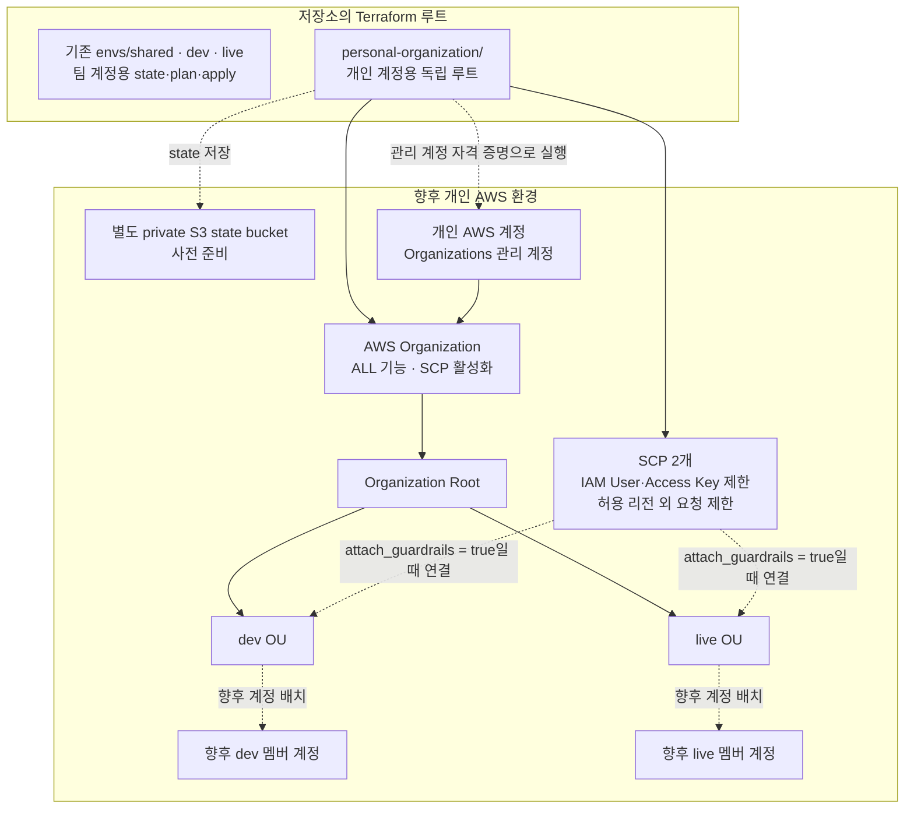

# 개인 AWS 계정의 조직 기반 준비

이 디렉터리는 기존 `envs/shared`, `envs/dev`, `envs/live`와 state·plan·apply 대상을 공유하지 않는 **독립 Terraform 루트**다. PR에서는 저장소 공통 CI의 Terraform 형식 검사가 이 디렉터리도 검사한다. 현재 팀 AWS 계정을 변경하지 않고, 향후 개인 계정을 Organizations 관리 계정으로 사용할 때 필요한 OU와 SCP를 준비한다. 이 코드는 기존 애플리케이션 자원이나 데이터를 계정 간에 이동하지 않는다.

## 아키텍처

아래는 Terraform을 개인 계정에 적용하고 멤버 계정을 분리했을 때의 **목표 구조**다. 현재 AWS 자원을 생성한 상태를 뜻하지 않는다.

실선은 이 루트가 정의하는 조직 구조와 정책을, 점선은 별도 준비나 향후 조건부 연결을 나타낸다. 그림의 `dev`·`live` 멤버 계정과 state bucket은 **현재 코드가 생성하지 않는다**. 기존 팀 계정용 루트는 개인 계정용 루트와 state·plan·apply 경로를 공유하지 않는다.

| 파일 | 역할 |
| --- | --- |
| `versions.tf` | AWS provider 버전, 관리 계정 ID 제한, 별도 S3 backend 선언 |
| `main.tf` | Organization, OU, SCP와 조건부 OU 연결 |
| `variables.tf` | OU 이름, 허용 리전, SCP 연결 여부 입력 |
| `outputs.tf` | 조직·OU 식별자와 연결 상태 출력 |
| `backend.hcl.example` | 개인 계정 state bucket 설정 예시 |
| `personal.tfvars.example` | 개인 계정용 비밀값 없는 입력 예시 |

## 포함 범위

- 모든 기능이 켜진 AWS Organization과 `dev`, `live` OU
- `management_account_id`에 지정한 개인 관리 계정에서만 provider가 동작하도록 제한
- IAM User 및 장기 Access Key 생성을 막는 SCP
- 허용한 리전 외의 리전 API 요청을 막는 SCP
- OU별 SCP 연결. 기본값 `attach_guardrails = false`이므로 연결은 생성되지 않는다.

OU에는 아직 계정을 넣지 않는다. AWS Organizations **관리 계정에는 SCP가 적용되지 않는다**. 실제로 SCP 효과를 얻으려면 별도 멤버 계정을 마련하고, 테스트한 뒤 그 계정을 OU로 옮겨야 한다. SCP는 권한을 부여하지 않으므로 IAM Identity Center의 Permission Set과 계정 할당도 별도로 설계해야 한다.

## 기존 CI·배포 영향

- PR의 `infra/terraform/**` 변경은 Terraform Plan 워크플로를 실행한다. 공통 `fmt -recursive` 검사에는 이 디렉터리가 포함된다.
- 현재 자동 plan/apply 스크립트는 `shared`, `dev`, `live`만 대상으로 하므로 이 디렉터리의 Organization·SCP를 팀 계정에 적용하지 않는다. 다만 기존 환경에 드리프트가 있다면 해당 plan은 별도로 판독해야 한다.
- `dev`에 머지하면 현재 앱 배포 워크플로는 `.tf`·`.hcl` 변경을 배포 대상 변경으로 판단한다. 따라서 이 구성만 추가해도 기존 dev 앱이 재배포될 수 있다. 배포 영향이 없다고 가정하고 머지하지 않는다.
- `main`에 머지하는 경우에도 live 승격 게이트가 켜져 있다면 동일한 변경 분류가 적용된다.

## 향후 사용 순서

1. 개인 AWS 계정의 소유권과 현재 Organization 소속 여부를 확인한다. 이미 Organization이 있으면 `aws_organizations_organization.personal`을 **import**해야 하며, 새 Organization을 생성하면 안 된다. 기존에 활성화된 정책 유형과 서비스 trusted access를 확인해 각각 `enabled_policy_types`와 `aws_service_access_principals`에 모두 반영한다. 누락하면 Terraform이 비활성화를 계획할 수 있으므로, plan에 의도하지 않은 제거가 나오면 진행하지 않는다.
2. 별도 private S3 state bucket을 준비한다. `backend.hcl.example`을 `backend.hcl`로 복사해 bucket/region을 채운다. 실행 IAM에는 bucket의 `s3:ListBucket`, state 객체의 `s3:GetObject`·`s3:PutObject`, `personal-organization/terraform.tfstate.tflock` 객체의 `s3:GetObject`·`s3:PutObject`·`s3:DeleteObject` 권한이 필요하다. `backend.hcl`과 state 파일은 Git에서 제외된다. 이 디렉터리의 state는 팀 계정의 state와 공유하지 않는다.
3. 개인 계정의 AWS profile 또는 단기 자격 증명을 선택하고 `aws sts get-caller-identity`로 계정 ID를 확인한다. 계정 ID를 확인하기 전에는 plan을 실행하지 않는다.
4. `personal.tfvars.example`을 `personal.tfvars`로 복사하고 `management_account_id`를 확인한 개인 관리 계정 ID로 바꾼다. OU·허용 리전·기존 Organization의 활성 정책 유형과 trusted access 서비스도 검토한다. 이 파일은 Git에서 제외되며, 계정 ID가 자격 증명과 다르면 provider가 중단된다.
5. `terraform init -backend-config=backend.hcl`과 `terraform plan -var-file=personal.tfvars`로 추가·변경·삭제 대상을 검토한다. 특히 Organization 생성/수정, SCP 정책 본문, OU 연결을 확인한다.
6. 추후 멤버 계정을 마련하면 우선 비운영 OU에서 SCP를 검증한다. 그 뒤 `attach_guardrails = true`와 멤버 계정 이동을 별도 계획으로 진행한다. 운영 OU에 바로 연결하지 않는다.

정적 검증만 할 때에는 `terraform init -backend=false` 후 `terraform fmt -check`와 `terraform validate`를 사용할 수 있다. 이 저장소의 에이전트는 `terraform apply`를 실행하지 않는다.

## 정책의 범위

`aws:RequestedRegion`은 API 요청 엔드포인트를 기준으로 평가한다. 모든 서비스의 데이터 위치를 보장하는 장치는 아니며, IAM·Route 53 같은 글로벌 서비스는 예외가 필요하다. 제공된 예외 목록은 실제 사용하는 AWS 서비스에 맞춰 plan과 별도 멤버 계정에서 검증해야 한다.

IAM Identity Center 자체 활성화, Permission Set, 사용자·그룹 할당은 현재 포함하지 않는다. 인스턴스와 그룹 식별자가 정해지고 멤버 계정이 생기면 이 루트 또는 별도 identity 루트에서 추가한다. 현재 개인 계정이 관리 계정 하나뿐이라면, Identity Center만으로는 멤버 계정의 SCP 효과를 확인할 수 없다.

참고: [AWS SCP 동작](https://docs.aws.amazon.com/organizations/latest/userguide/orgs_manage_policies_scps.html), [AWS 리전 제한 예시](https://docs.aws.amazon.com/organizations/latest/userguide/orgs_manage_policies_scps_syntax.html), [Terraform AWS Organizations](https://registry.terraform.io/providers/hashicorp/aws/latest/docs/resources/organizations_organization).
